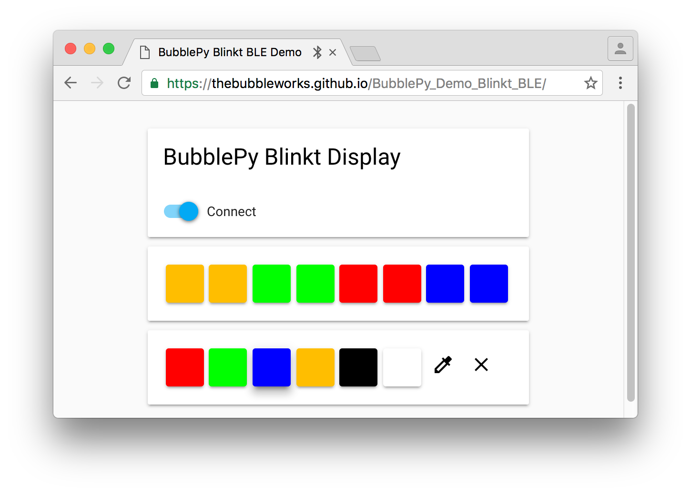
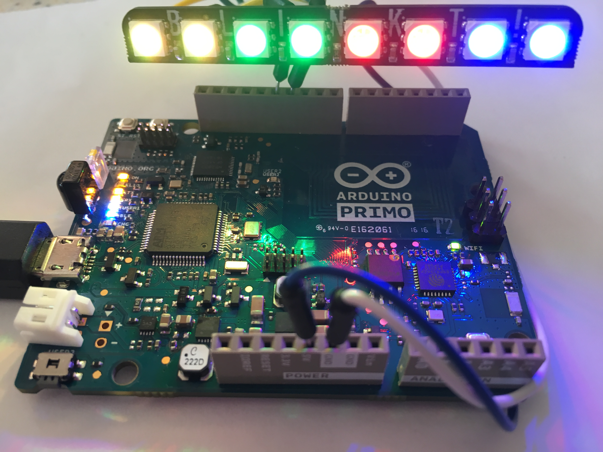
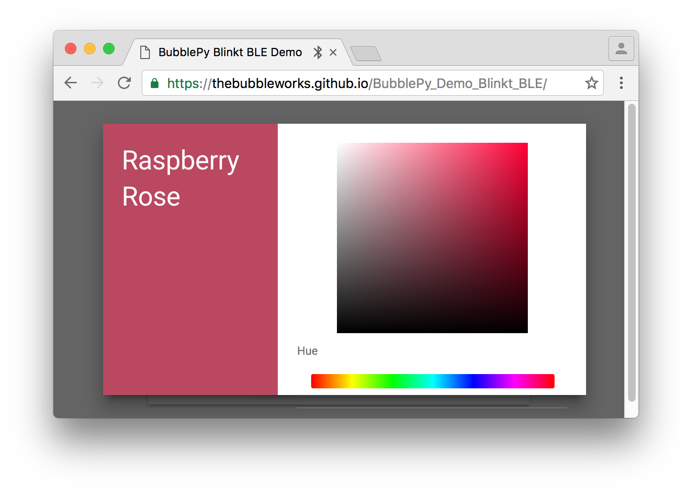
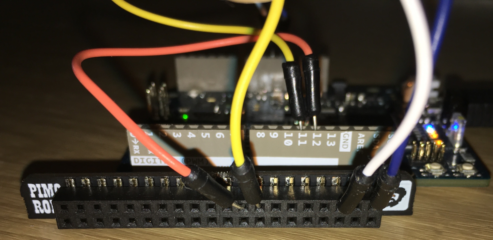

# BubblePy Blinkt BLE + Web Bluetooth Demo

This is a [BubblePy](https://thebubbleworks.com/bubblepy/) demo of controlling a [Pimoroni Blinkt](https://shop.pimoroni.com/products/blinkt) via BluetoothLE on an [Arduino Primo](https://www.nordicsemi.com/eng/News/News-releases/Product-Related-News/Arduino-Primo-base-board-features-native-Bluetooth-low-energy-wireless-connectivity-and-NFC-Touch-to-Pair-using-Nordic-Semiconductor-nRF52832-SoCs).

The Python code demonstrates BubblePy's MicroPython versions of [gpiozero](https://github.com/RPi-Distro/python-gpiozero) and [bluezero](https://github.com/ukBaz/python-bluezero) and can run on many different kinds of Bluetooth LE enabled devices (more details below).

Of note, the code will run pretty much as-is on an Arduino Primo, a micro:bit, a RaspberryPi and others.

The User Interface runs in a browser using the [Web Bluetooth JavaScript API](https://github.com/WebBluetoothCG/web-bluetooth#web-bluetooth). Web Blutooth is used for discovering and connecting to Bluetooth LE devices from within a browser, e.g. a native app or plugin on Desktop or Mobile is not required.


## User Interface

You can open the Web Bluetooth demo [here](https://thebubbleworks.github.io/BubblePy_Demo_Blinkt_BLE/).

*Note: Please check your platform and browser are supported [here](https://github.com/WebBluetoothCG/web-bluetooth/blob/gh-pages/implementation-status.md).*

Here's the browser UI:



Here's the Blinkt on the Arduino Primo:



There is also a colour wheel to pick your own colours:


## Wiring Setup

To connect the Blinkt to the Primo please see the image below and note the following in the diagram:

- Blue goes to Arduino 5v
- White goes to Arduino GND 



## Firmware Image

A firmware image is available in Intel hex format [here](./firmware/bubblepy_blinkt_ble.hex)

This firmware has been tested successfully on the following OS'es, hardware and Chrome Browser combinations:

* Android 6.0.1 (Nexus 7 Tablet): Chrome Version 52.0.2743.98
* macOS Sierra (Mac Book Pro 2015):  53.0.2785.143 (64-bit) (note: requires WebBluetooth flag enabled first)
* Chromebook (Toshiba Chromebook 2): ChromeOS 53.0.2785.103 (64-bit)  (note: requires WebBluetooth flag enabled first)
* Windows: not supported


## Python Code

The Python code below runs via [BubblePy](https://thebubbleworks.com/bubblepy/) on these devices:

- Arduino Primo
- BBC micro:bit
- Raspberry Pi
- Other Nordic Semiconductor nRF51 and nRF52 devices, e.g. RuuviTag, Red Bear Labs Nano

**The DAT and CLK pins may need changing for some hardware platforms.*


The Blinkt portion of the code below is a gpiozero version of the original Blinkt library found [here](https://github.com/pimoroni/blinkt).
A native MicroPython 'blinkt' module is also available, therefore the demonstrative code below would be much smaller in practice.


```python
from gpiozero import OutputDevice
from bluezero import peripheral

#############
# Blinkt part

# (for demonstration purposes, there's a MicroPython 'blinkt' module available to import)

DAT = 23
CLK = 24
NUM_PIXELS = 8
BRIGHTNESS = 7

dat = OutputDevice(DAT)
clk = OutputDevice(CLK)

pixels = [[0,0,0,BRIGHTNESS]] * 8


def set_brightness(brightness):
    for x in range(NUM_PIXELS):
        pixels[x][3] = int(31 * brightness) & 0b11111

def clear():
    for x in range(NUM_PIXELS):
        pixels[x][0:3] = [0,0,0]

def write_byte(byte):
    for x in range(8):
        bit = (byte & (1 << (7-x))) > 0
        if bit:
            dat.on()
        else:
            dat.off()
        clk.on()
        clk.off()

def show():
    for x in range(4):
        write_byte(0)

    for pixel in pixels:
        r, g, b, brightness = pixel
        write_byte(0b11100000 | brightness)
        write_byte(b)
        write_byte(g)
        write_byte(r)

    write_byte(0xff)

def set_pixel(x, r, g, b, brightness=None):
    if brightness is None:
        brightness = pixels[x][3]
    else:
        brightness = int(31 * brightness) & 0b11111
    pixels[x] = [int(r) & 0xff,int(g) & 0xff,int(b) & 0xff,brightness]


def set_all(r,g,b):
    for x in range(8):
        set_pixel(x,r,g,b)

###################
# Bluetooth LE part

# These are Bluetooth LE unique identifiers that are also used by a commercial LED display.

# 128-Bit UUID's here, but 16 bit UUID's would work too, e.g. 0xFFF0 and 0xFFF3 in this case
SERVICE_UUID =  '0000fff0-0000-1000-8000-00805f9b34fb'
CHAR_UUID =    '0000fff3-0000-1000-8000-00805f9b34fb'


# Command constants, received when the WebBluetooth client writes to the BluetoothLE GATT characteristic 

CMD_CLEAR_PIXELS=0x0601
CMD_SET_PIXEL=0x0702

# Callback that is invoked when a Central device passes data to the 'write' characteristic (CHAR_UUID)
def ble_write_callback(bytes):
    if len(bytes)>2:
        cmd = (bytes[0]<<8) + (bytes[1] & 0xff)

        if cmd == CMD_SET_PIXEL:
            if len(bytes) >=7 :
                set_pixel(bytes[3]-1, bytes[4], bytes[5], bytes[6] )
        elif cmd == CMD_CLEAR_PIXELS:
            if len(bytes) >=5:
                set_all(bytes[2], bytes[3], bytes[4] )
    show()


service = peripheral.Service(SERVICE_UUID, True)
char = peripheral.Characteristic(CHAR_UUID, ['write'], 0)

char.add_write_event(ble_write_callback)
service.add_characteristic(char)

peripheral.add_service(service)
peripheral.start()
```


