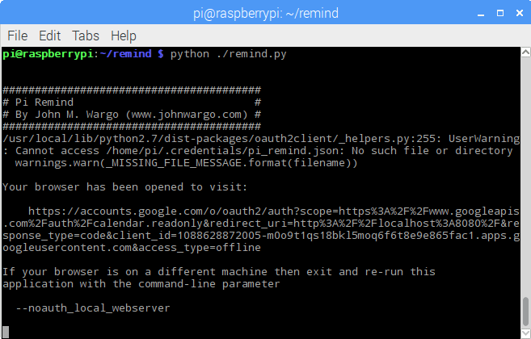
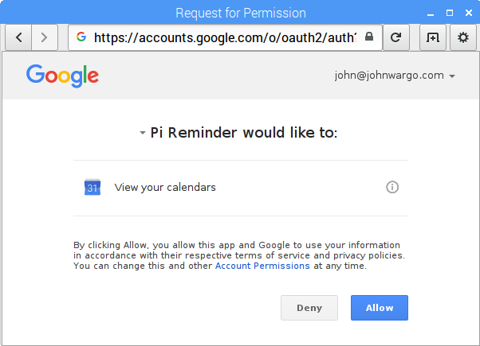
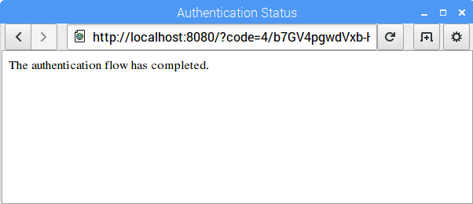
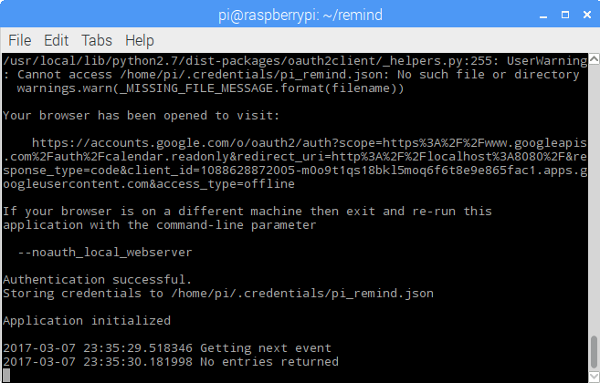

# Raspberry Pi Reminder (Pi Zero W & Blinkt Version)

I often get distracted by what I'm working on, and miss reminders from Google Calendar on my desktop or laptop PCs. To help me avoid missing meetings, I created the Pi Reminder project, a visual notifier that uses the Raspberry Pi, the Pimoroni Unicorn HAT and the Google Calendar API to remind me when I have upcoming appointments. The folks at Make Magazine published the original version of the article as [*Get a Flashing Meeting Reminder with a Raspberry Pi*](http://makezine.com/projects/get-a-flashing-meeting-reminder-with-a-raspberry-pi/), and I later published an article about the project on [johnwargo.com](http://johnwargo.com/microcontrollers-single-board-computers/raspberry-pi-reminder-project.html). The completed project's been sitting on my desk for months, quietly reminding me of my Google Calendar appointments throughout the day.

With the announcement of the [Raspberry Pi Zero W](https://www.raspberrypi.org/blog/raspberry-pi-zero-w-joins-family/), I knew I had an opportunity to create a much smaller version of the Pi Reminder project. I used a Raspberry Pi 3 for the original project because I needed an built-in Internet connection for the project. I ended up using a wired connection, but could have used the built-in Wi-Fi connection instead. With the new Pi Zero W, I had everything I needed in a smaller package. Immediately after the announcement, I poked around on the Internet looking for a way to buy one. Adafruit, and the other US distributors wouldn't have any for quite a while (it took me 5 months to get a Pi Zero in the US after it launched), so I looked in the UK and found the Pimoroni [Pi Zero W Starter Kit](https://shop.pimoroni.com/products/pi-zero-w-starter-kit) which seemed just right for this project. I ordered one and it made it across the US in about a week. The kit includes the Pi, a case and the Blinkt LED board, all I needed to add was a power supply. 

The repository contains the project code for the Pi Zero W/Blinkt version of the Pi Reminder project.

## Hardware Components

For this project, I used the [Pi Zero W Starter Kit](https://shop.pimoroni.com/products/pi-zero-w-starter-kit). From the Pimoroni web site, here's the list of the kit's components:

+	Pi Zero W
+	Blinkt! multicolor LED strip
+	Pibow case
+	8GB micro-SD card with operating system pre-loaded
+	Male 2x20 pin header
+	USB A to micro-B cable
+	USB A (female) to micro B (male) adapter
+	mini to full-size HDMI adapter
+	Sticker sheet (personalize your Pibow!)
+	Reusable kit box

You'll also need a 5V power supply, I used the [CanaKit 5V 2.5A Raspberry Pi 3 Power Supply / Adapter / Charger (UL Listed)](http://www.amazon.com/CanaKit-Raspberry-Supply-Adapter-Charger/dp/B00MARDJZ4) from Amazon.

## Operation

### Alerts

The Pi connects to my Google Calendar account every minute and checks for upcoming appointments. When it finds one, it flashes the LEDs for following alerts:

+	White @ 10 minutes until 5 minutes
+	Yellow @ 5 minutes until 2 minutes
+	Orange @ 2 minutes

### Indicator LED

The app uses a single indicator LED to let you know the app is working. It will illuminate a single LED along the row of LEDs and move the LED across the display every time it connects to Google to obtain calendar information. The color of the LED indicates status of the app as well:

+	Blue - The app is connecting to the Google Calendar API
+	Green - The app received data from the Google Calendar API, but there are no pending appointments within the next 10 minutes
+	Red - The app encountered an error connecting to the Google Calendar API
+	White - There is an appointment beginning within 10 minutes
+	Yellow - There is an appointment beginning within the next 5 minutes
+	Orange - There is an appointment beginning within the next 2 minutes

This way, even if you miss the flashing lights, you can glance at the display and still determine how far away your next appointment is.

## Raspberry Pi Setup & Configuration

### Hardware Setup

To setup the hardware, complete the following steps:

1. Assemble the Pibow case using the [setup instructions](https://learn.pimoroni.com/tutorial/sandyj/pibow-zero-assembly) 
2. Attach the Blinkt! board to the Raspberry Pi
3. Power it up!

That's it, you're done. That was easy, right?

### Software

Download the latest version of the Raspbian OS from the [Raspberry Pi web site](https://www.raspberrypi.org/downloads/raspbian/) and follow the [instructions](https://www.raspberrypi.org/documentation/installation/installing-images/README.md) for writing the OS image to a Micro SD card for the Pi. Insert the **SD card** in the Pi, connect **Ethernet**, **keyboard**, **mouse**, and a **monitor** to the Pi using the cables that come with the starter kit, and, finally, **power it up** using a smartphone charger or some suitable power source.

> **Note**: The memory card included with my starter kit came with the January, 2017 version of the Raspbian OS. Unfortunately, that version of the OS doesn't include support for the Wi-Fi hardware in the Pi Zero W. So, even though the kit comes with a pre-loaded memory card, there's no guarantee it will work with your Pi. Sorry.

Connect the Pi to your Wireless network (the Pi Zero doesn't support a wired network connection, so you'll have to use Wi-Fi) using [these instructions](https://www.raspberrypi.org/documentation/configuration/wireless/).

When the Pi is connected to the network all ready to go, open a terminal window and update the device's software using the following commands:

	sudo apt-get update
	sudo apt-get upgrade

The first command updates the local software repositories and the second command updates the Raspbian OS and associated files to their latest versions.

Now, install the Blinkt! Python libraries and example applications by executing the following command:

	curl -sS get.pimoroni.com/blinkt | bash

Next, download the project source code; in the terminal window, execute the following command:

	git clone https://github.com/johnwargo/Pi-Remind-Zero-Blinkt

This will download and extract the project source code to the local `Pi-Remind-Zero-Blinkt` folder. Change to the new folder using the following command:

	cd Pi-Remind-Zero-Blinkt 
 
If all went well, you can type `ls` to get a directory listing and should see the following files:

+	`LICENSE` - This software is licensed under the [MIT License](https://en.wikipedia.org/wiki/MIT_License)
+	`readme.md` - This file
+	`remind.py` - The main application file for this project
+	`start-remind.sh` - a shell script used to execute the project's code on start up

### Google Calendar API Setup

Before you can use the project's software, you have to setup an account with Google so the app can consume the Google Calendar APIs used in this project. To setup your account, read the [Google Calendar API Python Quickstart](https://developers.google.com/google-apps/calendar/quickstart/python) and follow its instructions to create your account. 

Download your Google Calendar API application's `client_secret.json` file to the project folder. Be sure to name the downloaded file using that file name. You'll need it to authorize the app to access your Google Calendar and that particular file name is hard coded into the project's main Python app (`remind.py`).

### Google Calendar API Installation

Now, install the [Google Calendar API Python files](https://developers.google.com/api-client-library/python/start/installation) along with some other, required libraries using the following command:

    sudo pip install --upgrade google-api-python-client python-dateutil pytz httplib2 oauth2client

## Running the Reminder Application

With everything in place, in the terminal window pointing to the `Pi-Remind-Zero-Blinkt` folder, execute the reminder app using the following command:

    sudo python ./remind.py

> **Note**: We're running the application here using `sudo` because later, when you configure the app to run at startup, it will run as `root`, so the configuration that happens next must also be done as `root` otherwise it won't work.

The application will launch, validate its configuration and warn you that there's additional configuration that must be completed. 

Before the app can access the calendar, you'll need to authorize the app to use the Google Calendar API for your calendar account. The browser will launch and walk you through the process. It starts by prompting you to login to the Google account for the calendar you want the app to monitor. Enter the email address associated with that account and click the **Next** button. 

Enter the password associated with the Google account and click the **Sign In** button.

Next, the browser prompts you to approve the application's access to your calendar.

At this point, you're done and can close the browser window when you see the following page:

With authorization in place, the app will begin checking your calendar every minute. When you see **no entries returned**, that doesn't indicate that there's a problem, instead it simply means that there are no events on your calendar scheduled for the next 10 minutes. 

> **Note**: if you ever change Google calendars (from a work to a personal calendar or from one work calendar profile to another) you'll need to whack the existing access token created during the initial startup of the Pi Reminder app. Instructions for deleting this token are available on [johnwargo.com](http://www.johnwargo.com/index.php/microcontrollers-single-board-computers/pi-reminder-%E2%80%93-delete-google-calendar-access-authorization-token.html).

## Starting The Project's Application's Automatically

There are a few steps you must complete to configure the Raspberry Pi so it executes the the reminder app on startup. You can read more about this here: [Autostart Python App on Raspberry Pi in a Terminal Window](http://johnwargo.com/index.php/microcontrollers-single-board-computers/autostart-python-app-on-raspberry-pi-in-a-terminal-window.html).

> **Note:** Don't forget to authorize the Google Calendar API to access your Google Calendar by running the manual startup process described in the previous session before enabling autostart. 

If you don't already have a terminal window open, open one then navigate to the folder where you extracted the project files. Make the project's bash script files executable by executing the following command:

    chmod +x start-remind.sh
    
Next, you'll need to open the pi user's session `autostart` file using the following command:  

	sudo nano ~/.config/lxsession/LXDE-pi/autostart    

Add the following lines to the end (bottom) of the file:

	@lxterminal -e /home/pi/Pi-Remind-Zero-Blinkt/start-remind.sh

To save your changes, press `ctrl-o` then press the Enter key. Next, press `ctrl-x` to exit the `nano` application.
  
Reboot the Raspberry Pi; when it restarts, the python remind process should execute in its own terminal window.

## Update History

Nothing yet.

***
By [John M. Wargo](http://www.johnwargo.com) - If you find this code useful, and feel like thanking me for providing it, please consider making a purchase from [my Amazon Wish List](https://amzn.com/w/1WI6AAUKPT5P9). You can find information on many different topics on my [personal blog](http://www.johnwargo.com). Learn about all of my publications at [John Wargo Books](http://www.johnwargobooks.com). 