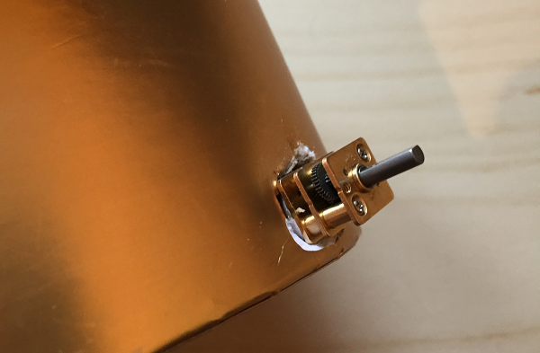

## Add wheels

- Ask an adult to help you with this step. Using a pair of scissors or a sharp instrument, carefully make a hole near the bottom of your box.

    

- Once the hole is big enough, push your motor into the hole so that the shaft of the motor is on the outside of the box. Be careful not to bend or break the pins on your motor when you push it through, and ensure that the box is not preventing the gears of the motor from moving.

    

- Repeat these steps on the opposite side of your box to add the second motor. Our buggy only has two wheels, but if you want to add a second axle with two non-powered wheels to stabilise your buggy, add that now.

    

- Push a tyre onto each motor shaft and connect two jumper wires to each motor.

    

