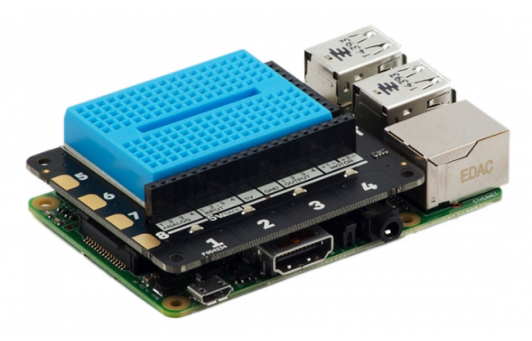

## Connect the Raspberry Pi

- Connect the Explorer HAT to your Raspberry Pi.

    

- On the Explorer HAT, locate the two holes labelled "Motor 1": one is **+** and the other **-**. Take two jumper leads connected to the **same** motor and push them into the holes for Motor one. It does not matter which way round the leads go.

    

- Repeat this step, pushing the two leads from the other motor into the holes on the Explorer HAT labelled "Motor 2".

    

