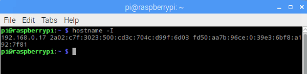

## Connecting to your Raspberry Pi remotely

You probably don't want your buggy to be tethered to a keyboard, mouse, monitor or any of the usual peripherals we use to control a Raspberry Pi. Instead, we will use a **headless** setup where we control the Raspberry Pi remotely from another computer. To do this, your Raspberry Pi will need to be connected to a network, so you should use a Raspberry Pi 3 (with built in wireless receiver). If you are using an earlier version, you will need to add a WiFi dongle.

- Set up your Raspberry Pi with the usual screen, keyboard, mouse etc. just as you would normally.

- Follow the instructions in Option 1 of [this worksheet](https://projects.raspberrypi.org/en/projects/teachers-guide/remote/) to make sure that the VNC server is enabled on your Raspberry Pi.

- Open a terminal window:

    

- Type in the following command, then press Enter.

    ```bash
    hostname -I
    ```

    This command lets you find the IP address of your Raspberry Pi so that you can connect to it remotely.

    

    The IP address is the first part. It looks like four numbers separated by dots. The IP address of our Raspberry Pi in this example was `192.168.0.17`. Make a note of the IP address as you will need it in a minute.

- Shut down your Raspberry Pi. Remove the peripherals, then attach the USB power pack and put the Raspberry Pi into the chassis.

    

- You can access your Raspberry Pi buggy, using VNC by following the instructions below.

[[[rpi-vnc-access]]]

