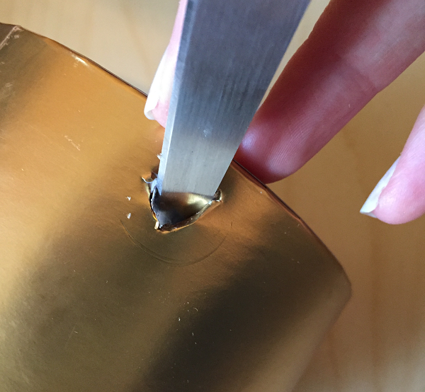
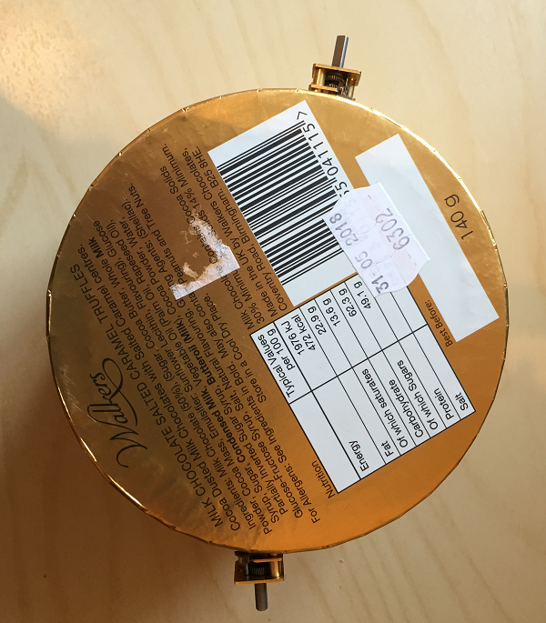
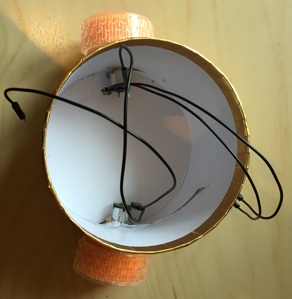
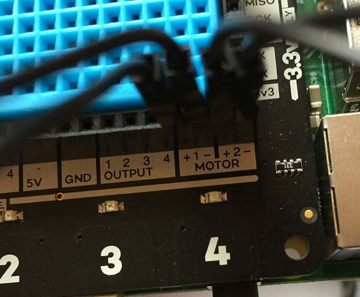
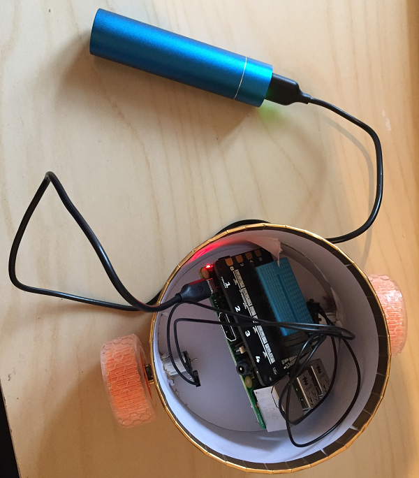

# Explorer HAT buggy

In this resource you will make a very simple buggy, with an optional GUI interface to control it remotely from another computer.

## Choosing a chassis

To make a buggy, you will need to create a chassis so that you can attach the wheels. This is harder than it looks! We chose to use a small chocolate box because it is made of stiff cardboard and about the right size to hold the Raspberry Pi and the USB power stick. You might have a suitable box, or you might wish to create a chassis from other materials such as Lego. You could even 3D print your chassis.


## Add wheels

1. Ask an adult to help you with this step. Using a pair of scissors or a sharp instrument, carefully make a hole near the bottom of your box.

    

1. Once the hole is big enough, push your motor into the hole so that the shaft of the motor is on the outside of the box. Be careful not to bend or break the pins on your motor when you push it through, and ensure that the box is not preventing the gears of the motor from moving.

    

1. Repeat these steps on the opposite side of your box to add the second motor. Our buggy only has two wheels, but if you want to add a second axle with two non-powered wheels to stabilise your buggy, add that now.

    

1. Push a tyre onto each motor shaft and connect two jumper wires to each motor.

    


## Connect the Raspberry Pi

1. Connect the Explorer HAT to your Raspberry Pi.

    

1. On the Explorer HAT, locate the two holes labelled "Motor 1": one is **+** and the other **-**. Take two jumper leads connected to the **same** motor and push them into the holes for Motor one. It does not matter which way round the leads go.

    

1. Repeat this step, pushing the two leads from the other motor into the holes on the Explorer HAT labelled "Motor 2".

    


## Connecting to your Raspberry Pi remotely

You probably don't want your buggy to be tethered to a keyboard, mouse, monitor or any of the usual peripherals we use to control a Raspberry Pi. Instead, we will use a **headless** setup where we control the Raspberry Pi remotely from another computer. To do this, your Raspberry Pi will need to be connected to a network, so you should use a Raspberry Pi 3 (with built in wireless receiver). If you are using an earlier version, you will need to add a WiFi dongle.

1. Set up your Raspberry Pi with the usual screen, keyboard, mouse etc. just as you would normally.

1. Follow the instructions in Option 1 of [this worksheet](https://www.raspberrypi.org/learning/teachers-guide/remote/) to make sure that the VNC server is enabled on your Raspberry Pi.

1. Open a terminal window:

    

1. Type in the following command, then press Enter.

    ```bash
    hostname -I
    ```

    This command lets you find the IP address of your Raspberry Pi so that you can connect to it remotely.

    

    The IP address is the first part. It looks like four numbers separated by dots. The IP address of our Raspberry Pi in this example was `192.168.0.17`. Make a note of the IP address as you will need it in a minute.

1. Shut down your Raspberry Pi. Remove the peripherals, then attach the USB power pack and put the Raspberry Pi into the chassis.

    

1. Follow [these instructions](https://www.raspberrypi.org/learning/teachers-guide/vnc-windows/) to download the VNC viewer software onto the computer you will use to connect to the Raspberry Pi. Connect to the Raspberry Pi via the VNC, using the IP address you just wrote down.


## Programming the robot

1. Once you are connected to the Raspberry Pi via the VNC, you should see the usual Raspberry Pi desktop in a window on your computer.

1. Open up **Python 3** from the **Programming** menu:

    

1. Begin your code by importing the Explorer HAT library and the sleep function from the time library:

    ```python
    import explorerhat
    from time import sleep
    ```

1. Underneath that, add some test code to make the buggy move forwards for two seconds:

    ```python
    explorerhat.motor.one.forward(100)
    explorerhat.motor.two.forward(100)

    sleep(2)

    explorerhat.motor.one.stop()
    explorerhat.motor.two.stop()
    ```

1. Make sure your buggy is in a good place to be able to move, then save your code and press F5 to run it. Your buggy should move forwards for a short distance.

1. Can you figure out how to make your robot do the following:

    - Move backwards
    - Move for a longer length of time
    - Move more slowly
    - Turn left and right?


## Adding a GUI

If you want to, you could create a GUI (Graphical User Interface) to control your buggy.


1. With your other import statements, add a line of code to import features from the **guizero** library:

    ```python
    from guizero import App, PushButton
    ```

1. Underneath your import statements, define a function called `forwards()`:

    ```python
    def forwards():
    ```

1. Move your code to make the buggy move forwards so that it is __inside the function__. For Python to understand which code is inside the function, the code must be indented, like this:

    ```python
    def forwards():
        explorerhat.motor.one.forward(100)
        explorerhat.motor.two.forward(100)

        sleep(2)

        explorerhat.motor.one.stop()
        explorerhat.motor.two.stop()
    ```

1. Underneath your function, create the GUI app. The text "Buggy controller" will appear in the title bar - you can change this if you like.

    ```python
    app = App("Buggy controller")
    ```

1. Now add a button to your GUI:

    ```python
    drive = PushButton(app, forwards, text="Forwards")
    ```

    Let's look at the code in more detail:
    - `drive =` - this is the variable name, so we can refer to the button
    - `PushButton` - tells Python to create a button using the PushButton class from guizero
    - `app` - adds this button to the app we just created
    - `forwards` - calls the function called forwards when the button is pressed
    - `text="Forwards"` - this text will be displayed on the button
    

1. Finally, add the following line at the bottom of your program to display and update the GUI:

    ```python
    app.display()
    ```

1. Save your program and press F5 to run it. You should see your GUI appear. Press the forwards button on the GUI and check that your robot moves forwards.

    

    The full GUI code is [here](code/buggygui.py) for you to look at if you wish.

## What next?

1. Can you add more buttons to your GUI - make the robot go backwards, or turn left and right?

    

1. Could you add pictures (e.g. arrows) to the buttons to show what they do, instead of words? Use the [documentation](https://lawsie.github.io/guizero/pushbutton/) to help you.

1. Could you lay out the buttons in a better way? There is the option for a [grid layout in guizero](https://lawsie.github.io/guizero/box/) that you could use.
