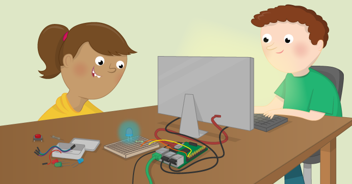

# Physical Computing with Python

In this resource you will learn how to use the GPIO pins on your Raspberry Pi to interface with electronic components, such as LEDs and PIRs.

# Contents

- [Getting started](worksheet.md)
- [Using an active buzzer](buzzer.md)
- [Making traffic lights](trafficlights.md)
- [Using a light-dependent resistor](ldr.md)
- [Using a PIR Sensor](pir.md)
- [Using an ultrasonic distance sensor](distance.md)

## Licence

Unless otherwise specified, everything in this repository is covered by the following licence:

***Physical Computing with Python*** by the [Raspberry Pi Foundation](http://www.raspberrypi.org) is licenced under a [Creative Commons Attribution 4.0 International License](http://creativecommons.org/licenses/by-sa/4.0/).

Based on a work at https://github.com/raspberrypilearning/physical-computing-with-python
