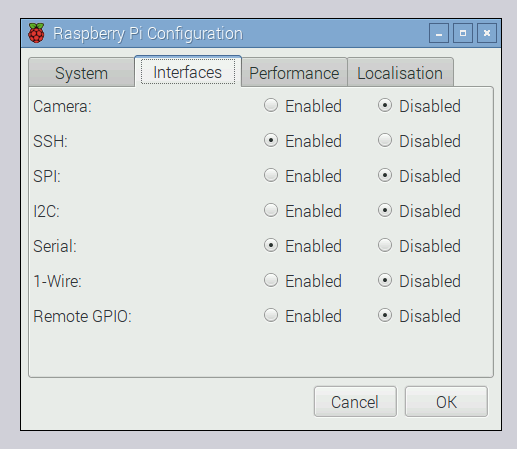
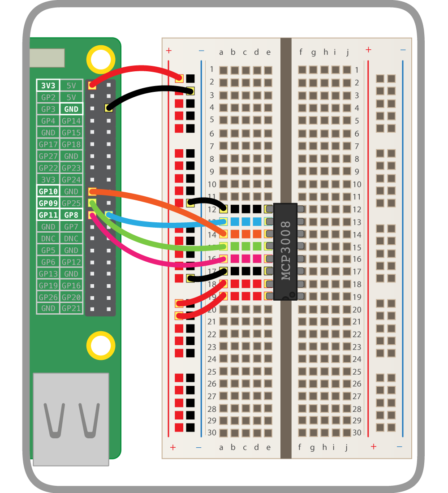
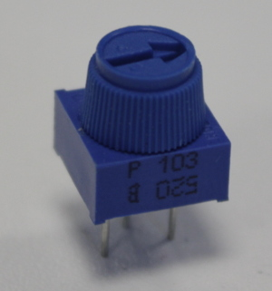
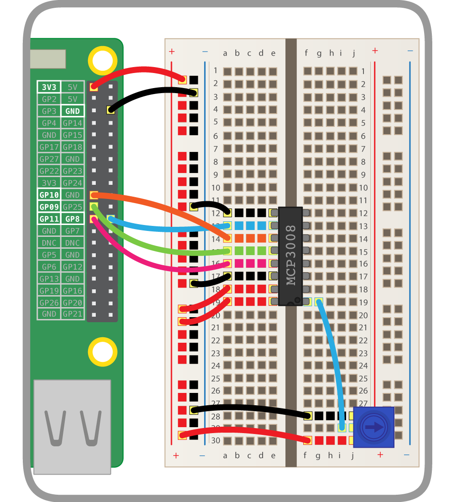
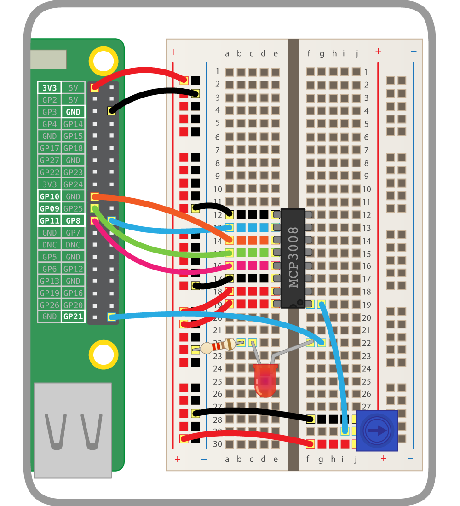
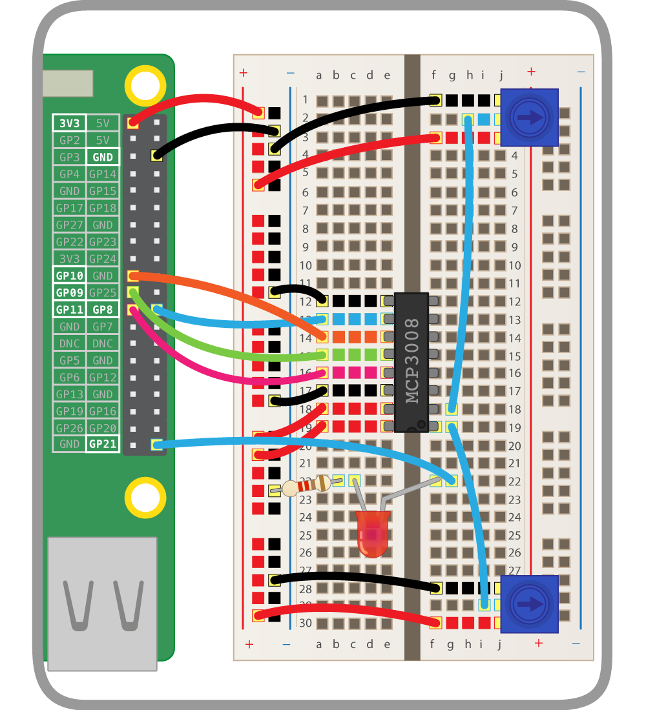

# Analogue Inputs

The Raspberry Pi's GPIO pins are digital pins, so you can only set outputs to high or low, or read inputs as high or low. However, using an ADC chip (Analogue-to-Digital converter), you can read the value of analogue input devices such as potentiometers.

## SPI

The analogue values are communicated to the Pi using the SPI protocol. While this will work in GPIO Zero out of the box, you may get better results if you enable full SPI support.

1. Open a terminal window and install the `spidev` package:

    ```bash
    sudo apt-get install python3-spidev python-spidev
    ```

1. Open the **Raspberry Pi Configuration** dialogue from the main menu and enable **SPI** in the **Interfaces** tab:

    

1. Click **OK** and reboot the Pi.

## Wiring the ADC (MCP3008)

The MCP3008 is an ADC providing eight input channels. The eight connectors on one side are connected to the Pi's GPIO pins, and the other eight are available to connect analogue input devices to read their values.

Place the MCP3008 chip on a breadboard and carefully wire it up as shown in the following diagram. You should see a small notch, or dot, in one end of the chip. In the diagram, this end of the chip is alligned with column **19** on the breadboard.



Alternatively, you could use the [Analog Zero](http://rasp.io/analogzero/) board, which provides the MCP3008 chip on a handy add-on board to save you from the complicated wiring.

## Add a potentiometer

Now that the ADC is connected to the Pi, you can wire devices up to the input channels. A potentiometer is a good example of an analogue input device: it's simply a variable resistor, and the Pi reads the voltage (from 0V to 3.3V).



A potentiometer's pins are ground, data, and 3V3. This means you connect it to ground and a supply of 3V3, and read the actual voltage from the middle pin.

1. Place a potentiometer on the breadboard and wire one side to the ground rail, the other to the 3V3 rail, and the middle pin to the first input channel as shown:

    

## Code

Now your potentiometer is connected and its value can be read from Python!

1. Open **Python 3** from the main menu.

1. In the shell, start by importing the `MCP3008` class from the GPIO Zero library:

    ```python
    from gpiozero import MCP3008
    ```

1. Create an object representing your analogue device:

    ```python
    pot = MCP3008(0)
    ```

    Note the `0` represents the ADC's channel 0. There are 8 channels (0 to 7), and you're using the first one.

1. Try to read its value:

    ```python
    print(pot.value)
    ```

    You should see a number between 0 and 1. This represents how far the dial is turned.

1. Now read the value in a loop:

    ```python
    while True:
        print(pot.value)
    ```

    Try twisting the dial around to see the value change.

## PWMLED

Now you've tested you can read values from the potentiometer, you should connect it to another GPIO device.

1. Add an LED to your breadboard and wire it to the Pi, connecting it to GPIO pin 21:

    

1. In your Python code, start by importing the `PWMLED` class:

    ```python
    from gpiozero import PWMLED
    ```

    The `PWMLED` class lets you control the brightness of an LED using PWM, or pulse-width modulation. 

1. Create a `PWMLED` object on pin 21:

    ```python
    led = PWMLED(21)
    ```

1. Test you can control the LED manually:

    ```python
    led.on()  # the led should be lit
    led.off()  # the led should go off
    led.value = 0.5  # the led should be lit at half brightness
    ```

1. Now connect the LED to the potentiometer:

    ```python
    led.source = pot.values
    ```

1. Turn the dial to change the LED brightness!

### Source and values

GPIO Zero has a powerful feature: **source and values**. Every device has a `value` property (the current value) and a `values` property (a stream of the device's values at all times). Every output device has a `source` property which can be used to set what the device's value should be.

- `pot.value` gives the potentiometer's current value (it's read only, as it's an input device)
- `led.value` is the LED's current value (it's read/write: you can see what it is, and you can change it)
- `pot.values` is a generator constantly yielding the potentiometer's current value
- `led.source` is a way of setting where the LED gets its values from

Rather than continuously setting the value of the LED to the value of the potentiometer in a loop, you can just pair the two devices. Therefore the line `led.source = pot.values` is equivalent to the following loop:

```python
while True:
    led.value = pot.value
```

## Multiple potentiometers

1. Add a second potentiometer to your breadboard and connect it to the ADC's channel 1:

    

1. Now create a second `MCP3008` object on channel 1:

    ```python
    pot2 = MCP3008(1)
    ```

1. Make the LED blink:

    ```python
    led.blink()
    ```

    The LED will blink continuously, one second on and one second off.

1. Change the `on_time` and `off_time` parameters to make it blink faster or slower:

    ```python
    led.blink(on_time=2, off_time=2)
    led.blink(on_time=0.5, off_time=0.1)
    ```

1. Now use a loop to change the blink times according to the potentiometer values:

    ```python
    while True:
        print(pot.value, pot2.value)
        led.blink(on_time=pot.value, off_time=pot2.value, n=1, background=False)
    ```

    Note you have to make it blink once in the foreground, so that each iteration gets time to finish before it updates the blink times.

1. Rotate the dials to make it blink at different speeds!

1. Also try changing `blink` to `pulse` and change `on_time` and `off_time` to `fade_in_time` and `fade_out_time` so that it fades in and out at different speeds, rather than just blinking on and off:

    ```python
    while True:
        print(pot.value, pot2.value)
        led.pulse(fade_in_time=pot.value, fade_out_time=pot2.value, n=1, background=False)
    ```

1. Rotate the dials to change the effect.

## What next?

- Use potentiometers to control other GPIO Zero output devices
- Use potentiometers to control the speed of motors
- Use potentiometers to control the visual settings of a Camera Module in real time
- Find more analogue sensors that will work with the ADC
- Use potentiometers to control a player in a [PyGame Zero](http://pygame-zero.readthedocs.io) game, or in [Minecraft](https://www.raspberrypi.org/learning/getting-started-with-minecraft-pi/)
- Continue to the next worksheet on using [Motors](motors.md)
