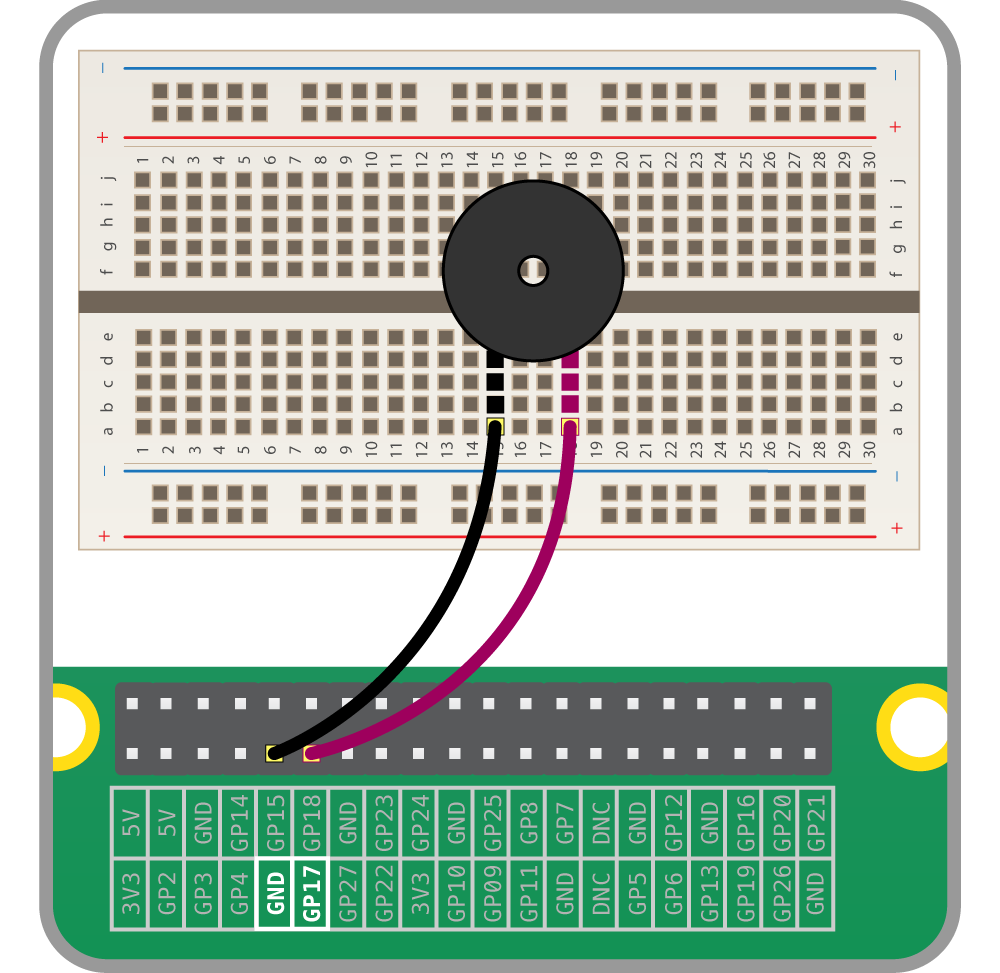

# Buzzers

There are two main types of buzzer: *active* and *passive*.

A *passive* buzzer emits a tone when a voltage is applied across it. It also requires a specific signal to generate a variety of tones. The *active* buzzers are a lot simpler to use, so these are covered here.

## Connecting a buzzer

An *active* buzzer can be connected just like an LED, but as they are a little more robust, you won't be needing a resistor to protect them.

Set up the circuit as shown below:



1. Add `Buzzer` to the `from gpiozero import...` line:

    ```python
    from gpiozero import Buzzer
	from time import sleep
    ```

1. Add a line below your creation of `button` and `lights` to add a `Buzzer` object:

    ```python
    buzzer = Buzzer(17)
    ```

1. In GPIO Zero, a `Buzzer` works exactly like an `LED`, so try adding a `buzzer.on()` and `buzzer.off()` into your loop:

    ```python
    while True:
        buzzer.on()
	    sleep(1)
        buzzer.off()
		sleep(1)

    ```

1. A `Buzzer` has a `beep()` method which works like an `LED`'s `blink`. Try it out:

    ```python
    while True:
        buzzer.beep()
    ```

## What Next?

- Continue to the next worksheet on building a [traffic lights](trafficlights.md) system using GPIO Zero.
