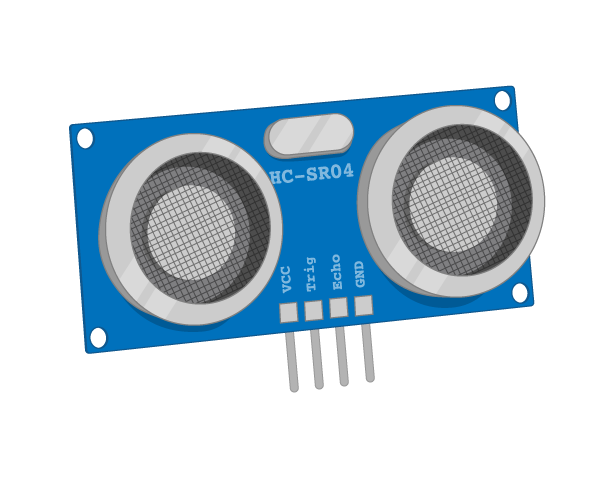
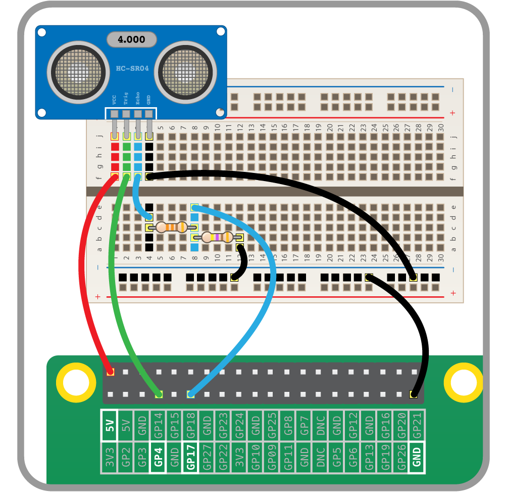

# Ultrasonic distance sensor

In air, sound travels at a speed of 343 metres per second. An ultrasonic distance sensor sends out pulses of ultrasound which are inaudible to humans, and detects the echo that is sent back when the sound bounces off a nearby object. It then uses the speed of sound to calculate the distance from the object.



## Wiring

The circuit connects to two GPIO pins (one for echo, one for trigger), the ground pin, and a 5V pin. You'll need to use a pair of resistors (330Ω and 470Ω) as a potential divider:



## Code

To use the ultrasonic distance sensor in Python, you need to know which GPIO pins the echo and trigger are connected to.

1. Open Python 3.

1. In the shell, enter the following line to import `DistanceSensor` from the GPIO Zero library:

    ```python
    from gpiozero import DistanceSensor
    ```

    After each line, press **Enter** and the command will be executed immediately.

1. Create an instance of `DistanceSensor` using your echo and trigger pins:

    ```python
    ultrasonic = DistanceSensor(echo=17, trigger=4)
    ```

1. See what distance it shows:

    ```python
    ultrasonic.distance
    ```

    You should see a number: this is the distance to the nearest object, in metres.

1. Try using a loop to print the distance continuously, while waving your hand in front of the sensor to alter the distance reading:

    ```python
    while True:
        print(ultrasonic.distance)
    ```

    The value should get smaller the closer your hand is to the sensor. Press **Ctrl + C** to exit the loop.

## Ranges

As well as being able to see the distance value, you can also get the sensor to do things when the object is in or out of a certain range.

1. Use a loop to print different messages when the sensor is in range or out of range:

    ```python
    while True:
        ultrasonic.wait_for_in_range()
        print("In range")
        ultrasonic.wait_for_out_of_range()
        print("Out of range")
    ```

    Now wave your hand in front of the sensor; it should switch between showing the message "In range" and "Out of range" as your hand gets closer and further away from the sensor. See if you can work out the point at which it changes.

1. The default range threshold is 0.3m. This can be configured when the sensor is initiated:

    ```python
    ultrasonic = DistanceSensor(echo=17, trigger=4, threshold_distance=0.5)
    ```

    Alternatively, this can be changed after the sensor is created, by setting the `threshold_distance` property:

    ```python
    ultrasonic.threshold_distance = 0.5
    ```

1. Try the previous loop again and observe the new range threshold.

1. The `wait_for` functions are **blocking**, which means they halt the program until they are triggered. Another way of doing something when the sensor goes in and out of range is to use `when` properties, which can be used to trigger actions in the background while other things are happening in the code.

    First, you need to create a function for what you want to happen when the sensor is in range:

    ```python
    def hello():
        print("Hello")
    ```

    Then set `ultrasonic.when_in_range` to the name of this function:

    ```python
    ultrasonic.when_in_range = hello
    ```

1. Add another function for when the sensor goes out of range:

    ```python
    def bye():
        print("Bye")

    ultrasonic.when_out_of_range = bye
    ```

    Now these triggers are set up, you'll see "hello" printed when your hand is in range, and "bye" when it's out of range.

1. You may have noticed that the sensor distance stopped at 1 metre. This is the default maximum and can also be configured on setup:

    ```python
    ultrasonic = DistanceSensor(echo=17, trigger=4, max_distance=2)
    ```

    Or after setup:

    ```python
    ultrasonic.max_distance = 2
    ```

1. Try different values of `max_distance` and `threshold_distance`.

## What next?

Now you've learned to use an ultrasonic distance sensor, you could:

- Build a proximity sensor alert using a buzzer or a sound file
- Build a Pi camera photo booth which is activated when a person is close enough to the camera
- Build a robot with a distance sensor to stop it bumping into other objects
- Continue to the next worksheet on [analogue inputs](analogue.md)
