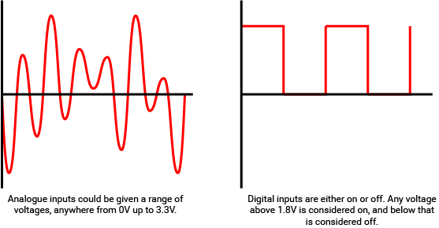
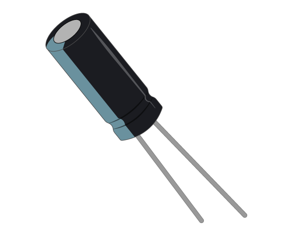
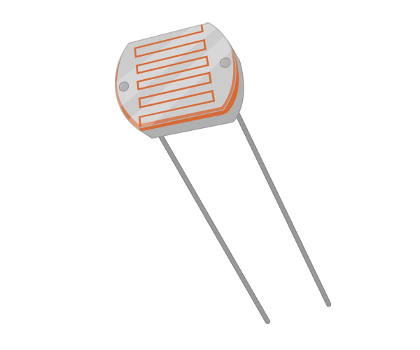
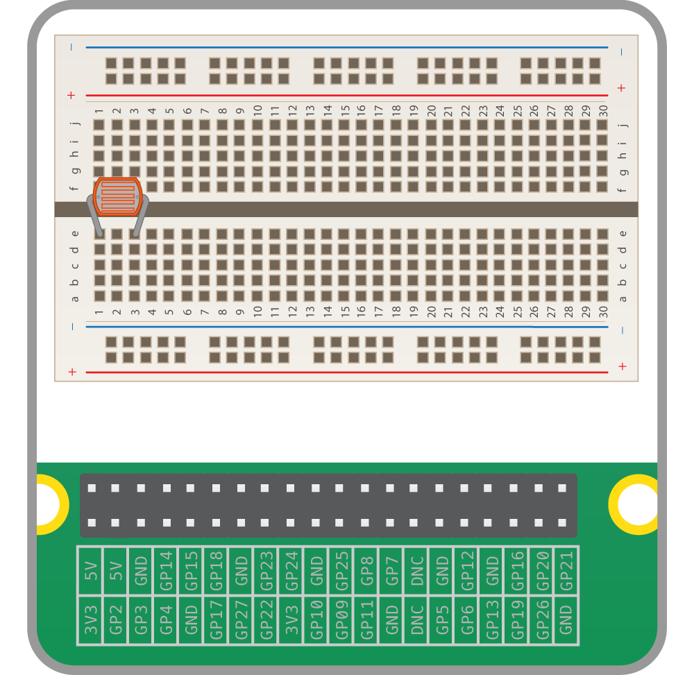
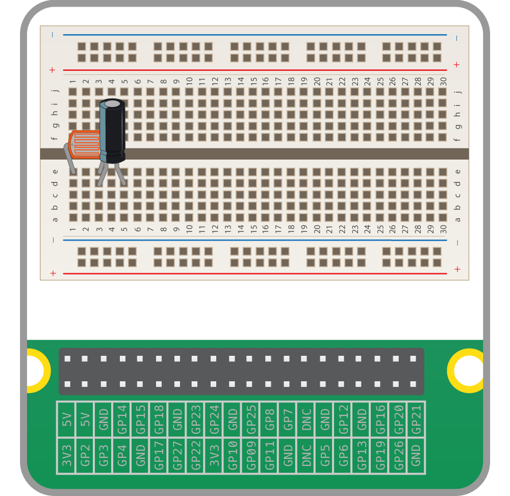
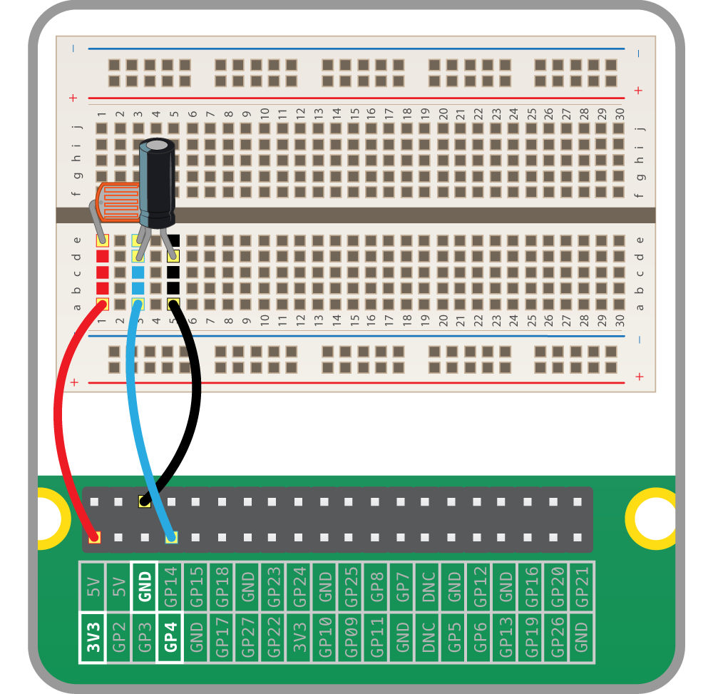

# Light-dependent resistor (LDR)

## Analogue inputs

In the world of electrical engineering, there are two type of input and output (I/O): analogue and digital. Digital I/O is fairly easy to understand; it's either *on* or *off*, *1* or *0*.

When talking about voltages and the Raspberry Pi, any input that is approximately below 1.8V is considered *off* and anything above 1.8V is considered *on*. For output, 0V is off and 3.3V is on.

Analogue I/O is a little trickier. With an analogue input, we can have a range of voltages from 0V up to 3.3V, and the Raspberry Pi is unable to detect exactly what that voltage is.



How, then, can we use a Raspberry Pi to determine the value of an analogue input, if it can only tell when the voltage to a GPIO pin goes above 1.8V?

### Using a capacitor for analogue inputs

Capacitors are electrical components that store charge.



When current is fed into a capacitor, it will begin to store charge. The voltage across the capacitor will start off low, and increase as the charge builds up.

By putting a resistor in series with the capacitor, you can slow the speed at which it charges. With a high resistance, the capacitor will charge slowly, whereas a low resistance will let it charge quickly.

If you time how long it takes the capacitor's voltage to get over 1.8V (or be *on*), you can work out the resistance of the component in series with it.

## Light-dependent resistors

An LDR (sometimes called a photocell) is a special type of resistor.



When light hits the LDR, its resistance is very low, but when it's in the dark its resistance is very high.

By placing a capacitor in series with an LDR, the capacitor will charge at different speeds depending on whether it's light or dark.

## Creating a light-sensing circuit

1.  Place an LDR into your breadboard, as shown below:



1.  Now place a capacitor in series with the LDR. As the capacitor is a polar component, you must make sure the long leg is on the same track as the LDR leg.



1.  Finally, add jumper leads to connect the two components to your Raspberry Pi.



## Coding a light sensor

Luckily, most of the complicated code you would have to write to detect the light levels received by the LDR has been abstracted away by the `gpiozero` library. This library will handle the timing of the capacitor's charging and discharging for you.

Use the following code to set up the light sensor:

```python
  from gpiozero import LightSensor, Buzzer

  ldr = LightSensor(4)  # alter if using a different pin
  while True:
      print(ldr.value)

```

Run this code, then cover the LDR with your hand and watch the value change. Try shining a strong light onto the LDR.

## What Next?

- You could have a go at using your new knowledge of LDRs to build a [laser-tripwire](https://www.raspberrypi.org/learning/laser-tripwire/).
- Continue to the next worksheet on using a [Passive Infra-red Sensor](pir.md)
