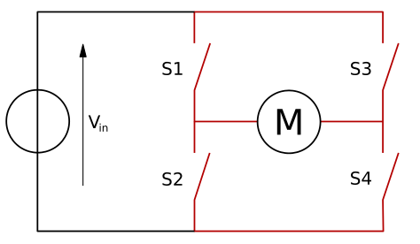
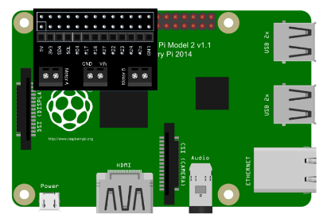
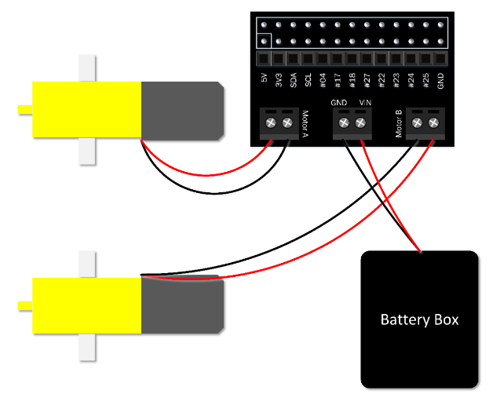

# Motors

Motors are great for physical computing: they allow you to turn a wheel forwards and backwards, or make something spin around.

A motor can't be controlled directly from the Raspberry Pi's GPIO pins, because it needs a variable supply of 5 volts. This means you need to power it separately. However, motor controller add-on boards can be used to provide this functionality.

In this guide, you'll be controlling two motors from your Raspberry Pi using Python on the desktop. First, it's best just to learn how to control the motor. Then, once you have it working, you could easily use your code to drive a Raspberry Pi-powered robot by detaching the monitor, mouse, and keyboard and building a robot around a chassis.

## H bridge

A motor can be driven forwards or backwards depending on which way around current flows through it. However, it would be awkward to have to rewire a motor, every time you want to change the direction it spins. To overcome this issue, motor controller boards include an H bridge. An H bridge uses 4 transistors to allow digital control of which way current flows through the motor. Most H bridges also contain *flyback diodes*. A flyback diode prevents the voltage spike that is generated by the motor when it is no longer powered (but still spinning) from damaging delicate electronics.



*Image credit: [Wikipedia](https://en.wikipedia.org/wiki/H_bridge), CC BY-SA*

## Wiring

You'll need to wire up two motors and your battery pack using the motor controller.

1. With your Pi switched off, mount your motor controller board on the GPIO pins:

    

1. Connect a battery pack to the power ports of the motor controller, connecting the positive (red) battery wire to the positive (+) power terminal on the motor controller, and the negative (black) battery wire to the negative (-) power terminal on the motor controller, and connect two motors:

    

1. You'll need to know which GPIO pins your motor controller uses. Refer to the board's documentation. This will usually be described as Motor A and Motor B, or MA1, MA2, MB1, and MB2. Make a note of these pin numbers. If you're not sure which is which, you can investigate this next.

## Output devices

First, you should learn to control motors by controlling the pins individually.

1. Boot the Pi and open Python 3.

1. In the shell, enter the following line to import `OutputDevice` from the GPIO Zero library:

    ```python
    from gpiozero import OutputDevice
    ```

    After each line, press **Enter** and the command will be executed immediately.

1. Now create an instance of an `OutputDevice` on each of the pins for one motor:

    ```python
    a = OutputDevice(4)
    b = OutputDevice(14)
    ```

1. Now you should be able to make the motor spin by turning one of the pins on:

    ```python
    a.on()
    ```

    The motor should now be spinning! If not, check you are addressing the right pin numbers. The two pins should be connected to the same motor. Also, check your wiring and your batteries.

1. Now try turning that pin off, and turning the other pin on:

    ```python
    a.off()
    b.on()
    ```

    The motor should now be spinning in the opposite direction.

1. To stop the motor, just make sure both pins are off:

    ```python
    a.off()
    b.off()
    ```

1. Now try the same with the second motor:

    ```python
    c = OutputDevice(17)
    d = OutputDevice(27)
    c.on()
    ```

1. And backwards:

    ```python
    c.off()
    d.on()
    ```

1. And stop:

    ```python
    c.off()
    d.off()
    ```

1. Try controlling one of the motors in a loop:

    ```python
    from time import sleep

    for i in range(5):
        b.off()
        a.on()
        sleep(5)
        a.off()
        b.on()
        sleep(5)
    b.off()
    ```

    The motor should now spin forwards for 5 seconds then backwards for 5 seconds, repeat this 5 times, and then stop.

## PWM

So far, you have used simple on/off commands to control your motors. PWM (pulse-width modulation) allows you to control the speed. The `on()` function sets the motor to go at full speed, but you can control this to make the motor go at a fraction of this speed.

1. Since you're going to reuse the same pins in a different way, you'll have to close the connections to the pins. The easiest way to do that is to restart the Python shell by clicking **Shell > Restart shell**.

1. Import the `PWMOutputDevice` class:

    ```python
    from gpiozero import PWMOutputDevice
    ```

1. Create new connections to each of your pins as before, but using `PWMOutputDevice`:

    ```python
    a = PWMOutputDevice(4)
    b = PWMOutputDevice(14)
    c = PWMOutputDevice(17)
    d = PWMOutputDevice(27)
    ```

1. You can still use `a.on()`, `a.off()` and so on, but you can also set the device's value to a number between `0` and `1`. Try half:

    ```python
    a.value = 0.5
    ```

    The motor should now be spinning at half speed.

1. To turn the motor in the opposite direction, turn `a` off (or set its value to `0`) and set `b`'s value to `0.5`:

    ```python
    a.value = 0
    b.value = 0.5
    ```

    The motor should now be spinning backwards at half speed.

1. Try controlling both motors at different speeds to compare:

    ```python
    a.value = 0.5
    b.value = 0
    c.value = 1
    d.value = 0
    ```

1. Try increasing the speed in a loop:

    ```python
    b.off()
    d.off()
    for i in range(1, 11):
        speed = i / 10
        print(speed)
        a.value = speed
        b.value = speed
    ```

    The motors should now speed up from 0 (stopped) to 0.1, 0.2 and up to 1.

    Be aware, though, that the motor may not move until it gets above a certain speed, as there may not be enough power to engage it.

## Motor class

Now you've learned how setting pins high and low can control a motor, you should proceed to using the built-in `Motor` class; this has all the functionality you just learned about, provided in a simple way, including PWM for speed.

1. Restart the shell again (**Ctrl + F6**).

1. Import the `Motor` class:

    ```python
    from gpiozero import Motor
    ```

1. Now create a `Motor` instance using the pin numbers for each motor:

    ```python
    motor1 = Motor(4, 14)
    motor2 = Motor(17, 27)
    ```

    Note: to make it easier to see which pin is which, you can use `Motor(forward=4, backward=14)` for future reference.

1. Now drive one of the motors forward using the following code:

    ```python
    motor1.forward()
    ```

1. And the other backwards:

    ```python
    motor2.backward()
    ```

1. Or try half speed:

    ```python
    motor1.forward(0.5)
    motor2.backward(0.5)
    ```

1. The `Motor` class also allows you to reverse the motor's direction. Try using this loop:

    ```python
    motor1.forward()
    motor2.backward()
    while True:
        sleep(5)
        motor1.reverse()
        motor2.reverse()
    ```

    This will make the motors spin in opposite directions, then switch every five seconds. Press **Ctrl + C** to exit the loop.

1. Now stop the motors:

    ```python
    motor1.stop()
    motor2.stop()
    ```

## Robot class

If you had a robot with two wheels you would want to control the two motors together, rather than separately, just like you did for the two pins of each motor. Luckily, there's also a `Robot` class in GPIO Zero.

1. Restart the shell again (**Ctrl + F6**).

1. Import the `Robot` class:

    ```python
    from gpiozero import Robot
    ```

1. Now create a `Robot` instance using the pin numbers for each motor:

    ```python
    robot = Robot((4, 14), (17, 27))
    ```

    Note: to make it easier to see which pin is which, you can use `Robot(left=(4, 14), right=(17, 27))` for future reference.

1. Now drive one of the motors forward using the following code:

    ```python
    robot.forward()
    ```

    Both motors should now be driving forwards.

1. And backwards:

    ```python
    robot.backward()
    ```

    Both motors should now be driving backwards.

1. Try reverse a few times:

    ```python
    robot.reverse()
    robot.reverse()
    robot.reverse()
    ```

1. Or try half speed:

    ```python
    robot.forward(0.5)
    ```

1. That's not all! What would happen if the left wheel went forwards and the right wheel went backwards? The robot would turn right. Try it:

    ```python
    robot.right()
    ```

1. Then try this:

    ```python
    robot.left()
    ```

1. Now stop the robot:

    ```python
    robot.stop()
    ```

## What next?

Now you've learned how motors work, you can try:

- Making your own robot with our [Build a robot](https://www.raspberrypi.org/learning/robo-butler/) resource
- Making a [spinning flower wheel](https://www.raspberrypi.org/learning/spinning-flower-wheel/)
