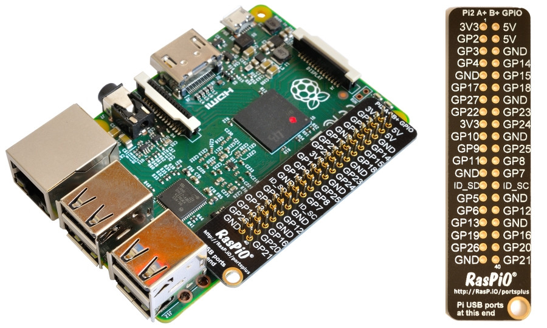
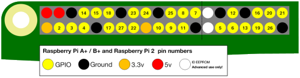
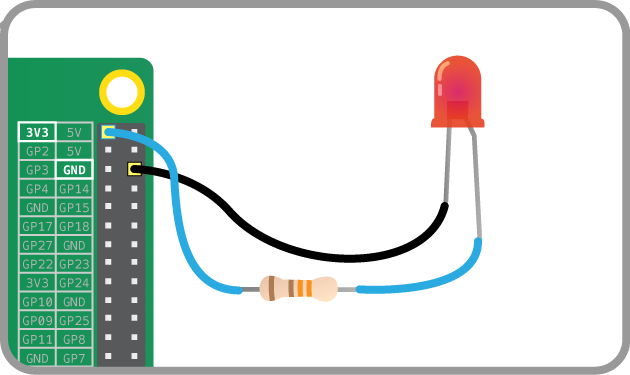
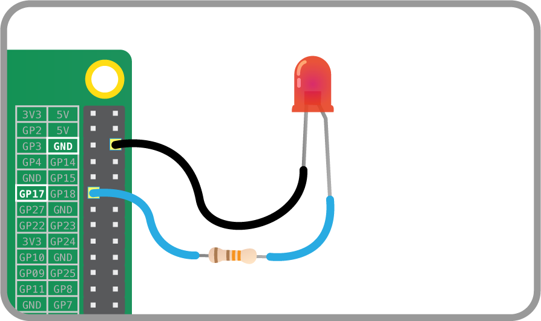
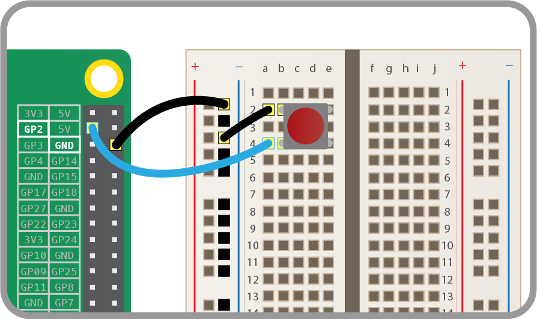

# Getting started with physical computing

## GPIO pins

One powerful feature of the Raspberry Pi is the row of GPIO pins along the top edge of the board. GPIO stands for General-Purpose Input/Output. These pins are a physical interface between the Raspberry Pi and the outside world. At the simplest level, you can think of them as switches that you can turn on or off (input) or that the Pi can turn on or off (output).

The GPIO pins allow the Raspberry Pi to control and monitor the outside world by being connected to electronic circuits. The Pi is able to control LEDs, turning them on or off, run motors, and many other things. It's also able to detect whether a switch has been pressed, the temperature, and light. We refer to this as physical computing.

There are 40 pins on the Raspberry Pi (26 pins on early models), and they provide various different functions.

If you have a RasPiO pin label, it can help to identify what each pin is used for. Make sure your pin label is placed with the keyring hole facing the USB ports, pointed outwards.



If you don't have a pin label, then this guide can help you to identify the pin numbers:



You'll see pins labelled as 3V3, 5V, GND and GP2, GP3, etc:

|   |   |   |
|---|---|---|
| 3V3 | 3.3 volts | Anything connected to these pins will always get 3.3V of power |
| 5V | 5 volts | Anything connected to these pins will always get 5V of power |
| GND | ground | Zero volts, used to complete a circuit |
| GP2 | GPIO pin 2 | These pins are for general-purpose use and can be configured as input or output pins |
| ID_SC/ID_SD/DNC | Special purpose pins ||

**WARNING**: If you follow the instructions, then playing about with the GPIO pins is safe and fun. Randomly plugging wires and power sources into your Pi, however, may destroy it, especially if using the 5V pins. Bad things can also happen if you try to connect things to your Pi that use a lot of power; LEDs are fine, motors are not. If you're worried about this, then you might want to consider using an add-on board such as the [Explorer HAT](https://shop.pimoroni.com/products/explorer-hat) until you're confident enough to use the GPIO directly.

## Lighting an LED

LEDs are delicate little things. If you put too much current through them they will pop (sometimes quite spectacularly). To limit the current going through the LED, you should always use a resistor in series with it.

Try connecting the long leg of an LED to the Pi's 3V3 and the short leg to a GND pin. The resistor can be anything over about 50Ω.



The LED should light up. It will always be on, because it's connected to a 3V3 pin, which is itself always on.

Now try moving it from 3V3 to GPIO pin 17:



The LED should now turn off, but now it's on a GPIO pin, and can therefore be controlled by code.

## Switching an LED on and off

GPIO Zero is a new Python library which provides a simple interface to everyday GPIO components. It comes installed by default in Raspbian.

1. Open IDLE from the main menu (`Menu`>`Programming`>`Python 3 (IDLE)`.

1. You can switch an LED on and off by typing commands directly into the Python interpreter window (also known as the Python **shell**). Let's do this by first importing the GPIO Zero library. You also need to tell the Pi which GPIO pin you are using - in this case pin 17. Next to the chevrons `>>>`, type:

	```python
	from gpiozero import LED
	led = LED(17)
	```
    
	Press **Enter** on the keyboard.

1. To make the LED switch on, type the following and press **Enter**:

	```python
	led.on()
	```

1. To make it switch off you can type:

	```python
	led.off()
	```

1. Your LED should switch on and then off again. But that's not all you can do.

## Flashing an LED

With the help of the `time` library and a little loop, you can make the LED flash.	

1. Create a new file by clicking **File > New file**.

1. Save the new file by clicking **File > Save**. Save the file as `gpio_led.py`.

1. Enter the following code to get started:

    ```python
    from gpiozero import LED
    from time import sleep

    led = LED(17)

    while True:
        led.on()
        sleep(1)
        led.off()
        sleep(1)
    ```

1. Save with **Ctrl + S** and run the code with **F5**.

1. The LED should be flashing on and off. To exit the program press **Ctrl + C** on your keyboard.

## Using buttons to get input

Now you're able to control an output component (an LED), let's connect and control an input component: a button. 

1. Connect a button to another GND pin and GPIO pin 2, like this:

    

1. Create a new file by clicking **File > New file**.

1. Save the new file by clicking **File > Save**. Save the file as `gpio_button.py`.

1. This time you'll need the `Button` class, and to tell it that the button is on pin 2. Write the following code in your new file:

	```python
	from gpiozero import Button
	button = Button(2)
	```

1. Now you can get your program to do something when the button is pushed. Add these lines:

	```python
	button.wait_for_press()
	print('You pushed me')
	```
1. Save with **Ctrl + S** and run the code with **F5**. 
1. Press the button and your text will appear. 

## Manually controlling the LED

You can now combine your two programs written so far to control the LED using the button.

1. Create a new file by clicking **File > New file**.

1. Save the new file by clicking **File > Save**. Save the file as `gpio_control.py`.

1. Now write the following code:

    ```python
    from gpiozero import LED, Button
    from time import sleep
    
    led = LED(17)
    button = Button(2)
    
    button.wait_for_press()
    led.on()
    sleep(3)
    led.off()
    ```
	
1. Save and run your program. When you push the button the LED should come on for three seconds.

## Making a switch

With a switch, a single press and release on the button would turn the LED on, and another press and release would turn it off again.

1. Modify your code so that it looks like this:

	```python
	from gpiozero import LED, Button
	from time import sleep

	led = LED(17)
	button = Button(2)

	while True:
	    button.wait_for_press()
	    led.toggle()
        sleep(0.5)
	```

    `led.toggle()` switches the state of the LED from on to off, or off to on. Since this happens in a loop the LED will turn on and off each time the button is pressed.

1. It would be great if you could make the LED switch on only when the button is being held down. With GPIO Zero, that's easy. There are two methods of the `Button` class called `when_pressed` and `when_released`. These don't block the flow of the program, so if they are placed in a loop, the program will continue to cycle indefinitely.

1. Modify your code to look like this:

    ```python
    from gpiozero import LED, Button
    from signal import pause

    led = LED(17)
    button = Button(2)

    button.when_pressed = led.on
    button.when_released = led.off

    pause()
    ```

1. Save and run the program. Now when the button is pressed, the LED will light up. It will turn off again when the button is released.

## What next?

There are lots of other things you can control or monitor with your Raspberry Pi. Have a look at the worksheets below, to see how easily this can be done.

- [Using an active buzzer](buzzer.md)  
- [Making traffic lights](trafficlights.md)  
- [Using a light-dependent resistor](ldr.md)  
- [Using a PIR Sensor](pir.md)  
- [Using an ultrasonic distance sensor](distance.md)
- [Analogue inputs](analogue.md)
- [Using motors](motors.md)
