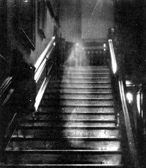

# Ghost-Camera
Raspberry Pi, Pimoroni EnviropHAT ghost camera project

As a child I learnt that to see if  a Ghost is present there are a number of elements that can be checked. 1) Is there a sudden drop in the temperature? 2) Are objects moving or being moved? 3) Are the lights turned on and off ? 
​Pimoroni’s EnviropHAT packs 4 different sensors, letting you measure temperature, pressure, light level, colour, 3-axis motion, compass heading, and analog inputs. They state that “It's ideal for monitoring conditions in your house, garage or galleon. Set up a web server with Flask and remotely monitor everything from anywhere.”
So, you can use the BMP280 temperature/pressure sensor to measure a drop in temperature, the TCS3472 light and RGB colour sensor to pick up any changes in light and then the LSM303D accelerometer/magnetometer sensor for movement, that book being flown across the room.

More content at: http://www.tecoed.co.uk/halloween-2016.html
