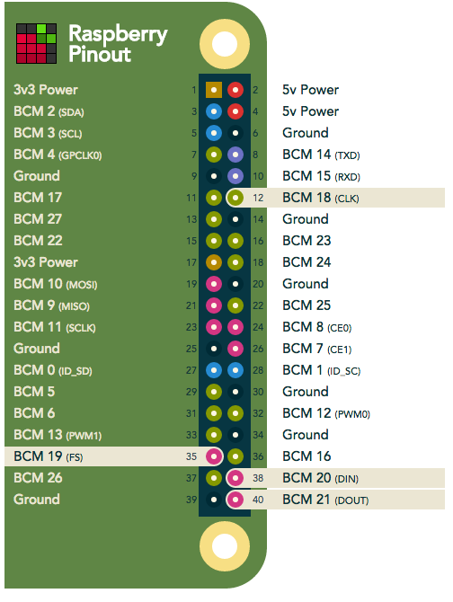
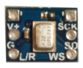

# rpi-i2s
Using the ICS43432 MEMS microphone on a Raspberry Pi with i2s

There has been poor documentation online about using i2s on a RaspberryPi and in particular connecting a MEMs microphone.  There is plenty of discussion but no clear tutorial and/or explaination.  These notes are meant to be a comprehensive way of connecting a microphone to an RPi over i2s.

## Hardware Setup

The following documentation used the ICS43432 MEMs microphone with a breakout board on an RPi 3.  Mirophone documentation can be found [here](https://www.embeddedmasters.com/datasheets/embedded/EMMIC-ICS43432-DS.pdf).  Header pins were soldered to the breakout board.  Unfortunately the breakout board was poorly designed and in order to properly install the header pins, the pin labels were covered.  Regardless, the connection uses Pulse Code Modulation which requires four GPIO pins from the RPi.  The PCM setup can be found [here](https://pinout.xyz/pinout/pcm).  The connection is as follows:



```
Mic - RPi
---------
VCC - 3.3v
Gnd - Gnd
L/R - Gnd (this is used for channel selection. Connect to 3.3 or GND)
SCK - BCM 18 (pin 12)
WS  - BCM 19 (pin 35)
SD  - BCM 20 (pin 38)
```


## Software Requirements

The following is taken from [Paul Creaser's writeup](https://paulcreaser.wordpress.com/2015/11/01/mems-mic-module/).  I've added a bit more how-to description as well as fixed a few typo's in Paul's execution.  They're simple fiexes but for someone who's never compiled a kernal driver, debugging a typo can be annoying.

```
$ cat /etc/os-release
PRETTY_NAME="Raspbian GNU/Linux 8 (jessie)"
NAME="Raspbian GNU/Linux"
VERSION_ID="8"
VERSION="8 (jessie)"
ID=raspbian
ID_LIKE=debian
HOME_URL="http://www.raspbian.org/"
SUPPORT_URL="http://www.raspbian.org/RaspbianForums"
BUG_REPORT_URL="http://www.raspbian.org/RaspbianBugs"
```

### i2s Configuration
Several files need to be modified.  Uncomment ```#dtparam=i2s=on``` in ```/boot/config.txt``` and add ```snd-bcm2835``` to ```/etc/modules```.

```
$ uname -a
Linux raspberrypi 4.4.14-v7+ #896 SMP Sat Jul 2 15:09:43 BST 2016 armv7l GNU/Linux

$ sudo sed -i 's/#dtparam=i2s=on/dtparam=i2s=on/' /boot/config.txt
$ echo 'snd-bcm2835' | sudo tee --append /etc/modules > /dev/null

$ sudo reboot                   # reboot RPi

$ lsmod | grep snd              # confirm modules are loaded
snd_soc_simple_card     6790  0 
snd_soc_bcm2835_i2s     6354  2 
snd_soc_core          125885  2 snd_soc_bcm2835_i2s,snd_soc_simple_card
snd_pcm_dmaengine       3391  1 snd_soc_core
snd_bcm2835            20511  3 
snd_pcm                75698  3 snd_bcm2835,snd_soc_core,snd_pcm_dmaengine
snd_timer              19160  1 snd_pcm
snd                    51844  10 snd_bcm2835,snd_soc_core,snd_timer,snd_pcm
```
### Kernel Compiling

Paul provides some explaination about installing the proper gcc compiler.  I didnt have any propblems with this.

First update and install necessary dependencies:

```
$ sudo apt-get update
$ sudo rpi-update

$ gcc --version
gcc (Raspbian 4.9.2-10) 4.9.2

# mics dependencies that needed to be installed
$ sudo apt-get install bc
$ sudo apt-get install libncurses5-dev

# just for good measure
$ sudo apt-get update
$ sudo rpi-update
```
Get the kernel source and compile.  This takes a very long time on an RPi.  I believe there are ways of doing this on a local machine but I didnt try.  I would recommend installing the application ```sudo apt-get install screen```.  

```
$ sudo wget https://raw.githubusercontent.com/notro/rpi-source/master/rpi-source -O /usr/bin/rpi-source
$ sudo chmod +x /usr/bin/rpi-source
$ /usr/bin/rpi-source -q --tag-update
$ rpi-source
```
> Note: The ```rpi-source``` file downloaded here is different from what Paul used.  It seems there has been an update and the new source is being used above.  Information about ```rpi-source``` can be found [here](https://github.com/notro/rpi-source/wiki).

### Compile the i2S module

Mount the previously compiled kernal and check that the module name matches the source code ```3f203000.i2s```.
```
$ sudo mount -t debugfs debugs /sys/kernel/debug
$ sudo cat /sys/kernel/debug/asoc/platforms
3f203000.i2s
snd-soc-dummy
```

Now get the module and compile against the kernel source code.  The modeule was written by [Paul Creaser](https://github.com/PaulCreaser/rpi-i2s-audio).  In his documentation (and in the code itself), he states to modify the code changing certain names and changing the master/slave mode.  I didnt understand what to change - so I did not change anything and everything seems to work fine.  If someone wants to further elaborate on this please do so!!!

```
$ git clone https://github.com/PaulCreaser/rpi-i2s-audio
$ cd rpi-i2s-audio
$ make -C /lib/modules/$(uname -r )/build M=$(pwd) modules
$ sudo insmod my_loader.ko
```

Verify the module was loaded:
```
$ lsmod | grep my_loader
my_loader               1789  0 

$ dmesg | tail
[    9.777145] Bluetooth: HCI UART protocol H4 registered
[    9.777150] Bluetooth: HCI UART protocol Three-wire (H5) registered
[    9.777251] Bluetooth: HCI UART protocol BCM registered
[    9.946690] Bluetooth: BNEP (Ethernet Emulation) ver 1.3
[    9.946701] Bluetooth: BNEP filters: protocol multicast
[    9.946716] Bluetooth: BNEP socket layer initialized
[36934.903189] request module load 'bcm2708-dmaengine': 0
[36934.903444] register platform device 'asoc-simple-card': 0
[36934.903455] Hello World :)
[36934.921322] asoc-simple-card asoc-simple-card.0: snd-soc-dummy-dai <-> 3f203000.i2s mapping ok
```

### Autoload Module on Startup

Here is the [Linux Kernel Module Programming Guide](http://tldp.org/LDP/lkmpg/2.6/html/lkmpg.html#AEN119) where you can read all about modules in Linux.  A great resource but dont dive in too depp!!!

First copy the ```module.ko``` file to the folder ```/lib/modules/<version>```:
```
$ sudo cp my_loader.ko /lib/modules/$(uname -r)
```
Then you need to add the module to the ```/etc/modules``` list, then reload and reboot!
```
$ echo 'my_loader' | sudo tee --append /etc/modules > /dev/null
$ sudo depmod -a
$ sudo modprobe my_loader
$ sudo reboot
```

### Test

Record a file on the RPi and copy it to my local machine for listening.  My machine recorded only one channel despite the code specifiying two channels.  I'm pretty sure only one channel should work.  Further investigation required.

```
$ arecord -l
**** List of CAPTURE Hardware Devices ****
card 1: sndrpisimplecar [snd_rpi_simple_card], device 0: simple-card_codec_link snd-soc-dummy-dai-0 []
  Subdevices: 1/1
  Subdevice #0: subdevice #0

$ arecord -D hw:1 -c2 -r 48000 -f S32_LE -t wav -v file.wav

# On my local machine - Move file from RPi to local machine for listening
$ scp pi@<local-ip>:/home/pi/file.wav ~/Desktop/file.wav
```
