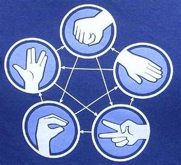

# Rock Paper Scissors Lizard Spock
# Sense-HAT-style
The classic game of Rock Paper Scissors Lizard Spock adapted for the Sense-HAT

[Video of the game in action:] (https://www.youtube.com/watch?v=T_ZvWkMgVFM)

R.P.S.L.S
You will know that Rock-paper-scissors is a hand game usually played between two people, in which each player simultaneously forms one of three shapes with an outstretched hand. These shapes are "rock" (a simple fist), "paper" (a flat hand), and "scissors" (a fist with the index and middle fingers together forming a V). The issue is that the game has only three possible outcomes other than a tie which means it is very easy to predict or guess your opponents hand.  This where the new game comes in, "rock-paper-scissors-Spock-lizard", invented by Sam Kass and Karen Bryla. This version adds "Spock" and "lizard" to the standard three choices. "Spock" is signified with the Star Trek Vulcan salute, while "lizard" is shown by forming the hand into a sock-puppet-like mouth. Spock smashes scissors and vaporizes rock; he is poisoned by lizard and is disproved by paper. Lizard poisons Spock and eats paper; it is crushed by rock and decapitated by scissor making the game more exciting, random and stimulating!

PyGame was used to add joystick controls to enable the player to make a selection, spock, lizard etc. Messages are scrolled to update the player on the game and who has won, the computer or the player. Finally I used SenseHAT Paint and 8x8GridDraw to create the LED images for the game. Watch the video above to learn the rules and see the RPSLS in action, then download the code and have a go yourself.
