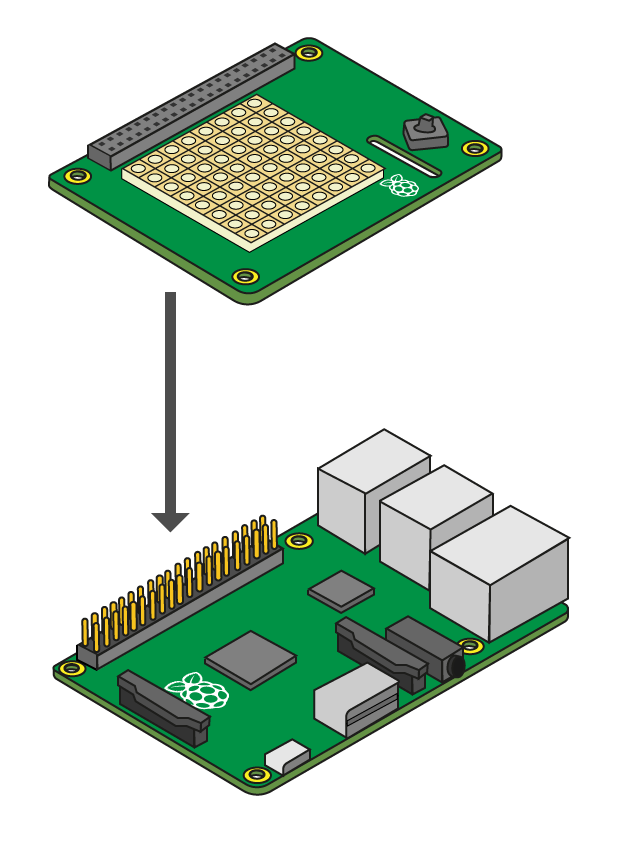

# Assemble the Sense HAT

1. If you have not yet installed the Sense HAT, now is the time to do so. Do this with the Raspberry Pi shut down, disconnected from the mains, and with all other cables disconnected.

1. The Sense HAT comes in a silver anti-static bag, along with the following fixtures and fittings:

  - 1 x GPIO pin extension header
  - 4 x Hexagon stand-offs (female-to-female)
  - 8 x M2.5 screws

  Check that these are all present before proceeding.

1. This diagram shows how it all fits together.

  

1. First, put the GPIO extension header block onto the Raspberry Pi GPIO pins.

1. Screw the hexagon stand-offs to the Raspberry Pi itself, by threading the screws through from the bottom and turning the hexagon stand-offs between finger and thumb.

1. Next, insert the Sense HAT into the GPIO pin extension header. The corner holes should line up with the hexagon stand-offs.

1. Lastly, put the remaining screws through from the top.

1. Use a small Phillips screwdriver to tighten each corner stand-off individually. They don't need to be especially tight, just enough to ensure that the HAT doesn't become loose.
