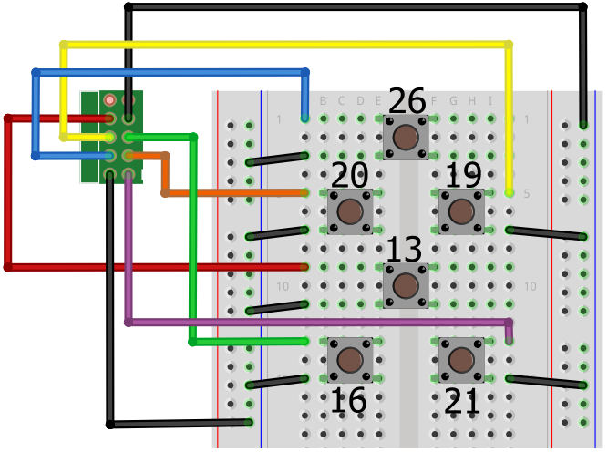

# Flight buttons

The Astro Pi flight case has six general-purpose buttons that you can also use in your programming. These are simply push buttons wired directly to GPIO pins in a pull-up circuit: you can easily recreate this setup using a breadboard, some buttons, and some wires.


## Required items

In order to do this you'll need access to the following items:

- A breadboard
- 6 tactile push buttons
- 14 male-to-female jumper cables
- A 40 pin GPIO stacking header (with the long pins)

    Use this to mount the Sense HAT onto the Raspberry Pi instead of the one you received with the HAT. Then you'll have the GPIO pins protruding through the HAT, so that jumper cables can be attached to the breadboard.

    Try [Toby Electronics](http://www.toby.co.uk/content/catalogue/products.aspx?series=REF-18xxxx-0x), part number REF-182684-02.

## GPIO mapping

The buttons are wired to the last six pins at the bottom of the GPIO header pins on the Pi.


Note the orientation of the pin diagram is with the Ethernet and USB ports facing downwards, and the row of pins on the right-hand side of the Pi.

This means that this setup cannot be exactly replicated if you're using an old model A or B Pi. If you're using an older model you can choose other pins, but be sure to modify the pin numbering in your code so that it will work on a flight unit before you submit via the competition website.

These are the pin assignments:

- Top quad
    - UP: GPIO 26, pin 37
    - DOWN: GPIO 13, pin 33
    - LEFT: GPIO 20, pin 38
    - RIGHT: GPIO 19, pin 35
- Bottom pair
    - A (left): GPIO 16, pin 36
    - B (right): GPIO: 21, pin 40

If you use these buttons in your Astro Pi competition entry, then you'll need to comply with these pin assignments in order for your code to work on the flight hardware that Tim Peake will have on the ISS.

## Breadboard wiring

GPIO pins can be set up as an input or an output. Output mode is used when you want to supply voltage to a device like an LED or buzzer. With input mode, a GPIO pin has a value that we can read in our code. If the pin has voltage going into it, the reading would be 1 (`HIGH`); if the pin was connected directly to ground (no voltage), the reading would be 0 (`LOW`).

The goal is to use a push button to switch voltage on and off for a GPIO pin, thus making the pin's reading change in our code when we press the button.

When a GPIO pin is in input mode the pin is said to be **floating**, meaning that it has no fixed voltage level. That's no good for what we want, as the pin will randomly float between `HIGH` and `LOW`. For this job, we need to know exactly whether the button is up or down, so we need to fix the voltage level to `HIGH` or `LOW`, and then make it change only when the button is pressed.

The flight hardware buttons are all wired in a **pull-up** configuration, which means we pull the GPIO to `HIGH` and only short it to `LOW` when we press the button.

So `HIGH` means the button is **up** and `LOW` means the button is **down**.

Fortunately, the Raspberry Pi has all the required circuitry built in; we can select a **pull-up** configuration in our code for each GPIO pin, which sets up some internal circuitry for us. You can get away with just using two jumper wires per button.

The diagram below shows how to wire up the six buttons on a breadboard so that they match the flight hardware. As always, wire colour doesn't matter. The numbers next to each button indicate the GPIO pin that they're connected to. Every button requires one side to be connected to ground, so that the `HIGH` GPIO pin can be shorted to `LOW` when the button is pressed.




## Detect a button press in code

You might be expecting to use the `RPi.GPIO` or `gpiozero` libraries to detect the button presses. You *could* do it this way, but this makes it difficult when you want your code to handle [joystick](joystick.md) *and* button events at the same time. To make it easier, there's a device tree overlay that causes the buttons to type `u`, `d`, `l`, `r`, `a` and `b` (up, down, left, right, a, b) when you press them.

**This is how the Astro Pis on the ISS work, and it's the way we recommend your code behaves if you're participating in a competition.**

Once you have all the buttons wired up, start up your Raspberry Pi with a monitor, keyboard and mouse connected. We need to download some files and change a few configuration settings. Firstly, download the device tree overlay that maps the push buttons to corresponding keyboard keys. Open a terminal and enter these commands:

```bash
cd /boot/overlays
sudo wget https://github.com/raspberrypilearning/astro-pi-guide/raw/master/inputs-outputs/dtb/astropi-keys.dtbo --no-check-certificate
ls
```

Check that the file `astropi-keys.dtbo` is now showing in the list of files.

Next, we need to configure `config.txt` to load this overlay:

```bash
sudo nano /boot/config.txt
```

Go to the bottom of the file and enter the line below:

```bash
dtoverlay=astropi-keys
```

Press `Ctrl - O` then `Enter` to save, followed by `Ctrl - X` to quit.

Now reboot the Astro Pi:

```bash
sudo reboot
```

Now let's download and run a Python test program to check everything is working. The test code uses [Pygame](http://pygame.org/wiki/tutorials), so please do this on the Raspberry Pi's own screen and not via remote access. Open a terminal and enter these commands:

```bash
cd ~
wget https://github.com/raspberrypilearning/astro-pi-guide/raw/master/inputs-outputs/test_code/pygame_test.py --no-check-certificate
chmod +x pygame_test.py
./pygame_test.py
```

Waggle the joystick and press all the push buttons. If everything is working, the joystick should give a direction indication and the buttons will show the corresponding letter on the LED matrix. Press `Escape` to exit.

## Try it yourself

1. Open **Python 3** from a terminal window as `sudo` by typing:

    ```bash
    sudo idle3 &
    ```

1. A Python Shell window will now appear.

1. Select `File > New Window`.

1. Type in the following code:

    ```python
    import pygame
    
    from pygame.locals import *
    from sense_hat import SenseHat
    
    pygame.init()
    pygame.display.set_mode((640, 480))
    
    sense = SenseHat()
    sense.clear()
    
    running = True
    
    while running:
        for event in pygame.event.get():
            if event.type == KEYDOWN:
                if event.key == K_ESCAPE:
                    running = False
                elif event.key == K_u:
                    sense.clear(255, 0, 0)
                elif event.key == K_d:
                    sense.clear(0, 255, 0)
                elif event.key == K_l:
                    sense.clear(0, 0, 255)
                elif event.key == K_r:
                    sense.clear(255, 255, 0)
                elif event.key == K_a:
                    sense.clear(255, 0, 255)
                elif event.key == K_b:
                    sense.clear(0, 255, 255)
            if event.type == QUIT:
                running = False
    ```

Notice that we've got the code at the top that sets up the pull-up resistors on the GPIO pins, but further down we're just looking for keyboard keys being pressed, which is what the device tree overlay `astropi-keys.dtb` does.

1. Select `File > Save` and choose a file name for your program.

1. Then select `Run > Run module`.

1. The LED matrix should change to a different colour when each button is pressed. Press `Escape` to exit.

1. Why not try making the joystick change the colours too? Check for `event.key` having these values:

  - `K_UP`
  - `K_DOWN`
  - `K_LEFT`
  - `K_RIGHT`
  - `K_RETURN`
