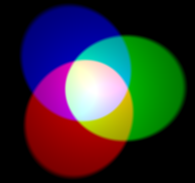
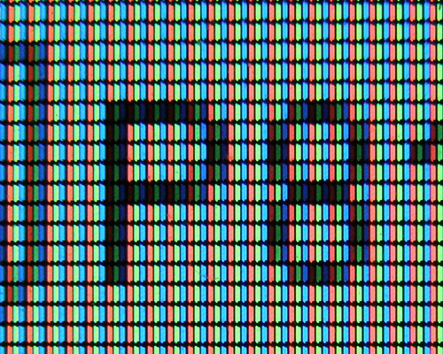
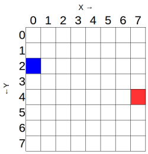

# LED Matrix

The Sense HAT LED matrix contains 64 multi-colour LEDs. Each of the 64 LEDs actually have three smaller LEDs inside them, just like a pixel on a TV, monitor or smartphone screen.

## Simple colour mixing



In additive colour mixing three colours: red, green, and blue are used to make other colours. In the image above, there are three spotlights of equal brightness, one for each colour. In the absence of any colour the result is black. If all three colours are mixed, the result is white. When red and green combine, the result is yellow. When red and blue combine, the result is magenta. When blue and green combine, the result is cyan. It's possible to make even more colours than this by varying the brightness of the three original colours used.

1. Click on `Menu` > `Programming` > `Python 3 (IDLE)` to open a new Python shell.

1. Select `File > New Window`.

1. Type in the following code:

    ```python
    from sense_hat import SenseHat

    sense = SenseHat()

    r = 255
    g = 255
    b = 255

    sense.clear((r, g, b))
    ```

1. Select `File > Save` and choose a file name for your program.

1. Then select `Run > Run module`.

1. The LED matrix will then go bright white.

<iframe src="https://trinket.io/embed/python/a588ddedcf" width="100%" height="600" frameborder="0" marginwidth="0" marginheight="0" allowfullscreen></iframe>

1. The variables `r`, `g` and `b` represent the colours red, green, and blue. The numbers they contain specify how bright each colour should be; they can be between 0 and 255. In the above code the maximum value for each colour has been used, so the result is white.

1. Change the values to specify 255 red but 0 green and blue, then run the code again.

1. What other colours can you make?

## Changing foreground and background colours

This colour mixing system is used throughout the Astro Pi programming module. You can use colour mixing to great effect by programming scrolling text. In this example, you can set the colour of the text that will appear on the matrix.

1. Type the following code into a new file:

    ```python
    from sense_hat import SenseHat

    sense = SenseHat()

    sense.show_message("Hello my name is Tim Peake", text_colour=(255, 0, 0))
    ```

    *Note the syntax `, text_colour=(255, 0, 0)`. Don't forget the comma!*

1. You can also modify the background colour for the message like so:

    ```python
    from sense_hat import SenseHat

    sense = SenseHat()

    sense.show_message("Hello my name is Tim Peake", text_colour=(255, 255, 0), back_colour=(0, 0, 255))
    ```

    *Note: The comma is important, don't forget it!*
    

<iframe src="https://trinket.io/embed/python/c77e0ee071" width="100%" height="600" frameborder="0" marginwidth="0" marginheight="0" allowfullscreen></iframe>

## Pixels

This image shows the pixels on a laptop LCD screen. You can see that the pixels are turned on and off to form the pattern of letters and numbers.



This is how all computer and smartphone screens work. If you want to make recognisable shapes on the LED matrix this is what you also need to do. You only have a resolution of 8 by 8 pixels to work with on the Sense HAT LED matrix though, so you must make shapes and icons that will look quite blocky. This can be a nice challenge!

1. Select `File > New Window`.

1. Type in the following code:

    ```python
    from sense_hat import SenseHat

    sense = SenseHat()

    sense.clear()

    x = 0
    y = 0

    sense.set_pixel(x, y, 255, 255, 255)
    ```

1. Select `File > Save` and choose a file name for your program.

1. Then select `Run > Run module`.

1. This will turn one LED in the corner white.

    <iframe src="https://trinket.io/embed/python/72b218f5b5" width="100%" height="600" frameborder="0" marginwidth="0" marginheight="0" allowfullscreen></iframe>

1. Remember that you can change the colour if you wish.

## Using coordinates to set pixels

The `x` and `y` variables can be used to control which individual LED the `set_pixel` command should change. **X** is horizontal and ranges from `0` on the *left* to `7` on the *right*. **Y** is vertical and ranges from `0` at the *top* to `7` on the *bottom*. Therefore, an `x, y` coordinate of `0, 0` is the *top left* and an `x, y` coordinate of `7, 7` is the *bottom right*.



You can get a different colour in each corner of the LED matrix. You will need to use the `set_pixel` command multiple times in your code like this:

```python
from sense_hat import SenseHat

sense = SenseHat()

sense.clear()
sense.set_pixel(0, 0, 255, 0, 0)
sense.set_pixel(0, 7, 0, 255, 0)
sense.set_pixel(7, 0, 0, 0, 255)
sense.set_pixel(7, 7, 255, 0, 255)
```

<iframe src="https://trinket.io/embed/python/78c2595904" width="100%" height="600" frameborder="0" marginwidth="0" marginheight="0" allowfullscreen></iframe>

## Drawing shapes and patterns on the LED matrix

You may be tempted to try and draw shapes or patterns using the `set_pixel` command over and over in your code. There is a `set_pixels` command though, and with it you can change all 64 LEDs using one line of code! For example, you could draw a Minecraft creeper face on the LED Matrix:

```python
from sense_hat import SenseHat

sense = SenseHat()

O = (0, 255, 0) # Green
X = (0, 0, 0) # Black

creeper_pixels = [
    O, O, O, O, O, O, O, O,
    O, O, O, O, O, O, O, O,
    O, X, X, O, O, X, X, O,
    O, X, X, O, O, X, X, O,
    O, O, O, X, X, O, O, O,
    O, O, X, X, X, X, O, O,
    O, O, X, X, X, X, O, O,
    O, O, X, O, O, X, O, O
]

sense.set_pixels(creeper_pixels)
```

<iframe src="https://trinket.io/embed/python/d6ccea808e" width="100%" height="600" frameborder="0" marginwidth="0" marginheight="0" allowfullscreen></iframe>

You can even use more than two colours, like in this example of Steve from Minecraft:

```python
from sense_hat import SenseHat

sense = SenseHat()

B = (102, 51, 0)
b = (0, 0, 255)
S = (205,133,63)
W = (255, 255, 255)

steve_pixels = [
    B, B, B, B, B, B, B, B,
    B, B, B, B, B, B, B, B,
    B, S, S, S, S, S, S, B,
    S, S, S, S, S, S, S, S,
    S, W, b, S, S, b, W, S,
    S, S, S, B, B, S, S, S,
    S, S, B, S, S, B, S, S,
    S, S, B, B, B, B, S, S
]

sense.set_pixels(steve_pixels)
```

## Loading images from files

Instead of setting the LED matrix, you may wish to use images which are loaded from files. This is a convenient option if you want to have lots of stock images, for example international flags.

1. Use any graphics editing tool (on Windows, OS X or Linux) to create the files. As long as they are saved onto the Raspberry Pi's SD card as `JPEG` or `PNG`, and are 8 x 8 pixels in size, then they can be loaded directly to the LED matrix with a single command.

1. Open the *File Manager* on the Raspberry Pi using `Menu > Accessories > File Manager`.

1. Browse into the `astro-pi-hat` folder followed by `examples`. There should be a file named `space_invader.png` which you can double-click.

1. Load the image onto the Sense Hat LED matrix by using the `load_image` function, which needs the file system path to the file you want to load. So for `space_invader.png` the full path is `/home/pi/astro-pi-hat/examples/space_invader.png`.

    Here is the code:

    ```python
    from sense_hat import SenseHat

    sense = SenseHat()

    sense.load_image("/home/pi/astro-pi-hat/examples/space_invader.png")
    ```
