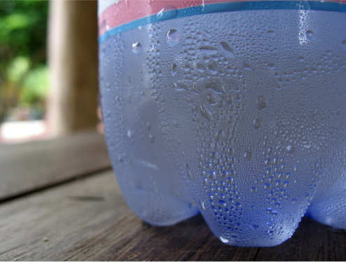

# Humidity

The Sense HAT features a number of sensors, one of which is a humidity sensor that measures the amount of water in the air.

## What does humidity mean?

- Humidity is the amount of water vapour in the air.
- Water vapour is the gaseous state of water.

The amount of water vapour suspended in the air is dependent on temperature.

- The higher the temperature, the more water vapour can be suspended in the air.
- The lower the temperature, the less water vapour can be suspended.

    

When you take a cold can or bottle out of the fridge you see water appearing on it. This happens because the cold bottle is cooling the air around it, causing the air to be less capable of suspending water vapour. This then causes the water vapour that can't be suspended to turn back into liquid water. This is called *condensation*. So, given this information, we next need to understand that there are two ways that we can measure humidity:

- *Absolute* humidity is the total mass of water vapour suspended in a given volume of air. Temperature is not taken into consideration. It's usually expressed as grams of water per cubic metre of air.
- *Relative* humidity, however, is expressed as a percentage. For any given air temperature there is a maximum amount of water vapour that it can suspend. Relative humidity is the percentage of actual water vapour present, compared to the maximum possible amount.

A known amount of water vapour will result in different relative humidity readings, depending on the temperature of the air and the ability of the air to suspend it. So a low air temperature might give a high relative humidity reading because the air can't suspend much more water vapour. Increasing the temperature of the air and keeping the same amount of water vapour will cause the relative humidity reading to drop, because the maximum amount of water vapour that *could* be suspended has increased.

The Sense HAT gives you the humidity measurement as relative humidity. This is why the humidity sensor also has a temperature sensor built in.

## what is the current humidity?

1. Click on `Menu` > `Programming` > `Python 3 (IDLE)` to open a new Python shell.

1. Select `File > New Window` and enter the following code:

    ```python
from sense_hat import SenseHat

sense = SenseHat()
sense.clear()

humidity = sense.get_humidity()
print(humidity)
    ```

1. Select `File > Save` and choose a file name for your program.

1. Select `Run > Run module`.

1. If you see the error `Humidity Init Failed, please run as root / use sudo` on the last line in red, it means you haven't followed the instructions above. Close everything and go back to step 1.

1. You should see something like this:

    ```bash
    Humidity sensor Init Succeeded
    34.6234588623
    ```

    <iframe src="https://trinket.io/embed/python/cd35fdd905" width="100%" height="600" frameborder="0" marginwidth="0" marginheight="0" allowfullscreen></iframe>

1. Just before the `print(humidity)` line add this line below:

    ```python
    humidity = round(humidity, 1)
    ```

1. You should now see something like this, without all the numbers after the decimal point:

    ```bash
    Humidity sensor Init Succeeded
    34.6
    ```

## Monitoring humidity over time

1. It would be good to monitor the humidity as it changes, so let's put your code into a `while` loop and run it again:

    ```python
    while True:
        humidity = sense.get_humidity()
        humidity = round(humidity, 1)
        print(humidity)
    ```

1. Exhale slowly onto the sensors. The water vapour in your breath should cause the readings to jump up.

1. Keep watching and it should slowly fall back to the background humidity of the room.

1. Press `Ctrl + C` to stop the program.

## Display the humidity on the LED matrix

Think about how you might use the matrix to display the humidity. One way is to divide 64 (the number of LEDs in the matrix) by 100, then multiply that by the percentage of relative humidity, which gives you the number of LEDs you should turn on. 100%, for example, would be all 64 LEDs turned on. To do this, you need to build up a pixel list of the right number of light vs. dark pixels, and then call the `set_pixels` function.

Here is some example code (notice that you have to clamp the humidity measurement to 100):

```python
from sense_hat import SenseHat

sense = SenseHat()
sense.clear()

on_pixel = [255, 0, 0]
off_pixel = [0, 0, 0]

while True:
    humidity = sense.get_humidity()
    humidity = round(humidity, 1)

    if humidity > 100:
        humidity = 100.0

    pixels = []
    on_count = int((64 / 100.0) * humidity)
    off_count = 64 - on_count

    pixels.extend([on_pixel] * on_count)
    pixels.extend([off_pixel] * off_count)

    sense.set_pixels(pixels)
```

<iframe src="https://trinket.io/embed/python/0b0d578bcf" width="100%" height="600" frameborder="0" marginwidth="0" marginheight="0" allowfullscreen></iframe>

**Please note that it is possible to get a value higher than 100 from the humidity sensor.**
