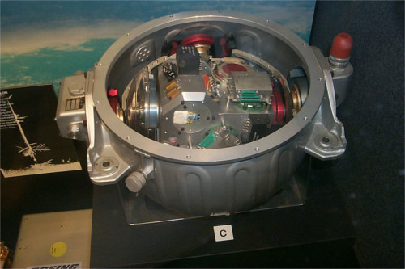
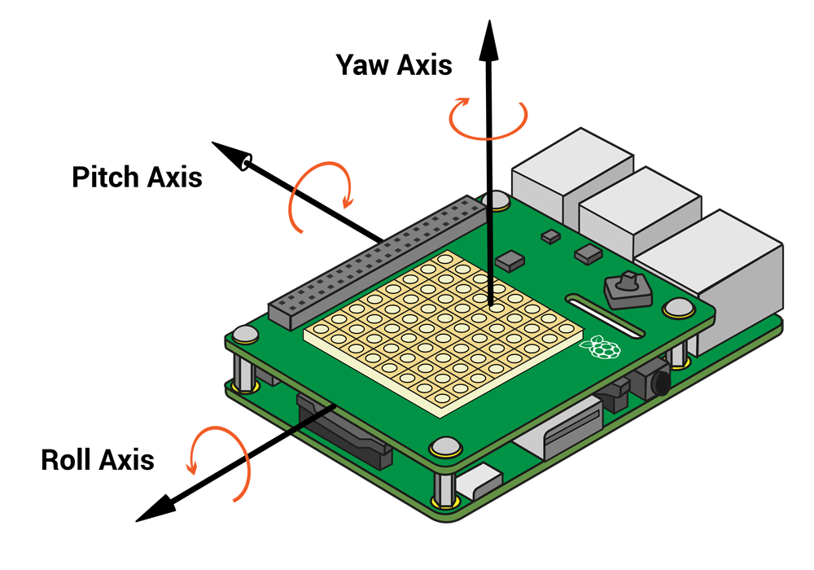
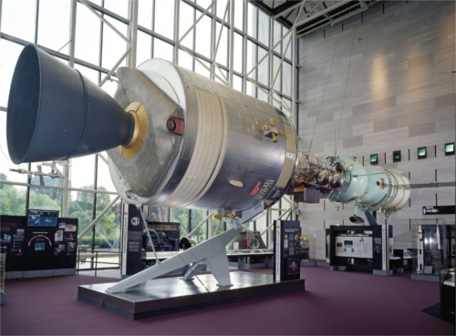

# Movement

The Sense HAT has a movement sensor called an IMU, which can measure the kind of movement it is experiencing.

## What is an IMU?

IMU stands for Inertial Measurement Unit. It's actually three sensors in one:

- A gyroscope (measures momentum and rotation)
- An accelerometer (measures acceleration forces and can be used to find the direction of gravity)
- A magnetometer (measures the Earth's own magnetic field, so it's a bit like a compass)



Why is a movement sensor important, though? When you're up in space there is one question of absolute importance to which you must always know the answer: **which way am I pointing?**

If you don't know your orientation you are in big trouble, so an IMU sensor like this one is used on all manned and unmanned spacecraft to track movements and maintain an understanding of orientation. Even the earliest spacecraft had them. Ask your grandparents if they remember the [Apollo missions](http://en.wikipedia.org/wiki/Apollo_program) that landed humans on the surface of the moon.

Above is a picture of the IMU sensor from the Apollo command module. You'll notice how big it is compared to the tiny black cube on the Astro Pi; that's the difference between 1975 and 2015 technology. Incidentally, the Astro Pi IMU is probably not as accurate as the Apollo one, however it is a million times cheaper!

**Note that the IMU is not currently supported within trinket.io, so can't be emulated at this time**

## How is orientation represented?

We all know the Earth rotates around an axis that runs between the North and South Poles. All objects in space or otherwise have *three* axes around which they can rotate. If you know how much rotation has happened on each axis, then you know which way the object is pointing.

The three axes are:

- **Pitch** (like a plane taking off)
- **Roll** (the plane doing a victory roll)
- **Yaw** (imagine steering the plane like a car)

Watch this short [video](https://www.youtube.com/watch?v=pQ24NtnaLl8) that shows where these axes are in relation to a plane. Try to imagine the plane pointing in any random direction. To get the plane into that position, you can rotate it by a known amount around each axis to get it to the orientation that you imagined.



The image above shows where these axes are in relation to the Sense HAT.

Let's download and run a 3D demo program to explore this.

## Apollo-Soyuz Demo

The image below shows the Apollo-Soyuz module that was formed when the USA and USSR met in orbit around the earth in 1975. The 3D demo we're going to play with shows this same spacecraft (but with less detail).



You will need to have your Raspberry Pi and Sense HAT connected to the internet in order to download the required software.

Enter the commands below into a terminal window:

```bash
sudo apt-get install python3-pip
sudo pip-3.2 install pi3d
git clone git://github.com/astro-pi/apollo-soyuz
cd apollo-soyuz
sudo ./soyuz.py
```

Pi 1 users will have to wait 3 to 4 minutes for this to load. For Pi 2 users it's about 30 seconds. When you see the spacecraft appear on the screen start moving the Raspberry Pi and Sense HAT around with your hands. The the main booster is where the SD card slot is on your Pi.

See if you can get the spacecraft to do the pitch, roll and yaw movements. Refer back to the [video](https://www.youtube.com/watch?v=pQ24NtnaLl8) if you need to remind yourself which is which.

The code behind this demo is basically calling the Sense HAT `get_orientation` function which accesses the IMU sensor. This then returns three angles between 0 and 360 degrees, one for each axis (pitch, roll and yaw). The spacecraft model is then rotated by those angles so that it points in the same direction. This is all repeating over and over very quickly to maintain the orientation of the model with what the IMU is reporting.

Press `Esc` to exit the demo. Let's try a simpler version of this ourselves in code.

## Which way am I pointing?

1. Click on `Menu` > `Programming` > `Python 3 (IDLE)` to open a new Python shell.


1. Select `File > New Window` and enter the following code:

    ```python
	from sense_hat import SenseHat
	sense = SenseHat()
	sense.clear()

	o = sense.get_orientation()
	pitch = o["pitch"]
	roll = o["roll"]
	yaw = o["yaw"]
	print("pitch {0} roll {1} yaw {2}".format(pitch, roll, yaw))
    ```

1. Select `File > Save` and choose a file name for your program.

1. Select `Run > Run module`.

1. If you see the error `IMU Init Failed, please run as root / use sudo` on the last line in red, it means you haven't followed the instructions above. Close everything and go back to step 1.

1. You should now see something like this:

    ```
    IMU Init Succeeded
    pitch 356.35723002363454 roll 303.4986602798494 yaw 339.19880231669873
    ```

	<iframe src="https://trinket.io/embed/python/c2009c972b" width="100%" height="600" frameborder="0" marginwidth="0" marginheight="0" allowfullscreen></iframe>


1. We don't need all the numbers after the decimal point so let's round them off. Just before the `print("pitch %s roll %s yaw %s" % (pitch, roll, yaw))` line, add these lines below:

    ```python
    pitch = round(pitch, 1)
    roll = round(roll, 1)
    yaw = round(yaw, 1)
    ```

## Monitor movement over time

1. It would be good to monitor the axis values changing during movements, so let's put your code into a `while` loop and run it again:

    ```python
	while True:
		o = sense.get_orientation()
		pitch = o["pitch"]
		roll = o["roll"]
		yaw = o["yaw"]

		pitch = round(pitch, 1)
		roll = round(roll, 1)
		yaw = round(yaw, 1)

		print("pitch {0} roll {1} yaw {2}".format(pitch, roll, yaw))
    ```

1. Move the Pi around in your hand and you should see the numbers changing. See if you can just make one axis change by moving only in the pitch direction for example. Do this for all three axes. Press `Ctrl - C` to stop the program.

	<iframe src="https://trinket.io/embed/python/5eae2e7b33" width="100%" height="600" frameborder="0" marginwidth="0" marginheight="0" allowfullscreen></iframe>

## Display orientation on the LED matrix

1. Displaying something which is 3D in a 2D way is always a challenge, especially when your screen is only 8 x 8 pixels in size. One way which might work well is to have one LED for each axis and then make them move in different ways. For example:

    - The pitch LED could go up and down
    - The roll LED could go side to side
    - The yaw LED could chase around the edge

1. Here is a clever trick you can do. The table below shows the sequential LED numbers laid out in horizontal rows.

    0 |  1 |  2 |  3 |  4 |  5 |  6 |  7
    --- | --- | --- | --- | --- | --- | --- | ---
    8 |  9 | 10 | 11 | 12 | 13 | 14 | 15
    16 | 17 | 18 | 19 | 20 | 21 | 22 | 23
    24 | 25 | 26 | 27 | 28 | 29 | 30 | 31
    32 | 33 | 34 | 35 | 36 | 37 | 38 | 39
    40 | 41 | 42 | 43 | 44 | 45 | 46 | 47
    48 | 49 | 50 | 51 | 52 | 53 | 54 | 55
    56 | 57 | 58 | 59 | 60 | 61 | 62 | 63

    For any of those numbers you can convert them into their X Y coordinate using the code below.

    ```python
    y = number // 8
    x = number % 8
    ```

    For the `y` value you floor divide `//` the number by 8. This is integer division and ignores the remainder. Then for the `x` value you do the modulus `%` of 8 which gives you **only** the remainder.

    For example (using the number 60 which is on the bottom row):
    - `60 // 8 = 7`
    - `60 % 8 = 4`

1. Try this code:

    ```python
    number = 60

    y = number // 8
    x = number % 8

    sense.set_pixel(x, y, 255, 255, 255)
    ```

1. The clever trick is to make a list containing the LED numbers for the path you want it to move back and forth through. So say you want to make an LED chase around the edge you would read the numbers accross the top of the table, down the right hand side, backwards along to bottom and up the left side. So it would be:

    ```python
    edge = [0, 1, 2, 3, 4, 5, 6, 7, 15, 23, 31, 39, 47, 55, 63, 62, 61, 60, 59, 58, 57, 56, 48, 40, 32, 24, 16, 8]
    ```

    We can then find the length of the list using the `len` function:

    ```python
    length = len(edge)
    ```

    So the length is 28. If we divide 28 by 360 we have a ratio between, say, the yaw measurement and the positions in our list (how far around the edge we are). We can then get the sequential pixel number out of the list at the calculated position, work out its coordinate and then switch the LED on! Like this:

    ```python
	from sense_hat import SenseHat

	sense = SenseHat()
	sense.clear()

	edge = [0, 1, 2, 3, 4, 5, 6, 7, 15, 23, 31, 39, 47, 55, 63, 62, 61, 60, 59, 58, 57, 56, 48, 40, 32, 24, 16, 8]
	length = len(edge)
	ratio = length / 360.0

	while True:
		o = sense.get_orientation()
		pitch = o["pitch"]
		roll = o["roll"]
		yaw = o["yaw"]

		yaw_list_position = int(yaw * ratio)

		yaw_pixel_number = edge[yaw_list_position]

		y = yaw_pixel_number // 8
		x = yaw_pixel_number % 8

		sense.set_pixel(x, y, 255, 255, 255)
    ```


	<iframe src="https://trinket.io/embed/python/cd6cd1ec54" width="100%" height="600" frameborder="0" marginwidth="0" marginheight="0" allowfullscreen></iframe>

1. What you'll notice is that the above code only turns LEDs on, you'll need to figure out how to turn them off yourself. Try having a variable for the previous `x` and `y` from the last time around the loop and if this is different from the new `x` and `y` you use `set_pixel` to set the LED to black.
