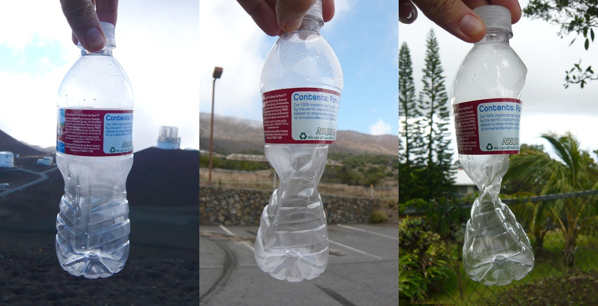
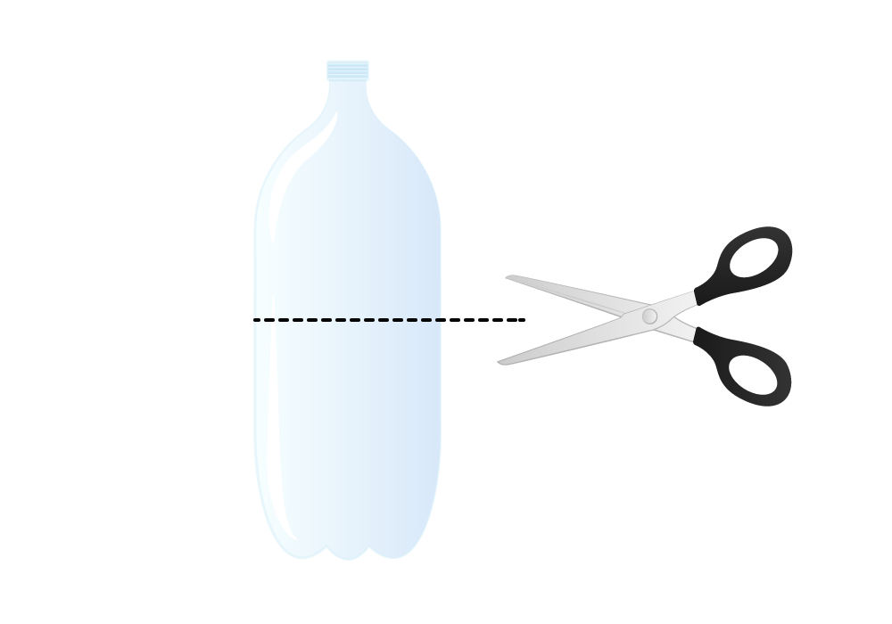
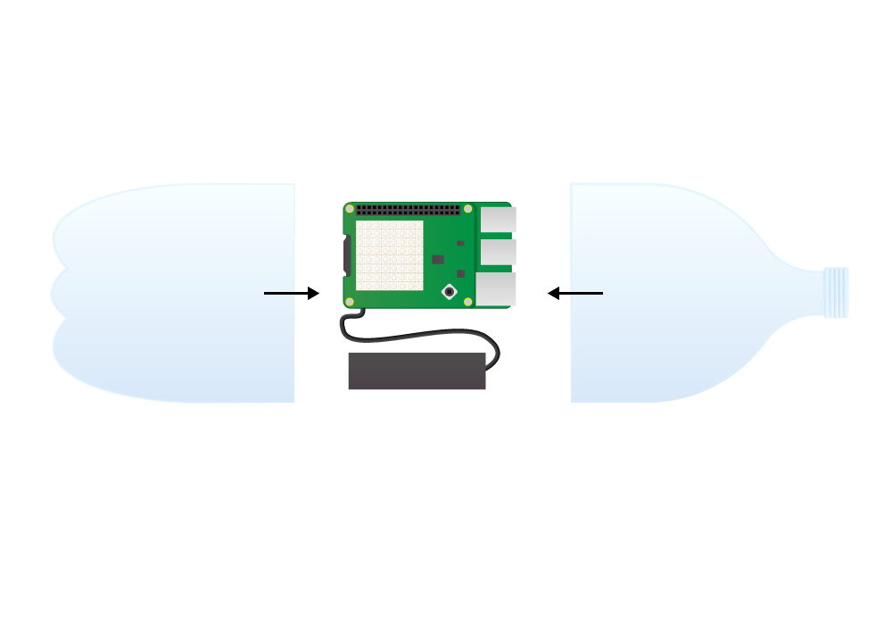
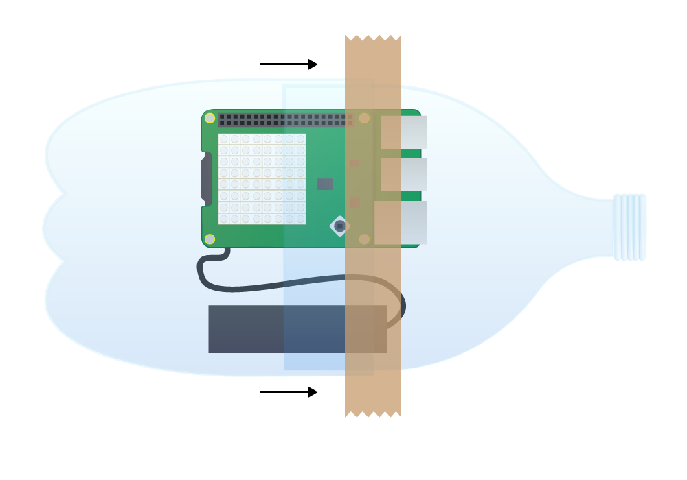
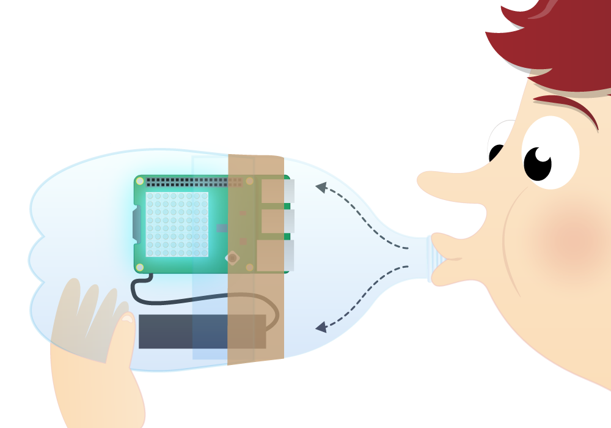

# Pressure

The Sense HAT features a number of sensors, including a pressure sensor.

## What is pressure and how can it be measured?

Pressure, generally speaking, is the force applied to a surface per unit of area. Imagine a brick sitting on a table. The force of its weight is being applied through the area of one of its faces. If you were then to balance the brick on a needle the force of its weight is concentrated on the area of the needle's tip, so the pressure being applied to the table is much higher.

Atmospheric pressure (also known as barometric pressure) is the pressure exerted by the weight of air in the Earth's atmosphere. Air pressure is pushing on every part of your body all the time. The pressure inside your body is the same as outside, though, so you don't feel anything. The unit of measurement is usually bars or millibars. One bar is about equal to the atmospheric pressure on Earth at sea level, which is 1000 millibars.

# Facts about pressure:

- Atmospheric pressure decreases smoothly from the Earth's surface (sea level) up to the edge of space.

    

- The plastic bottle above was sealed at approximately 4300 metres altitude, and was crushed by the increase in atmospheric pressure at 2700 metres and then 300 metres as it was brought down towards sea level.
- Animal and plant life need atmospheric pressure in order to survive. The air above 8000 metres altitude is dangerous to humans and has been named the [Death Zone](http://simple.wikipedia.org/wiki/Death_zone) by mountain climbers. The summit of Mount Everest is in this zone.
- The [Armstrong line](http://en.wikipedia.org/wiki/Armstrong_limit) is the altitude beyond which humans absolutely cannot survive in an unpressurised environment. This is between 18900 and 19350 metres, where water boils at the normal temperature of the human body.
- The ISS maintains an orbit with an altitude of about 400 km (400000 metres), which is way past the Armstrong line and right out in the vastness of space without any atmosphere (zero millibars). However, the air pressure inside the ISS is maintained at about 1013 millibars, which is nice and comfortable for the crew.

## What is the pressure?

1. Click on `Menu` > `Programming` > `Python 3 (IDLE)` to open a new Python shell.

1. Select `File > New Window` and enter the following code:

    ```python
    from sense_hat import SenseHat

    sense = SenseHat()
    sense.clear()

    pressure = sense.get_pressure()
    print(pressure)
    ```

1. Select `File > Save` and choose a file name for your program.

1. Select `Run > Run module`.

1. If you see the error `Pressure Init Failed, please run as root / use sudo` on the last line in red, it means you haven't followed the instructions above. Close everything and go back to step 1.

1. You should see something like this:

    ```bash
    Pressure sensor Init Succeeded
    1013.40380859
    ```

    If you get `0` just run the code again. This sometimes happens when you use the pressure sensor for the first time.

    <iframe src="https://trinket.io/embed/python/a70fc2a0df" width="100%" height="600" frameborder="0" marginwidth="0" marginheight="0" allowfullscreen></iframe>

1. Just before the `print(pressure)` line, add this line below:

    ```python
    pressure = round(pressure, 1)
    ```

## Monitoring the pressure

1. It would be good to monitor the pressure as it changes, so let's put your code into a `while` loop and run it again:

    ```python
    while True:
        pressure = sense.get_pressure()
        pressure = round(pressure, 1)
        print(pressure)
    ```

1. Unfortunately, it's not as easy to make it change as holding your thumb on the sensor or breathing on it, so use the plastic bottle experiment below to test your code.

## The plastic bottle experiment

The experiment involves sealing a Raspberry Pi fitted with a Sense HAT inside a plastic bottle along with a mobile phone top up battery, and then blowing into the bottle to increase the air pressure. Someone with a good pair of lungs should easily be able to increase the pressure to about 1100 millibars inside the bottle. You'll first need to program the visual display.

1. Watch [Dave Honess's video](https://www.youtube.com/watch?v=CHUukiKF3ew) about the plastic bottle experiment.

1. Take an empty two litre plastic bottle, discard the lid, and cut it in half across the middle as shown:

    

    Dry the inside of the bottle using a tissue or a dishcloth. Do not be tempted to use a heat gun or a hair dryer as they will warp the plastic.

1. Do a fit test. Try to fit the upper half inside the bottom half to join it back together. If you blow into the bottle now you'll feel the air coming back at you through the gaps in the side; later you'll use tape to seal them.

1. Shut down the Raspberry Pi, leaving all the peripherals connected.

1. Disconnect the power supply and replace it with the mobile top up battery.

1. The Pi should boot up as usual, allowing you to load up and run the code.

1. Disconnect all the peripherals apart from the battery once the code is running, and put everything into the bottle. Make sure the top half goes inside the bottom half, so you'll feel the air coming back at you when you blow.

    

1. Use the tape to seal the join between the two halves of the bottle:

    

1. Blow into the bottle. You should feel air coming back at you if you've got any leaks so just use more tape to patch these.

    

1. Be aware that the moisture in your breath will steam up the inside of the bottle, so stop before you make the Pi damp.

1. Remove the tape and separate the two halves of the bottle if you need to change the code. Just reconnecting the peripherals to do a quick edit should work fine.

## Display the pressure on the LED matrix

Below is the code that was used in the video. It can cope with 1000 to 1100 millibars, so that's 100 millibars of range. We know that the LED matrix colours have a range of 0 to 255, so the first thing it does is create a ratio between the pressure range and the colour range. The plan is then to multiply the measured pressure by that ratio to get the colour. You have to subtract 1000 from the measured pressure to make this work, so you're multiplying a number between 0 and 100 by the ratio. It then clamps the colour to a maximum of 255, in case there is someone with very strong lungs who can drive the pressure higher than 1100 millibars.

```python
from sense_hat import SenseHat

sense = SenseHat()
sense.clear()

ratio = 255 / 100.0

while True:
    pressure = sense.get_pressure()
    pressure = round(pressure, 1) - 1000
    blue = int(ratio * pressure)
    if blue > 255:
        blue = 255
    elif blue < 0:
        blue = 0
    sense.clear((0, 0, blue))
```


<iframe src="https://trinket.io/embed/python/5de196ff09" width="100%" height="600" frameborder="0" marginwidth="0" marginheight="0" allowfullscreen></iframe>
