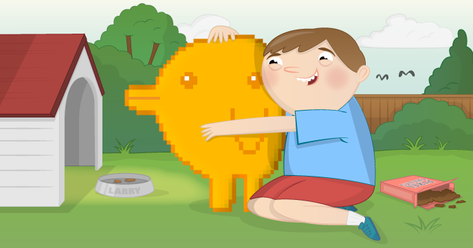

# Interactive Pixel Pet

Make your very own digital space pixel pet with your Raspberry Pi and Sense HAT. Using sensors and output devices are a great way to make your computer programs more interactive. The Raspberry Pi Sense HAT contains a whole set of sensors that can be used to detect movement, which will be used in this activity to take a digital pet for a walk.

## Requirements

As well as a Raspberry Pi, the usual peripherals, and an up-to-date SD card you'll also need:

### Hardware

- Sense HAT

### Software

- Sense HAT for Python 3
- python 3 pypng
- 8x8GridDraw 

See [software installation](software.md)

## The worksheet

- Go to the [worksheet](worksheet.md)
- Printable [workshop worksheet](files/printable-worksheet.pdf) based on this resource

## Licence

Unless otherwise specified, everything in this repository is covered by the following licence:

***Interactive Pixel Pet*** by the [Raspberry Pi Foundation](http://www.raspberrypi.org) is licenced under a [Creative Commons Attribution 4.0 International License](http://creativecommons.org/licenses/by-sa/4.0/).

Based on a work at https://github.com/raspberrypilearning/pixel-pet
