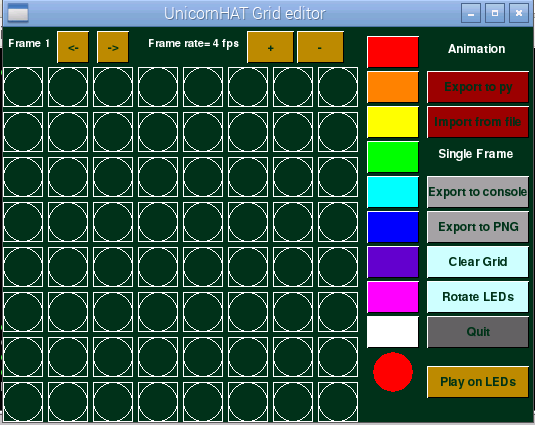
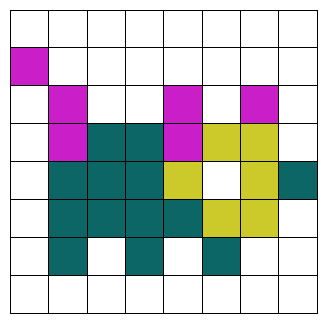
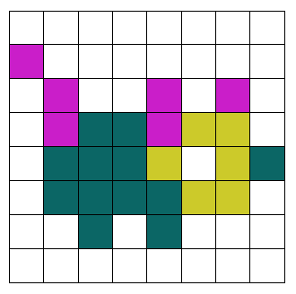
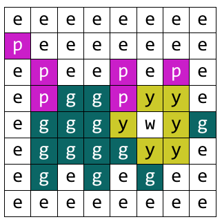

# Interactive Pixel Pet

Using sensors and output devices is a great way to make your computer programs more interactive. The Raspberry Pi Sense HAT contains a whole set of sensors that can be used to detect movement, which will be used in this activity to take a digital pet for a walk. You can watch a video tutorial to accompany this resource [here](https://www.youtube.com/watch?v=gfRDFvEVz-w).

## Draw your Pixel Pet

First you'll need to design your pet avatar before you program any actions. [Here are some examples](https://www.youtube.com/watch?v=PpHFQXoISWc) to give you an idea! You can also print [this worksheet](files/printable-worksheet.pdf) to help you design your pixel pet.

1. Open a Terminal by clicking on **Menu**, **Accessories** and **Terminal**.
1. Type `cd RPi_8x8GridDraw` and press **Enter** on the keyboard.
1. Next, type `python3 sense_grid.py`. This will run an application which you can use to draw your space pet avatar. 

	
	
1. Simply select the colour you wish to use from the grid with your mouse pointer, and then select the circle in the grid to change it to that colour. 

1. Alternatively, you may wish to draw your picture out on squared paper with coloured pencils instead like this:

	

1. You will need another pet design, preferably one that is very similar to the first, so that we can animate your pet. Here you can see the image is almost identical to the one above, but the feet are in a different place:

		
	
	Later, when you code your animation, you will create the illusion that the pet is walking.
	
## Label each pixel of your image

1. Think of a letter from the alphabet to represent each colour in your pixel pet image. e.g. `w` for white or `r` for red. 
1. If you are using squared paper for your design, you can write the letters on top like this:

	
	
	Note that `e` stands for `empty`.

1. If you are using the 8x8GridDraw editor then you can write out your squares on paper, representing each colour with a letter and separating them with a comma. Alternatively, you could type them into a text editor like **Leafpad** which you can find by clicking on **Menu**, **Accessories** and **Text Editor**. 
	
	You'll end up with something that looks like this:
	
	```
	e, e, e, e, e, e, e, e,
	p, e, e, e, e, e, e, e,
	e, p, e, e, p, e, p, e,
	e, p, g, g, p, y, y, e,
	e, g, g, g, y, w, y, g,
	e, g, g, g, g, y, y, e,
	e, g, e, g, e, g, e, e,
	e, e, e, e, e, e, e, e
	```
	
	You'll notice that we have eight rows and eight columns of letters, each separated by a comma, to make up the LED matrix on the Sense HAT.
	
1. Repeat this step for your second pet design so that you end up with two grids of letters.

	Can you think of any problems that might arise when only using one letter to label different colours? How might you solve this problem?	

## Code your pet in Python 3

Now that you have your designs represented as letters in a grid or array, you can start to code them in Python.

1. Click on **Menu** then **Programming**, followed by **Python 3 (IDLE)**. This will open the Python 3 shell window.
1. Next, click on **File** and **New File** to open an empty text editor window. 
1. Save this empty file as `space-pet.py`.
1. First you will need to import all the modules and libraries you will need for this project in your code by typing:

	```python
	from sense_hat import SenseHat
	import time
	```
	
1. Underneath type:

	```python
	sense = SenseHat()
	```	
	
	Note that capital letters, full stops and commas are very important in Python. Your code might not work if you do not include these.

1. Next, create a `Variable` for each colour label in your pet design like this:

	```python
	p = (204, 0, 204) # Pink
	g = (0, 102, 102) #	 Dark Green
	w = (200, 200, 200) # White
	y = (204, 204, 0) # Yellow
	e = (0, 0, 0) # Empty
	```
	
	The numbers used here inside the brackets are `RGB` values, or `Red, Green and Blue` values. A mixture of these colours make different colours. The higher the number, the more of that colour it will contain. For example, `(255, 0, 0)` would make a solid red colour, whereas `(0, 255, 0)` would create a vivid green colour. 
	
	You can change these numbers in your code to get the colours that you want. 
	
1. Next, use a `list` to store your pixel pet design like this:

	```python
	pet1 = [
	    e, e, e, e, e, e, e, e,
		p, e, e, e, e, e, e, e,
		e, p, e, e, p, e, p, e,
		e, p, g, g, p, y, y, e,
		e, g, g, g, y, w, y, g,
		e, g, g, g, g, y, y, e,
		e, g, e, g, e, g, e, e,
		e, e, e, e, e, e, e, e
		]
	```
	
	Here you have created a variable called `pet1` and stored a list of labels for each colour by using `[` at the start of each letter and `]` at the end. 
	
1. Repeat for the second pixel pet design, using a different variable name like `pet2`.

1. If you ran your code now nothing would happen, because so far you have only told the program to store information. To make something happen, you will need to write a command to call on that data and display your colours in the right order on the Sense HAT LED matrix. Type this command underneath your lists:

	```python
	sense.set_pixels(pet1)
	```
	
1. Save your code by pressing `Ctrl` + `S` on the keyboard followed by `F5`. 


    <iframe src="https://trinket.io/embed/python/46300eab23" width="100%" height="600" frameborder="0" marginwidth="0" marginheight="0" allowfullscreen></iframe>


	Note what happens. Why did only one of your pet designs display? It's because you have only called `pet1` in your command.
	
1. Add a delay using the `sleep` function, and then call the second picture using the same command as before like this:

	```python
	sleep(0.5)
	sense.set_pixels(pet2)
	```					    	
	
	Save and run your code to see your pet.
	
	<iframe src="https://trinket.io/embed/python/ab748e4522" width="100%" height="600" frameborder="0" marginwidth="0" marginheight="0" allowfullscreen></iframe>

## Animate your pet using a loop

So far, your pixel pet only changes once. To animate it fully, you will need to switch repeatedly between the pictures with a time delay. 

You could write the commands out over and over again but it makes more sense to put them into a loop. 

1. Move to the end of your program and locate the `sense.set_pixels(pet1)` part. Amend it to look like this:

	```python
    for i in range(10):
        sense.set_pixels(pet1)
        sleep(0.5)
        sense.set_pixels(pet2)
        sleep(0.5)
	```
	
	Don't forget to add the extra `sleep(0.5)` on the last line and remember to indent the lines after `for i in range(10):`. Indenting those lines means that they are inside the `for` loop. This `for` loop with the `range` function will repeat the indented code ten times and then stop.

1. Save and run your code to watch the animation.


    <iframe src="https://trinket.io/embed/python/3b41d00de6" width="100%" height="600" frameborder="0" marginwidth="0" marginheight="0" allowfullscreen></iframe>


1. You will notice that after the animation has completed, you are left with the same image still displayed on the LED matrix. There is a great function that you can use that will clear the LEDs. Add this line above your new loop to clear the LEDs when you first run your program:

	```python
	sense.clear()
	```

## Create a walking function

A `function` is a piece of code that you can use over and over. As the goal is to trigger the walking animation later on, it makes sense for us to put the animation code into a function that can be called when an action has been sensed by the hardware. 

1. To put your code into a function, you simply need to add this line above your `for` loop and indent the lines beneath like this:

	```python
	def walking():	
		for i in range(10):
        	sense.set_pixels(pet1)
        	sleep(0.5)
        	sense.set_pixels(pet2)
        	sleep(0.5)
    ```

	The use of `def` here means that you are ***defining*** a function which you have called ***walking***.

1. Now you need to call the function so at the bottom of your code type:

	```python
	walking()
	```			         	

## Shake to trigger action

It's time to use the Sense HAT's movement sensors, in particular its `accelerometer` to trigger the walking function to make the project more interactive.

1. Underneath your walking function, but above the function call line of `walking()`, type:

	```python
	x, y, z = sense.get_accelerometer_raw().values()

	while x<2 and y<2 and z<2:    	
		x, y, z = sense.get_accelerometer_raw().values()
	
	walking()
	```
	
	The first line will get current movement readings from the Sense HAT on its x, y, and z coordinates. As your Raspberry Pi is presumably sitting still on a desk, those readings will have a very low value.
	
	Then a `while` loop is introduced to continually check the accelerometer values, to see if they have changed to above or equal to the value `2`. You can help the Sense HAT have an accelerometer reading of above `2` by shaking it!


    <iframe src="https://trinket.io/embed/python/4ff36df371" width="100%" height="600" frameborder="0" marginwidth="0" marginheight="0" allowfullscreen></iframe>
	
1. Check your code, especially the indentation [against this version here](code/space-pet.py).	
	
1. Save your code and run it. Nothing should happen until you shake your Raspberry Pi. 	


## What next?

- Do you need to make use of the `sense.clear()` function to make your program work the way you want?
- What other sensors could you use to trigger functions that are on the Sense HAT? Can you create more actions in order to look after your space pet, like feeding or petting?
- Could you make a dice or Simon Says game like the ones in the [Getting Started with the Sense HAT resource](https://www.raspberrypi.org/learning/getting-started-with-the-sense-hat/)?    	
