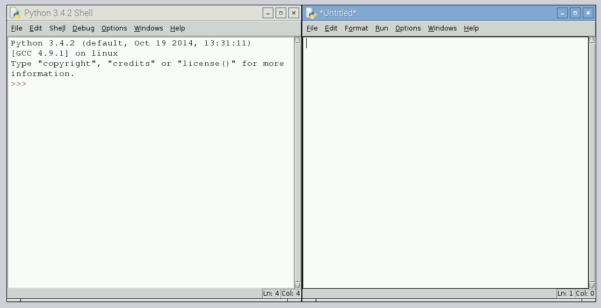
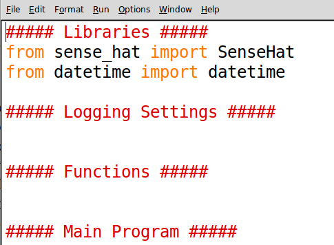
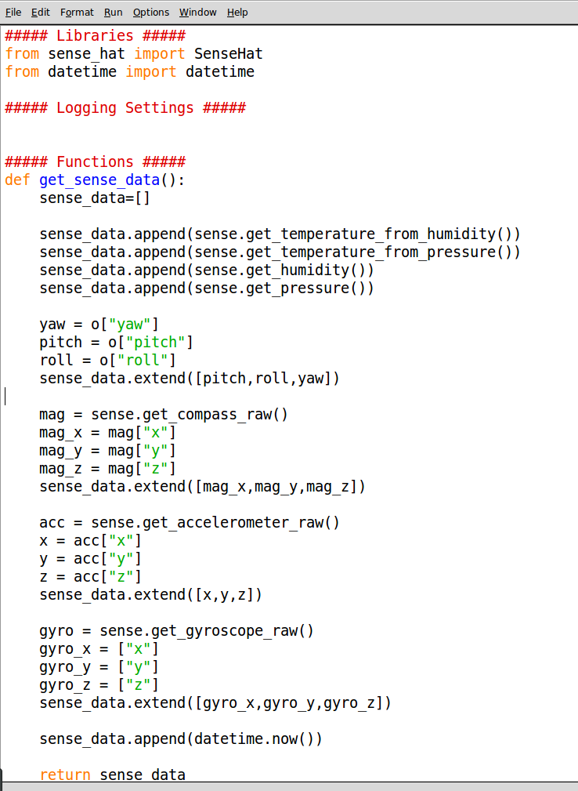
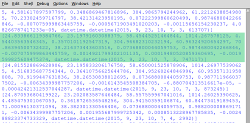
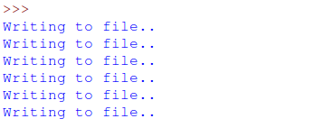
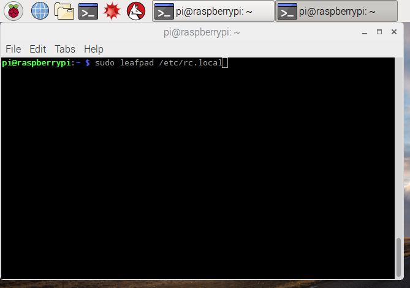
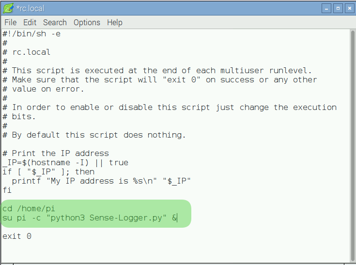

# Sense HAT Data Logger

During the Astro Pi mission, a pair of Raspberry Pis with Sense HATs attached will be capturing and logging a range of data about life on board the International Space Station.

In this activity you will use a Raspberry Pi, a Sense HAT and some Python code to create your own datalogging tool, which you can use to capture interesting data and perform experiments.

In preparation for this resource, attach your Sense HAT to your Raspberry Pi and install the software by following this [guide](https://www.raspberrypi.org/learning/astro-pi-guide/assemble.md).

## Getting data from the Sense HAT

1. First we'll write a short script to get data from the Sense HAT and output it to the screen. Using the sensors, we can capture the following data:

  - [Temperature](https://www.raspberrypi.org/learning/astro-pi-guide/sensors/temperature.md) (This can be read by two different sensors)
  - [Humidity](https://www.raspberrypi.org/learning/astro-pi-guide/sensors/humidity.md)
  - [Pressure](https://www.raspberrypi.org/learning/astro-pi-guide/sensors/pressure.md)
  - [Movement](https://www.raspberrypi.org/learning/astro-pi-guide/sensors/movement.md) (This is actually made up of twelve different sensor readings)

  To begin your script you need to boot your Raspberry Pi into desktop mode and run Idle for Python 3 from the programming section of the menu. 

  Once Idle has loaded you will need to select **File** and then **New File** which will load a separate window in which you can write your code.

  

  The window on the right of this image is where you should write your code and the one on the left is where the code will run. Let's begin by writing a program to collect data from the Sense HAT sensors.

1. In your right hand window, add the following lines of python code. The lines starting with a `#` symbol are **comments** and are ignored by the computer. You should use comments here to break you code into four sections, which will make it easier to build your program as it gets more complex.

  

  - The first section, **Libraries**, is where you will import code that will give your program extra abilities. The line `from sense_hat import SenseHat` allows your program to use the Sense-HAT hardware. The line `from datetime import datetime` allows your program to use the time module.
  - The section headed **Logging Settings** is where you will be able to control different features of your logger program.
  - The third section, **Functions**, will contain short "chunks" of reusable code which do a specific job, such as writing the current data to a file.
  - The final section, **Main Program**, is the part of your code which uses each of the functions in the right sequence to run the whole program.

1. In order to get data from the Sense HAT you will need to write a function called **get_sense_data** which will check each sensor in turn and store the sensor data in a list. The function should be added to the **Functions** section.

  ```python
  def get_sense_data():
      sense_data=[]

      sense_data.append(sense.get_temperature_from_humidity())
      sense_data.append(sense.get_temperature_from_pressure())
      sense_data.append(sense.get_humidity())
      sense_data.append(sense.get_pressure())
  ```
  The first line defines your function name, and the second sets up an empty **list** structure into which you will add your collected data.

  The next four lines get data from some of the sensors and adds (or appends) them to the `sense_data` list.

  The rest of the sensors are a bit more complex as they each give three values back. In the lines above you are asking the Sense HAT for the three orientation values (yaw, pitch, roll) and the second line extends the sense_data list by those three values.

  ```python
    o = sense.get_orientation()
    yaw = o["yaw"]
    pitch = o["pitch"]
    roll = o["roll"]
    sense_data.extend([pitch,roll,yaw])
  
    mag = sense.get_compass_raw()
    mag_x = mag["x"]
    mag_y = mag["y"]
    mag_z = mag["z"]
    sense_data.extend([mag_x,mag_y,mag_z])
    
    acc = sense.get_accelerometer_raw()
    x = acc["x"]
    y = acc["y"]
    z = acc["z"]
    sense_data.extend([x,y,z])

    gyro = sense.get_gyroscope_raw()
    gyro_x = gyro["x"]
    gyro_y = gyro["y"]
    gyro_z = gyro["z"]
    sense_data.extend([gyro_x,gyro_y,gyro_z])
    
    sense_data.append(datetime.now())

    return sense_data
  ```
  The final part of the function adds three more sensor values (magnetometer, accelorometer, and gyroscope), and then the current time. The final line of the function **returns** (or sends) the **sense_data** list to where the main program will ask for it.

1. Next you'll need to add some lines to your **Main Program** Section, this will need to do two things:
  - create a sense object, which represents the Sense HAT
  - repeatedly **get_sense_data** from the sensors and display it

  Add the following code to your **Main Program** section:

  ```python3
  sense = SenseHat()

  while True:
      sense_data = get_sense_data()
      print(sense_data)
  ```

  Your final program should look like this:

  

1. You can now test your logger. First you should save it: press **Ctrl+S** and chose a name such as `Sense_Logger_v1.py`. Once the program is saved you can run it by pressing **F5**. You should see lots of text scrolling past as shown below.

  

  The highlighted section shows a single line of data bundled together into a list, you should be able to tell which sensor data is which.

  To stop the program running you can press **Ctrl+C** to cancel the execution.

## Writing the data to a file

The program you have produced so far is able to continually check the Sense HAT sensors and write this data to the screen, however, unless you're a very fast reader this is not very helpful.

What would be more useful would be to write this data to a CSV (comma separated values) file, which you can examine once your logging program has finished. To create this file you will need to do the following:
  - specify the filename for this file
  - add a header row to the start of the file
  - convert each list of data into a line of text for the file
  - periodically write a batch of data out to the file

1. The first thing you need to do is to add 2 lines to your **Settings** section. These are:

  ```python
  FILENAME = ""
  WRITE_FREQUENCY = 50
  ```

  The first line here will be used to choose an filename for the data output, and the second will set how often the program will write data out to the file. In this case it will collect 50 lines of data and then add these to the file in one go.

1. Next you will need to add a **log_data** function, which will convert the **sense_data** to a line of comma seperated values ready to be written to the file. The line of text will be added to a list called **batch data**, which will store the data until it is written to the file.

  Add the following code after the **Functions** heading and before the **get_sense_data** function.

  ```python
  def log_data():
      output_string = ",".join(str(value) for value in sense_data)
      batch_data.append(output_string)
```

  The first line takes each value in the **sense_data** list and converts them to **strings** (text) and the joins them together with the `,` symbol. So a line like this:

  > [26.7224178314209, 25.068750381469727, 53.77205276489258, 1014.18017578125, 3.8002126669234286, 306.1720338870328, 0.3019065275890227, 71.13333892822266, 59.19926834106445, 39.75812911987305, 0.9896639585494995, 0.12468399852514267, -0.004147999919950962, -0.0013064055237919092, -0.0006561130285263062, -0.0011542239226400852, datetime.datetime(2015, 9, 23, 11, 53, 9, 267584)]

  gets converted to:

  > 26.7224178314209,25.068750381469727,53.77205276489258,1014.18017578125,3.8002126669234286,306.1720338870328,0.3019065275890227,71.13333892822266,59.19926834106445,39.75812911987305,0.9896639585494995,0.12468399852514267,-0.004147999919950962,-0.0013064055237919092,-0.0006561130285263062,-0.0011542239226400852,2015-09-23 11:53:09.267584

1. Another function you will need is the **file_setup** function which will create a list of headings that will be written to the file before any data. The function is shown below and needs to be added to your **Functions** section.


  ```python
  def file_setup(filename):
      header  =["temp_h","temp_p","humidity","pressure",
      "pitch","roll","yaw",
      "mag_x","mag_y","mag_z",
      "accel_x","accel_y","accel_z",
      "gyro_x","gyro_y","gyro_z",
      "timestamp"]

      with open(filename,"w") as f:
          f.write(",".join(str(value) for value in header)+ "\n")
```

  This function is slightly different to the previous as it needs an input (or **parameter**) in order to work, in this case the input has been called `filename`. When the main program calls this function it must also give the function the name of the file to write to. If it were called like this `file_setup("output.csv")` the function would create `output.csv`

  The function itself creates a list of header names called header. It then opens a file in **write** mode (which will overwrites any previous data) and refers to that file as f. whilst the file is open it joins all the list headings together using commas and writes that line to the file.

1. The two functions and the settings you added now need to be used in the main program.

  Straight after the lines that read:

  ```python
  ##### Main Program #####
  sense = SenseHat()
```

  add the following:

  ```python
  batch_data= []

  if FILENAME == "":
      filename = "SenseLog-"+str(datetime.now())+".csv"
  else:
      filename = FILENAME+"-"+str(datetime.now())+".csv"

  file_setup(filename)
```

  The first line here creates an empty list that the program will keep adding sense_data lines to until it reaches 50 (or whatever value is set by WRITE_FREQUENCY).

  The if/else block checks whether a FILENAME has been set, if it hasn't then the default of "SenseLog" is used. The current date and time is also added to the filename.

  Finally the **file_setup** functions is called and given the filename that was decided upon in the previous if / else block.

1. The last step is to change some of the logic inside the `while True:` loop.
  - You need to make it collect **sense_data**
  - Then use the **log_data** function to convert the sense_data into csv form and add the the current **batch_data**.
  - Once the data is logged, the program checks whether the size of **batch_data** exceeds the WRITE_FREQUENCY setting, if so the data is written to a file and **batch_data** is reset.

  Your `while True:` loop should be updated to look like this:

  ```python
  while True:
      sense_data = get_sense_data()
      log_data()

      if len(batch_data) >= WRITE_FREQUENCY:
          print("Writing to file..")
          with open(filename,"a") as f:
              for line in batch_data:
                  f.write(line + "\n")
              batch_data = []
  ```

  - The line `print("Writing to file..")` is optional, but it will show whenever data is being written.
  - The line `with open(filename,"a") as f:` opens the file in **append** mode which adds the data at the end point of the file rather than overwriting.

  You can check your code against a full code listing [here](code/Sense_Logger_v2.py).

  When you running the program you should simply see the messages saying `Writing to file..` every so often.

  

  You can stop logging by pressing **Ctrl+C**

## Starting your data logger on boot.
It's quite likely that you will not want to have a screen, keyboard and mouse handy every time you want to log data. A handy way to avoid this is to have you program run whenever your Raspberry Pi boots up.
To do this you will first need to open a terminal window like the one below, and enter the command `sudo leafpad /etc/rc.local`. The `rc.local` script is the last startup script to load as the Raspberry Pi boots. Anything you add to this script will load on boot.

  

  Once Leafpad has loaded, you should add two lines like the ones shown here:

  

  - The first line changes to the directory where your datalogger script is stored.
  - The second line changes to the `pi` user  and runs the command `python3 Sense-Logger.py`, the `&` symbol makes this command run as a background task and allows the Raspberry Pi to continue with other tasks.

  You will need to update these lines to reflect the name and location of your program.

  The next time your Raspberry Pi boots it should automatically start logging data

## Collect your data
Conduct an experiment involving a change in one of conditions in order to measure and collect data. You could:
  - Place your Raspberry Pi in the fridge and record the ambient temperature. What happens when you open the door? How quickly does the temperature inside the fridge return to normal?
  - Drop your Raspberry Pi from a height and track the changes in orientation and acceleration (ensure you protect your Raspberry Pi carefully before dropping it)
  - Send your Raspberry Pi high into the atmosphere using a high-altitude balloon and explore the changes in temperature, pressure, and humidity throughout the flight.

## What's Next
  - Continue onto [Worksheet 2](worksheet2.md) to develop your datalogger further by adding features:
    - Choosing which pieces of data to log
    - Timed logging (every so many seconds)
  - Use your data logging code to explore conditions on the ISS following our [Sensing Science](https://github.com/raspberrypilearning/sensing-space) activity.
