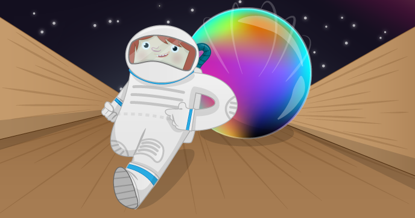

# Sense HAT Marble Maze

In this activity you will create a marble maze game that can be played on the LED matrix of your Sense HAT. You will use the in-built orientation sensors of the Sense HAT to control the movement of the marble, simulating the way a real marble rolls around a maze.

## Requirements

As well as a Raspberry Pi, the usual peripherals, and an up-to-date SD card, you'll also need:

### Hardware

- Sense HAT

### Software

- Sense HAT for Python 3

See [software installation](software.md)

## The worksheet

- Go to the [worksheet](worksheet.md)

## Licence

Unless otherwise specified, everything in this repository is covered by the following licence:

***Sense HAT Marble Maze*** by the [Raspberry Pi Foundation](http://www.raspberrypi.org) is licenced under a [Creative Commons Attribution 4.0 International License](http://creativecommons.org/licenses/by-sa/4.0/).

Based on a work at https://github.com/raspberrypilearning/sense-hat-marble-maze
