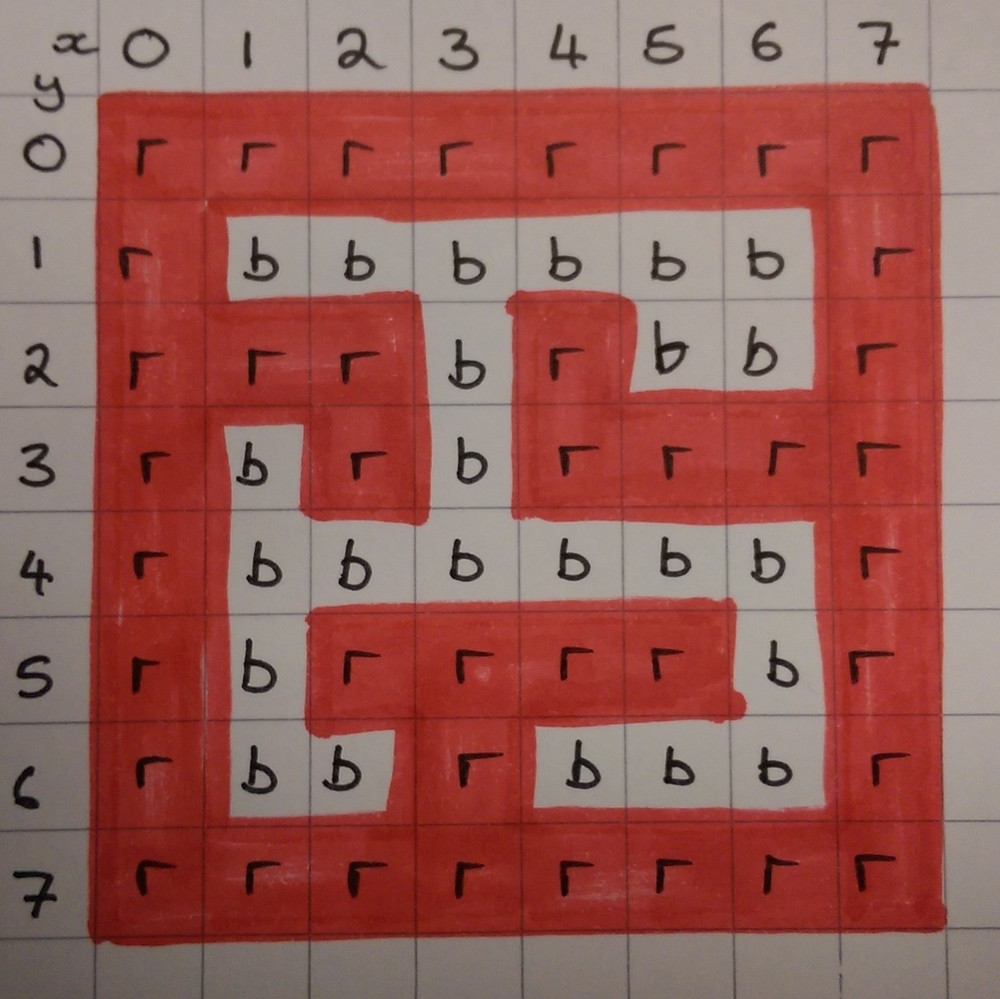
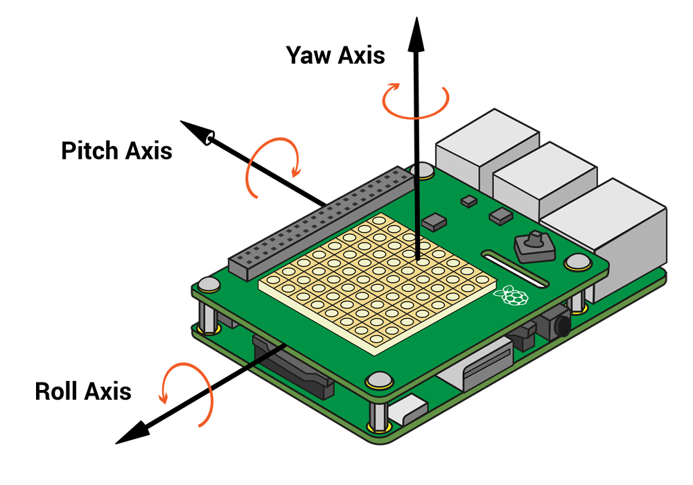

# Sense Hat Marble Maze

A marble maze is a game of skill and dexterity: one or more marbles are placed inside a maze, and the player guides them to a specific point by tilting the maze in various directions, causing the marbles to roll around.


Given that the Sense HAT is capable of reporting its exact orientation and has an in-built 8x8 pixel LED display, it is the perfect device with which to create an electronic marble maze game.

## Setting up the Sense HAT

1. To begin with you'll need to start IDLE (`Menu>Programming>Python 3 (IDLE)`) if you're using a real SenseHat, or open a new [Trinket](https://trinket.io/) if you're using the emulator.

1. Now create a new text file in which to write your code (`File>New File`).

1. You're going to need to import some modules from the **sense_hat** package to get going, so write the following three lines into your text file to enable access to the Sense HAT and to clear the LED matrix.

	```python
	from sense_hat import SenseHat
	sense = SenseHat()
	sense.clear()
	```
	<iframe src="https://trinket.io/embed/python/4728cbe745" width="100%" height="600" frameborder="0" marginwidth="0" marginheight="0" allowfullscreen></iframe>

## Drawing the maze

1. To begin with you're going to need to display your maze on the LED matrix. It's best to use some squared paper to draw the design out first, so that you can easily identify the paths through the maze. The layout is up to you, but you could use the example below if you wanted. It is important that the maze is constructed from solid walls, and that there are no diagonal gaps.

	

1. Once you have drawn your maze, write down the initial of the colour used for each square.

	

1. Now you can implement this in code. First, you'll need to define the colours that you are using.

	```python
	r = (255,0,0)
	b = (0,0,0)
	```
	
1. Then you can draw your maze. You're going to use a **list of lists** to do this. Each row of the matrix is represented by a single list, which are all grouped together in a larger list.

	```python
	maze = [[r,r,r,r,r,r,r,r],
			[r,b,b,b,b,b,b,r],
			[r,r,r,b,r,b,b,r],
			[r,b,r,b,r,r,r,r],
			[r,b,b,b,b,b,b,r],
			[r,b,r,r,r,r,b,r],
			[r,b,b,r,b,b,b,r],
			[r,r,r,r,r,r,r,r]]

	```

1. To finish off this section, you can see how your maze looks on the LED matrix. To do this you're going to need to **flatten** the **list of lists** into a single list. This is easy to do in Python, as you can add all the individual lists together using the syntax - `sum(maze,[])`. To display this on the LED matrix, you can write:

	```python
	sense.set_pixels(sum(maze,[]))
	```

1. Your code should now look like this:

	```python
	from sense_hat import SenseHat

	sense = SenseHat()
	sense.clear()

	r = (255,0,0)
	b = (0,0,0)

	maze = [[r,r,r,r,r,r,r,r],
			[r,b,b,b,b,b,b,r],
			[r,r,r,b,r,b,b,r],
			[r,b,r,b,r,r,r,r],
			[r,b,b,b,b,b,b,r],
			[r,b,r,r,r,r,b,r],
			[r,b,b,r,b,b,b,r],
			[r,r,r,r,r,r,r,r]]

    sense.set_pixels(sum(maze,[]))
	```

	<iframe src="https://trinket.io/embed/python/3312ca9b94" width="100%" height="600" frameborder="0" marginwidth="0" marginheight="0" allowfullscreen></iframe>
	
1. Save it and run it to see the maze displayed on the LED matrix (`Ctrl` + `s`, `F5`).

## Adding a marble

1. You're going to need a marble to go in your maze. This can be achieved by changing one of the LEDs in the maze list to be white. Start by creating a variable to store the colour white, in the place where you have set the other colours.

	```python
	w = (255,255,255)
	```

1. Then you can set the starting position of the marble. You can use the variable `x` to store the horizontal position and the variable `y` to store the vertical position. (Note that, if you're using `y` to store a vertical position, it's important to ensure you don't ever store the colour yellow with a `y`).

	```python
	x = 1
	y = 1
	```

1. As the marble is going to be continually on the move, it's best to set up a main game loop straight away, before drawing the marble itself. You'll need a variable called `game_over` declared somewhere near the top of your program

	```python
	game_over = False
	```

1. Next you can create a `while` loop, and use it to add the marble to the maze list and then redraw the maze.

	```python
	while not game_over:
		maze[y][x] = w
		sense.set_pixels(sum(maze,[]))

	```

1. Your code should now look like this:


	```python
	from sense_hat import SenseHat

	sense = SenseHat()
	sense.clear()

	r = (255,0,0)
	b = (0,0,0)
	w = (255,255,255)

	x = 1
	y = 1

	maze = [[r,r,r,r,r,r,r,r],
			[r,b,b,b,b,b,b,r],
			[r,r,r,b,r,b,b,r],
			[r,b,r,b,r,r,r,r],
			[r,b,b,b,b,b,b,r],
			[r,b,r,r,r,r,b,r],
			[r,b,b,r,b,b,b,r],
			[r,r,r,r,r,r,r,r]]

	game_over = False

	while not game_over:
		maze[y][x] = w
		sense.set_pixels(sum(maze,[]))
	```

1. Save it and run it to see the maze and marble on the LED matrix (`Ctrl` + `s`, `F5`)

<iframe src="https://trinket.io/embed/python/fbd97f0e7e" width="100%" height="600" frameborder="0" marginwidth="0" marginheight="0" allowfullscreen></iframe>

## Moving the marble

1. The marble's movement will be controlled by the orientation of the Sense HAT. The Sense HAT library can detect the pitch, roll and yaw of the board. You can see a picture illustrating this below.

	

1. You don't need the yaw orientation of the Sense HAT for this project, just the pitch and the roll. Add these two lines into the `while` loop, so that you get constant and up-to-date readings of the orientation, and it looks like this:

	```python
	while not game_over:
		pitch = sense.get_orientation()['pitch']
		roll = sense.get_orientation()['roll']
		maze[y][x] = w
		sense.set_pixels(sum(maze,[]))
	```

1. Now it is time to move the marble. You're going to write a separate function to do this. **Above** the `while` loop, you can define the new function.

	```python
	def move_marble(pitch, roll, x, y):
	```

1. The function has `pitch`, `roll`, `x`, and `y` as parameters. You're going to want to keep the `x` and `y` positions of the marble unchanged (you'll see why later), so the first thing to do is store these values as other variables.

	```python
	def move_marble(pitch, roll, x, y):
		new_x = x
		new_y = y
	```

1. Now it's time to change the position of the marble, depending on the way that the Sense HAT is tilted. When the Sense HAT is lying flat, pitch and roll should be approximately 0. They will then either increase as the Sense HAT is tilted (0,1,2,3,4...), or they'll decrease (0,359,359,357,356...). You'll want to ignore very tiny movements (less than a degree) as the Sense HAT will very rarely be lying completely flat.

1. If the pitch is between 1 and 179, then `new_x` needs to decrease. If it's between 359 and 181, then `new_x`should increase.

	```python
	def move_marble(pitch,roll,x,y):
		new_x = x
		new_y = y
		if 1 < pitch < 179:
			new_x -= 1
		elif 359 > pitch > 181:
			new_x += 1
		return new_x, new_y
	```

1. To test this code out, you'll need to call the function within the `while` loop.

	```python
	while not game_over:
		pitch = sense.get_orientation()['pitch']
		roll = sense.get_orientation()['roll']
		x,y = move_marble(pitch,roll,x,y)
		maze[y][x] = w
		sense.set_pixels(sum(maze,[]))
	```

1. Your entire script should now look like this:

	```python
	from sense_hat import SenseHat

	sense = SenseHat()
	sense.clear()

	r = (255,0,0)
	b = (0,0,0)
	w = (255,255,255)

	x = 1
	y = 1

	maze = [[r,r,r,r,r,r,r,r],
			[r,b,b,b,b,b,b,r],
			[r,r,r,b,r,b,b,r],
			[r,b,r,b,r,r,r,r],
			[r,b,b,b,b,b,b,r],
			[r,b,r,r,r,r,b,r],
			[r,b,b,r,b,b,b,r],
			[r,r,r,r,r,r,r,r]]

	def move_marble(pitch,roll,x,y):
		new_x = x
		new_y = y
		if 1 < pitch < 179:
			new_x -= 1
		elif 359 > pitch > 181:
			new_x += 1
		return new_x,new_y

	game_over = False

	while not game_over:
		pitch = sense.get_orientation()['pitch']
		roll = sense.get_orientation()['roll']
		x,y = move_marble(pitch,roll,x,y)
		maze[y][x] = w
		sense.set_pixels(sum(maze,[]))
	```

1. Save and run your code. It **will** break, but don't worry: we will fix it in the next step.

<iframe src="https://trinket.io/embed/python/7197ab0e48" width="100%" height="600" frameborder="0" marginwidth="0" marginheight="0" allowfullscreen></iframe>

## Fixing the code

1. There are two issues:
  - A single line of LEDs illuminate instead of a moving marble.
  - The code breaks with a `IndexError: list assignment index out of range` error.

1. The first problem occurs because, once the marble moves onto the next LED, you have not changed the colour of the first LED back to black. This can be fixed by adding a short `sleep()` interval and then setting the colour of the `x`,`y` LED in the while loop. Import the `time` library first, near where you imported the SenseHat library.

	```python
	from time import sleep
	```

1. Then alter the `while` loop, so that the white LED is reset to black in each cycle.

	```python
	while not game_over:
		pitch = sense.get_orientation()['pitch']
		roll = sense.get_orientation()['roll']
		x,y = move_marble(pitch,roll,x,y)
		maze[y][x] = w
		sense.set_pixels(sum(maze,[]))
		sleep(0.05)
		maze[y][x] = b
	```

1. Save and run your code to check that the marble looks as if it is moving.

1. The `IndexError: list assignment index out of range` error needs to be fixed next. This occurs because both `x` and `y` values can increase above `7` or decrease below `0`. As this would be outside the boundaries of the LED matrix, the SenseHat library returns an error. This can be fixed by only changing `x` and `y` when they are **not** equal to 0 or 7. Alter your `move_marble` function so that it looks like this:

	```python
	def move_marble(pitch,roll,x,y):
		new_x = x
		new_y = y
		if 1 < pitch < 179 and x != 0:
			new_x -= 1
		elif 359 > pitch > 179 and x != 7 :
			new_x += 1
		return new_x,new_y
	```

1. Save and run your code to ensure the marble is moving horizontally across the screen.

1. Now that you have the marble moving horizontally, you need to make it move vertically as well. Update the `move_marble` function so that it uses the `roll` to move the marble in the y direction.

	```python
	def move_marble(pitch,roll,x,y):
		new_x = x
		new_y = y
		if 1 < pitch < 179 and x != 0:
			new_x -= 1
		elif 359 > pitch > 179 and x != 7 :
			new_x += 1
		if 1 < roll < 179 and y != 7:
			new_y += 1
		elif 359 > roll > 179 and y != 0 :
			new_y -= 1
		return new_x,new_y
	```

1. Your full code should now look like this:

	```python
	from sense_hat import SenseHat
	from time import sleep

	sense = SenseHat()
	sense.clear()

	r = (255,0,0)
	b = (0,0,0)
	w = (255,255,255)

	x = 1
	y = 1

	maze = [[r,r,r,r,r,r,r,r],
			[r,b,b,b,b,b,b,r],
			[r,r,r,b,r,b,b,r],
			[r,b,r,b,r,r,r,r],
			[r,b,b,b,b,b,b,r],
			[r,b,r,r,r,r,b,r],
			[r,b,b,r,b,b,b,r],
			[r,r,r,r,r,r,r,r]]

	def move_marble(pitch,roll,x,y):
		new_x = x
		new_y = y
		if 1 < pitch < 179 and x != 0:
			new_x -= 1
		elif 359 > pitch > 179 and x != 7 :
			new_x += 1
		if 1 < roll < 179 and y != 7:
			new_y += 1
		elif 359 > roll > 179 and y != 0 :
			new_y -= 1
		return new_x,new_y

	game_over = False

	while not game_over:
		pitch = sense.get_orientation()['pitch']
		roll = sense.get_orientation()['roll']
		x,y = move_marble(pitch,roll,x,y)
		maze[y][x] = w
		sense.set_pixels(sum(maze,[]))
		sleep(0.05)
		maze[y][x] = b

	```

<iframe src="https://trinket.io/embed/python/5c2e24ced3" width="100%" height="600" frameborder="0" marginwidth="0" marginheight="0" allowfullscreen></iframe>

## Handling collision with the walls.

1. You have probably noticed that when the marble moves around the maze, it deletes the walls as it goes. To prevent this from happening, you're going to need some basic collision detection. To do this you can write a new function.

	```python
	def check_wall(x,y,new_x,new_y):
	```

1. This function will check whether there is a wall at the `new_x` and `new_y` coordinates. If there is no wall, then it will return the `new_x` and `new_y`, otherwise it will return to old `x` and `y`. This is why we needed to copy the `x` and `y` variables earlier.

	```python
	def check_wall(x,y,new_x,new_y):
		if maze[new_y][new_x] != r:
			return new_x, new_y
		elif maze[new_y][x] != r:
			return x, new_y
		elif maze[y][new_x] != r:
			return new_x, y
		return x,y
	```

1. This function can now be called within the `move_marble` function, to decide what the `x` and `y` coordinates of the marble will be. The last line needs to be changed to return `x` and `y`, and the line before needs to be added, to call the `check_wall` function.

	```python
	def move_marble(pitch,roll,x,y):
		new_x = x
		new_y = y
		if 1 < pitch < 179 and x != 0:
			new_x -= 1
		elif 359 > pitch > 179 and x != 7 :
			new_x += 1
		if 1 < roll < 179 and y != 7:
			new_y += 1
		elif 359 > roll > 179 and y != 0 :
			new_y -= 1
		x,y = check_wall(x,y,new_x,new_y)
		return x,y
	```

1. The full code should now look like this:

	```python
	from sense_hat import SenseHat
	from time import sleep

	sense = SenseHat()
	sense.clear()

	r = (255,0,0)
	b = (0,0,0)
	w = (255,255,255)

	x = 1
	y = 1

	maze = [[r,r,r,r,r,r,r,r],
			[r,b,b,b,b,b,b,r],
			[r,r,r,b,r,b,b,r],
			[r,b,r,b,r,r,r,r],
			[r,b,b,b,b,b,b,r],
			[r,b,r,r,r,r,b,r],
			[r,b,b,r,b,b,b,r],
			[r,r,r,r,r,r,r,r]]

	def move_marble(pitch,roll,x,y):
		new_x = x
		new_y = y
		if 1 < pitch < 179 and x != 0:
			new_x -= 1
		elif 359 > pitch > 179 and x != 7 :
			new_x += 1
		if 1 < roll < 179 and y != 7:
			new_y += 1
		elif 359 > roll > 179 and y != 0 :
			new_y -= 1
		x,y = check_wall(x,y,new_x,new_y)
		return x,y

	def check_wall(x,y,new_x,new_y):
		if maze[new_y][new_x] != r:
			return new_x, new_y
		elif maze[new_y][x] != r:
			return x, new_y
		elif maze[y][new_x] != r:
			return new_x, y
		return x,y

	game_over = False

	while not game_over:
		pitch = sense.get_orientation()['pitch']
		roll = sense.get_orientation()['roll']
		x,y = move_marble(pitch,roll,x,y)
		maze[y][x] = w
		sense.set_pixels(sum(maze,[]))
		sleep(0.05)
		maze[y][x] = b
	```

<iframe src="https://trinket.io/embed/python/4ffb8826a8" width="100%" height="600" frameborder="0" marginwidth="0" marginheight="0" allowfullscreen></iframe>

## For the win

1. Lastly, you'll want a way for the player to win. You can pick any black LED in the maze and set it as the target for the player to reach. The simplest way to do this is to create a new variable for the colour and then add it into your maze. Add the line and then update the maze.

	```python
	g = (0,255,0)

	maze = [[r,r,r,r,r,r,r,r],
			[r,b,b,b,b,b,b,r],
			[r,r,r,b,r,b,b,r],
			[r,b,r,b,r,r,r,r],
			[r,b,b,b,b,b,b,r],
			[r,b,r,r,r,r,b,r],
			[r,b,b,r,g,b,b,r],
			[r,r,r,r,r,r,r,r]]
	```

1. Next you need a function to check whether the player has hit the target.

	```python
	def check_win(x,y):
	```

1. This function needs to be able to alter the state of `game_over`, so add it in as a global variable first.

	```python
	def check_win(x,y):
		global game_over
	```

1. Then the function needs to see whether the player has landed on the green LED. If it has, the game ends.

	```python
	def check_win(x,y):
		global game_over
		if maze[y][x] == g:
			game_over = True
			sense.show_message('You Win')
	```

1. Then this function needs to be called inside the main game loop.

	```python
	while not game_over:
		pitch = sense.get_orientation()['pitch']
		roll = sense.get_orientation()['roll']
		x,y = move_marble(pitch,roll,x,y)
		check_win(x,y)
		maze[y][x] = w
		sense.set_pixels(sum(maze,[]))
		sleep(0.05)
		maze[y][x] = b
	```

1. Your full code should now look like this:

	```python
	from sense_hat import SenseHat
	from time import sleep

	sense = SenseHat()
	sense.clear()

	r = (255,0,0)
	g = (0,255,0)
	b = (0,0,0)
	w = (255,255,255)

	x = 1
	y = 1

	maze = [[r,r,r,r,r,r,r,r],
			[r,b,b,b,b,b,b,r],
			[r,r,r,b,r,b,b,r],
			[r,b,r,b,r,r,r,r],
			[r,b,b,b,b,b,b,r],
			[r,b,r,r,r,r,b,r],
			[r,b,b,r,g,b,b,r],
			[r,r,r,r,r,r,r,r]]

	def move_marble(pitch,roll,x,y):
		new_x = x
		new_y = y
		if 1 < pitch < 179 and x != 0:
			new_x -= 1
		elif 359 > pitch > 179 and x != 7 :
			new_x += 1
		if 1 < roll < 179 and y != 7:
			new_y += 1
		elif 359 > roll > 179 and y != 0 :
			new_y -= 1
		x,y = check_wall(x,y,new_x,new_y)
		return x,y

	def check_wall(x,y,new_x,new_y):
		if maze[new_y][new_x] != r:
			return new_x, new_y
		elif maze[new_y][x] != r:
			return x, new_y
		elif maze[y][new_x] != r:
			return new_x, y
		return x,y

	game_over = False

	def check_win(x,y):
		global game_over
		if maze[y][x] == g:
			game_over = True
			sense.show_message('You Win')

	while not game_over:
		pitch = sense.get_orientation()['pitch']
		roll = sense.get_orientation()['roll']
		x,y = move_marble(pitch,roll,x,y)
		check_win(x,y)
		maze[y][x] = w
		sense.set_pixels(sum(maze,[]))
		sleep(0.05)
		maze[y][x] = b
	```

<iframe src="https://trinket.io/embed/python/84e8478d96" width="100%" height="600" frameborder="0" marginwidth="0" marginheight="0" allowfullscreen></iframe>

1. Run your code. Well done: you have completed your Sense HAT game!

## What Next?

1. Can you play around with the variable values to make the game easier or more difficult?

1. Can you alter the code so that the goal changes position each time the player wins a game? Maybe you could change the maze as well.

1. Can you add in another marble that starts in another part of the maze? 
