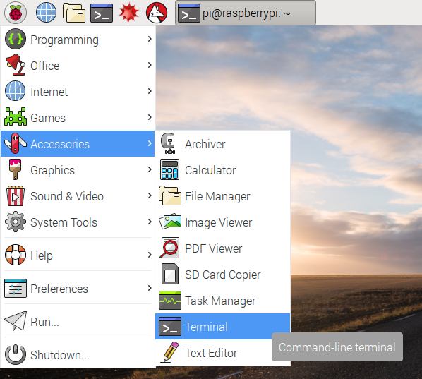
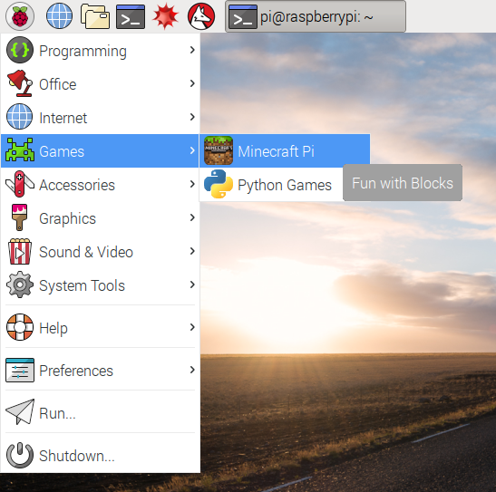
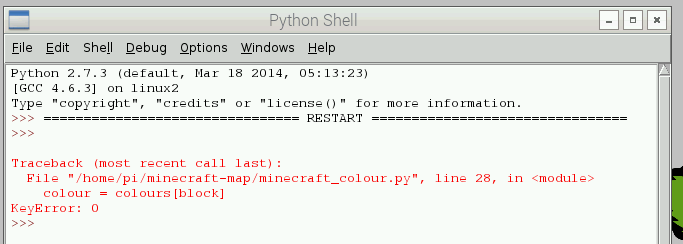
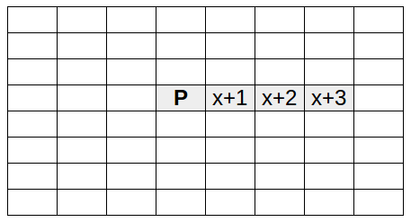
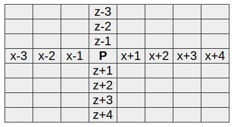
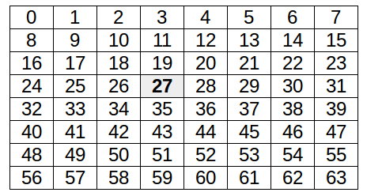
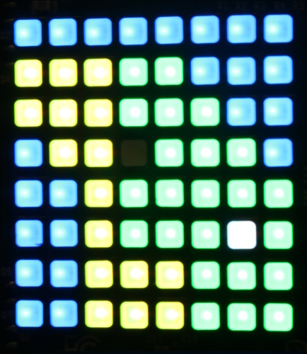

# Sense HAT Minecraft Map

Use the Sense HAT to create a map of the world around your player in Minecraft: Pi Edition.

## Getting started with the Sense HAT's LED display

The Sense HAT has an 8x8 LED matrix. That's 64 full-colour LEDs which you can set to any colour using the Sense HAT Python module, to learn about how colour displays in electronic systems work.

1. Mount the Sense HAT on your Raspberry Pi and boot up the Pi, referring to the [assembly instructions](https://www.raspberrypi.org/learning/astro-pi-guide/assemble.md) in the Sense HAT guide if neccessary.

1. Open the Terminal app from the applications menu, under **Accessories**, or from the taskbar:

    

1. Create a new directory for your project by entering the following command:

    ```bash
    mkdir minecraft-map
    ```

    `mkdir` means "make directory"; "directory" is another word for a folder.

1. Open Python 3 from the applications menu, under **Programming**:

    

1. When the Python shell window opens up, click `File > New Window` to open a new window. This is where you'll enter your code.

1. Save the file as `colours.py` in your new `minecraft-map` folder.

1. Enter the following code:

    ```python
    from sense_hat import SenseHat

    sense = SenseHat()

    sense.clear(255, 0, 0)
    ```

1. Save with `Ctrl + S` and run with `F5`.

    Your Sense HAT LEDs should now all be red!

    **How does it work?**

    - `from sense_hat import SenseHat`: this lets you use the Sense HAT module.
    - `sense = SenseHat()`: this creates a connection to the Sense HAT hardware, called `sense`.
    - `sense.clear(255, 0, 0)`: here we call the `clear` method (function) on the `sense` object and pass in three colour values, for red, green and blue.

    **How do colour displays work?**

    - All colours displayed in electronic systems are made up of a red value, a green value, and a blue value which can be combined to give a wide range of colours, a bit like mixing coloured paints.
    - Colour values go from `0` (none) to `255` (full).
    - Here we used `(255, 0, 0)`, which is full red, no green and no blue.
    - Similarly, `(0, 255, 0)` is full green and `(0, 0, 255)` is full blue.
    - Purple is a mix of blue and red, so `(255, 0, 255)` is purple.

1. Try changing the colour to:

    - green `(0, 255, 0)`
    - blue `(0, 0, 255)`

1. More things to try (think before you try them)

    - What colour does `(255, 255, 0)` make?
    - If `(255, 0, 255)` makes purple, what would `(100, 0, 255)` and `(255, 0, 100)` look like?
    - What colour does full red, green and blue `(255, 255, 255)` make?
    - What colour does `(0, 0, 0)` make?
    - What happens if you call `sense.clear()` without any colour values?

    Inside each of the Sense HAT's 64 LEDs are three smaller LEDs: a red, a green, and a blue. All you're doing is setting the brightness of each one and it gives the whole LED a different colour.

**Download a copy of [colour.py](code/colour.py)**

## Exploring the Minecraft world

Now you've had a go at setting the colours of the Sense HAT LED matrix, let's open up Minecraft and have a look around to see what block types you can identify.

1. Open Minecraft from the application menu, under **Games**:

    

1. Click **Start Game** and then either create a new world or enter an existing world.

1. Press the `Tab` key to regain access to the mouse cursor and then move the Minecraft window to one side of your screen.

1. Return to the Python windows. Open another new window from the Python shell and save it as `minecraft-colours.py` in the same project folder.

1. Move this window so that it is on the other side of the screen, and you can see the Python window and the Minecraft window side by side.

1. Enter the following code to get started:

    ```python
    from sense_hat import SenseHat
    from mcpi.minecraft import Minecraft
    from time import sleep

    sense = SenseHat()
    mc = Minecraft.create()

    mc.postToChat("Hello Minecraft!")
    sense.clear(0, 255, 0)
    ```

1. Save and run your code!

    You should see the text "Hello Minecraft" appear in the Minecraft window and the Sense HAT should turn green!

1. Now you've created a connection to both the Sense HAT and the Minecraft world, let's look at how you can determine what type of block you're standing on. Remove the `postToChat` and `sense.clear` lines and add the following code:

    ```python
    while True:
        x, y, z = mc.player.getTilePos()
        block = mc.getBlock(x, y-1, z)
        print(block)
        sleep(0.1)
    ```

1. Save and run the code.

    You should now see numbers being constantly printed to the Python shell. These numbers represent the IDs of the block your player is standing on. Walk around over different terrain and you'll see the number change. Note that you use the WASD keys to walk around, and the space bar to jump or fly

    **How does it work?**

    - `while True`: this is an infinite loop.
    - `x, y, z = mc.player.getTilePos()`: this gets the coordinates of where your player is standing and sets them to variables `x`, `y` and `z`.
    - `block = mc.getBlock(x, y-1, z)`: this looks up the ID of the block directly beneath the player (`y-1` means one below the player's `y` coordinate, which is the vertical axis).
    - `print(block)`: this shows us which block ID was returned by `getBlock`.
    - `sleep(0.1)`: this pauses for a tenth of a second each time the loop runs, so it's not printing out too fast.

1. You need to know the block types that are represented by the IDs you're seeing. Some common ones are:

    ```
    Air:   0
    Stone: 1
    Grass: 2
    Dirt:  3
    Water: 8
    Sand: 12
    Ice:  79
    ```

    See which block types you can identify while walking around the Minecraft world.

## Minecraft Sense HAT Colour Walk

Now you've explored the Minecraft world and seen the different block IDs that are printed out as you walk around, you're going to learn to make the Sense HAT show a different colour depending on what type of block you're standing on in the Minecraft world!

1. You're going need a way to create a mapping from a block ID to a colour; for example, grass should map to green, so block ID `2` should map to the colour code `(0, 255, 0)`.

    Start by adding some variables to identify block IDs. Add the following code above your `while` loop like so:

    ```python
    # blocks
    grass = 2
    water = 9
    sand = 12
    ```

    The first line is a comment helping explain what that bit of code is for. These variables are all integers (whole numbers) because that's what block IDs are represented by.

1. Below that, add the colours that represent these block types:

    ```python
    # colours
    green = (0, 255, 0)
    blue = (0, 0, 255)
    yellow = (255, 255, 0)
    ```
    These variables are tuples. A tuple is a data type (like an integer, string, or list) used to store a number of items in a particular order. These could be the `x`, `y` and `z` coordinates or, as in this case, the `R`, `G` and `B` values of a colour. These are 3-tuples because they each contain 3 values.

1. Next, below the colours, create a dictionary mapping each of the block types to a particular colour:

    ```python
    # block: colour
    colours = {
        grass: green,
        water: blue,
        sand: yellow,
    }
    ```
    A dictionary is a data type used for storing relations between two objects, like an address book mapping a name to a telephone number. The items in the dictionary are referred to as key-value pairs, so in an address book the name is the "key" and the phone number is the "value". In our case the block type is the "key" and the colour is the "value".

1. Now all that's left to do is to look up the block you're standing on, see which colour it should be, and use `sense.clear` to change the colour of the Sense HAT display accordingly!

    To look up a value in a dictionary, you pass in the key. If the dictionary was an address book, you'd pass in the name and be given that person's phone number. So to look up the block type `grass` you'd use `colours[2]` or `colours[grass]` and you'd get back the value for green which is `(0, 255, 0)`.

    Modify your `while` loop to look like this:

    ```python
    while True:
        x, y, z = mc.player.getTilePos()
        block = mc.getBlock(x, y-1, z)
        colour = colours[block]
        print(colour)
        sleep(0.1)
    ```
    Here we're looking up the ID of the block the player is standing on, as before, and then looking that up in the `colours` dictionary, then printing out the colour code tuple.

1. Save and run the code, and walk around the Minecraft world.

    You should see the colour code of the block you're standing on. Walk around to see different colour codes. When you walk on grass you should see `(0, 255, 0)`, when you're on sand you should see `(255, 255, 0)`, and on water, `(0, 0, 255)`.

1. If you walk over a block that isn't in the dictionary, you'll get an error message. If you haven't found another block type yet, just jump in the air using the space bar, and you'll get this error:

    

    This error is a `KeyError`, which is a Python exception meaning you tried to look up the value of a key which isn't in the dictionary, like trying to get the telephone number of a name you haven't got recorded.

1. First of all, let's deal with the `KeyError`. Modify your colour lookup like so:

    ```python
    if block in colours:
        colour = colours[block]
        print(colour)
    else:
        print("Don't know block ID %s" % block)
    sleep(0.1)
    ```

    Now it will check to see if the key is in the dictionary before looking up its value. If it's not, it will tell you which block ID it was.

1. Finally, now you have a colour value representing the block type your player is standing on, you can tell the Sense HAT to show that colour on the LED display, simply by changing the `print(colour)` line to:

    ```python
    sense.clear(colour)
    ```

1. Save and run the code, and walk around the Minecraft world and your Sense HAT should show green, blue or yellow when you walk on grass, water and sand.

1. Now add more blocks and colours to your dictionary!

**Download a copy of [minecraft_colour.py](code/minecraft_colour.py)**

## Setting individual LEDs on the Sense HAT

Until now, all you've done is set the whole Sense HAT LED display to the same colour. It's possible to set each pixel individually using the Sense Hat module's `set_pixel` method.

1. Create a new Python file and save it as `pixels.py`.

1. Write the following code:

    ```python
    from sense_hat import SenseHat
    from time import sleep

    sense  = SenseHat()

    sense.clear()
    sense.set_pixel(0, 0, 255, 255, 255)
    ```

1. Save and run the code. It should clear the display and set the top left pixel to white.

    **How does it work?**

    The `sense.set_pixel` method is used to set a particular pixel to a particular colour. The pixel is given as `x` and `y` and the colour is given as `R`, `G` and `B`. There are two ways of using the method:

    - pass in the `R`, `G` and `B` values separately:

    ```python
    sense.set_pixel(x, y, r, g, b)
    ```

    - use a 3-tuple for the colour and pass it in as a variable:

    ```python
    white = (255, 255, 255)
    sense.set_pixel(x, y, white)
    ```

1. Try a loop:

    ```python
    sense.clear()
    for y in range(8):
        for x in range(8):
            sense.set_pixel(x, y, 255, 0, 0)
            sleep(0.1)
    ```

    **Things to try:**

    - What happens when you reverse the order of the loops? Try `for x in range(8)` then `for y in range(8)`.
    - What happens if you add a `sense.clear()` before `sense.set_pixel()`?
    - What happens if you try `range(8, -1, -1)`?

1. Try this example using rows of colours:

    ```python
    white = (255, 255, 255)
    red = (255, 0, 0)
    green = (0, 255, 0)
    blue = (0, 0, 255)
    yellow = (255, 255, 0)

    colours = [white, red, white, green, white, blue, white, yellow]

    sense.clear()
    for y in range(8):
        colour = colours[y]
        for x in range(8):
            sense.set_pixel(x, y, colour)
            sleep(0.1)
    ```

1. You can also use the `set_pixels()` method which takes in a list of 64 colour tuples. Try the following code as an example:

    ```python
    r = red
    b = blue

    pixels = [
        r, b, r, b, r, b, r, b,
        b, r, b, r, b, r, b, r,
        r, b, r, b, r, b, r, b,
        b, r, b, r, b, r, b, r,
        r, b, r, b, r, b, r, b,
        b, r, b, r, b, r, b, r,
        r, b, r, b, r, b, r, b,
        b, r, b, r, b, r, b, r,
    ]

    sense.set_pixels(pixels)
    ```

    This should give you a checkerboard of red and blue pixels.

**Download a copy of [pixels.py](code/pixels.py)**

## Write a get_blocks function

Now you have your Sense HAT showing the colour of the block you're standing on, you can use the same logic to show a different colour for each block around you to make a mini map of the Minecraft world on the 8x8 display.

In order to make an 8x8 map, you'll need to retrieve the block IDs for all blocks immediately surrounding your player - enough to fill the 8x8 display. The Minecraft API does have an `mc.getBlocks()` function, but unfortunately it doesn't actually work, so you'll have to write your own function.

1. Create a new Python file and save it as `minecraft-map.py`.

1. Start by writing the following starter code:

    ```python
    from sense_hat import SenseHat
    from mcpi.minecraft import Minecraft
    from time import sleep

    sense = SenseHat()
    mc = Minecraft.create()

    def get_blocks():
        blocks = []

        return blocks
    ```

    Here you've imported the libraries you'll need, created a connection to the Sense HAT and to the Minecraft world, and created a function called `get_blocks` which returns an empty list.

1. Now you'll need to implement your `get_blocks` function. It would be nice to have a generic `get_blocks` function for any given range of `x`, `y` and `z` returning a cuboid of block IDs but for our purposes this is unnecessary as all we need is an 8x8 grid on the same y-axis.

    Starting with a simple version, we want to look up the block the player is standing on, and the 3 blocks to the right of the player to return a list of four block IDs:

    

    Enter the following code into your function:

    ```python
    def get_blocks():
        blocks = []
        x, y, z = mc.player.getTilePos()
        y -= 1
        for dx in range(x, x+4):
            block = mc.getBlock(dx, y, z)
            blocks.append(block)
        return blocks
    ```

    **What does it do?**

    - `blocks = []`: creates a new empty list.
    - `x, y, z = mc.player.getTilePos()`: get the player's position.
    - `y -= 1`: subtract one from the `y` coordinate to look at the level below the player.
    - `for dx in range(x, x+4):`: use `x` values from the player to 3 blocks away from the player.
    - `block = mc.getBlock(dx, y, z)`: look up the block at this location.
    - `blocks.append(block)`: add this block to the list.
    - `return blocks`: by the time the program gets to this line, this contains 4 blocks as it's been through the loop 4 times.

1. Add a line to the end of your code to print out the result of the `get_blocks` function:

    ```python
    print(get_blocks())
    ```

1. Run the code and you should see a list of four numbers (block IDs), which will be the block you are standing on and the three blocks to the side of you (the direction depends on which way you're facing).

1. Now you'll want to make the function do the same for a 2-dimensional space. This version loops over `x` and `z` 4 times and returns 16 values:

    ```python
    def get_blocks():
        blocks = []
        x, y, z = mc.player.getTilePos()
        y -= 1
        for dz in range(z, z+4):
            for dx in range(x, x+4):
                block = mc.getBlock(dx, y, dz)
                blocks.append(block)
        return blocks
    ```

    **What does it do?**

    - `blocks = []`: creates a new empty list.
    - `x, y, z = mc.player.getTilePos()`: get the player's position.
    - `y -= 1`: subtract one from the `y` coordinate to look at the level below the player.
    - `for dz in range(z, z+4):`: use `z` values from the player to 3 blocks away from the player (4 rows in total).
    - `for dx in range(x, x+4):`: use `x` values from the player to 3 blocks away from the player (4 columns in total).
    - `block = mc.getBlock(dx, y, dz)`: look up the block at this location.
    - `blocks.append(block)`: add this block to the list.
    - `return blocks`: by the time the program gets to this line, this contains 16 blocks as it's been through each loop 4 times.

1. Run the code and you should see a list of 16 block IDs, starting with the block you're standing on and the 7 to the side of you, followed by each row of 8 blocks away from you.

1. Now you'll want to make it loop over 8 rows and 8 columns, and make sure it looks to the left and right, and both behind and ahead of you. This version loops over `x` and `z` 8 times and returns 64 values:

    ```python
    def get_blocks():
        blocks = []
        x, y, z = mc.player.getTilePos()
        y -= 1
        for dz in range(z-3, z+5):
            for dx in range(x-3, x+5):
                block = mc.getBlock(dx, y, dz)
                blocks.append(block)
        return blocks
    ```

    **What does it do?**

    - `for dz in range(z-3, z+5):`: use `z` values from 3 behind the player up to 5 ahead (8 rows in total).
    - `for dx in range(x-3, x+5):`: use `x` values from 3 left of the player over to 5 to the right (8 columns in total).
    - `return blocks` - by the time the program gets to this line, this contains 64 blocks as it's been through each loop 8 times.

1. Run the code and you should see a list of 64 block IDs. This time they should be the 8x8 grid of blocks surrounding your player, with you in the middle (there's no centre point of an 8x8 grid so you're just off-centre):

    

1. Next, add a `while` loop to print the result of `get_blocks` every second:

    ```python
    while True:
        print(get_blocks())
        sleep(1)
    ```

1. Run the code and see it update as you walk around.

    You will probably find that it's a bit laggy: it takes a small amount of time to retrieve each block ID, and you're trying to do 64 every second.

## Reduce the lag with caching

In order to reduce the lag, you'll need to use a technique called caching. This means you record a value the first time you look it up, and refer to the saved value when you need it the next time, rather than look it up again. To do this, you're going to use a dictionary to store the known blocks. That way, you can look up a set of coordinates in the `known_blocks` dictionary, and only use `mc.getBlock()` if you need to. This will save lots of time and make your lookup run much faster.

1. First, create an empty dictionary called `known_blocks` before your `get_blocks` function:

    ```python
    known_blocks = {}
    ```

1. You'll need to access the `known_blocks` dictionary from within your `get_blocks` function. Python will let you read a variable you declared outside the function, but not write to it. In order to write to it, you'll need to make it a **global** within the function like so:

    ```python
    def get_blocks():
        global known_blocks
    ```
    Global means you're changing the scope of the variable from being read-only to read/write.

1. Inside the function, modify the loop to look like this:

    ```python
    for dz in range(z-3, z+5):
        for dx in range(x-3, x+5):
            b = (dx, y, dz)
            if b in known_blocks:
                block = known_blocks[b]
            else:
                block = mc.getBlock(dx, y, dz)
                known_blocks[b] = block
            blocks.append(block)
    ```

    **What does it do?**

    - `b = (dx, y, dz)`: create a 3-tuple of the current coordinates.
    - `if b in known_blocks`: check if the block has already been looked up.
    - `block = known_blocks[b]`: look up the block by its coordinates.
    - `known_blocks[b] = block`: once a block is looked up for the first time, add it to the `known_blocks` dictionary.

1. Run the code and walk around. You should see it's a lot quicker at printing the blocks list out. Try reducing the `sleep` down to `0.1` and see if it can still cope.

## Create the map

Now all that's left to do is create the map. You've already learned how to look up a colour from a block ID and set colours to display on the Sense HAT so this should be easy!

1. Add in some block variables:

    ```python
    # blocks
    air = 0
    grass = 2
    water = 9
    sand = 12
    ```

1. Add some colours:

    ```python
    # colours
    white = (255, 255, 255)
    green = (0, 255, 0)
    blue = (0, 0, 255)
    yellow = (255, 255, 0)
    black = (0, 0, 0)
    ```

1. Create a dictionary mapping block IDs to colours:

    ```python
    # block: colour
    colours = {
        air: white,
        grass: green,
        water: blue,
        sand: yellow,
    }
    ```

1. Modify your `while` loop like so:

    ```python
    while True:
        blocks = get_blocks()
        pixels = map_blocks_to_colours(blocks)
        print(pixels)
    ```

    Here we get the blocks from the `get_blocks` function which looks them up in the cached `known_blocks` dictionary or uses `mc.getBlock` to find them out. Then we try to convert these block IDs into colours, but that's currently a missing piece!

1. Now you'll need a `map_blocks_to_colours` function which takes a list of block IDs and returns a list of corresponding colours. Add this after your `get_blocks` function:

    ```python
    def map_blocks_to_colours(blocks):
        return [lookup_colour(block) for block in blocks]
    ```

    **How does it work?**

    This function is a one-liner, but it's quite complex. It uses a concept called list comprehension, which is a way of building up a list in a loop in a concise way.

    The whole thing is wrapped in square brackets, representing a list, and the definition is to call the `lookup_colour` function for each block in `blocks`. The list builds up as it loops over the list of blocks passed in, and is returned as a list of 64 colours.

    However, we don't have a `lookup_colour` function yet either!

1. Next you'll need to create a new `lookup_colour` function that takes a block and returns a colour. You could just use `colours[block]` but that will fail if you try to look up a colour which you haven't yet set in your directory.

    Here's a function that will return white if the block does not have a colour set:

    ```python
    def lookup_colour(block):
        if block in colours:
            return colours[block]
        else:
            return white
    ```

1. Now you have a 64 item `pixels` list, print it out to see what it looks like. It should contain 64 3-tuples representing different colour values.

1. You'll also need to define the variable `player_pos`. It'll need to be the number between `0` and `63` - the pixel which is the defined centre point of the grid. Since we used the range `x-3` to `x+5` and `z-3` to `z+5` the centre point will be the `(3, 3)` coordinate on the LED matrix, which is pixel number `27` as shown:

    

    Add the line `player_pos = 27` before your `while` loop.

1. Now add a line to your `while` loop to modify the `pixels` list to set a black pixel where your player is standing:

    ```python
    pixels[player_pos] = black
    ```

1. Everything's set up now and the last thing to do is send the list of pixels to the Sense HAT. Swap out the `print` line for a `set_pixels` one:

    ```python
    sense.set_pixels(pixels)
    ```

    Your `while` should now look like this:

    ```python
    while True:
        blocks = get_blocks()
        pixels = map_blocks_to_colours(blocks)
        pixels[player_pos] = black
        sense.set_pixels(pixels)
    ```

    This should now show a map of a small part of the Minecraft world around you. Walk around and watch it update!

    

**Download a copy of [minecraft_map.py](code/minecraft_map.py)**

## What next?

Now you've created a Minecraft Map on your Sense HAT:

- Make a [Minecraft Photobooth](https://www.raspberrypi.org/learning/minecraft-photobooth/) with a camera module
- Create a ["Whac-a-Block" game](https://www.raspberrypi.org/learning/minecraft-whac-a-block-game/) in Minecraft
- Try making your own 8x8 pixel art, game or animation on the Sense HAT display
- Look at the sensors on the Sense HAT and try to use them along with the LED display! See the [Astro Pi Guide](https://www.raspberrypi.org/learning/getting-started-with-astro-pi/)
- Think about what you would do with a Sense HAT in space! See the [Astro Pi](http://astro-pi.org/) competition
