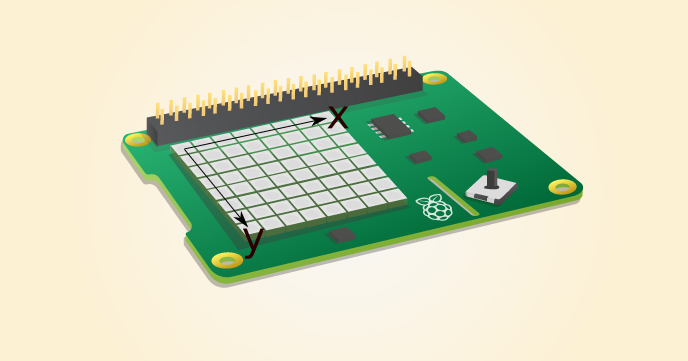
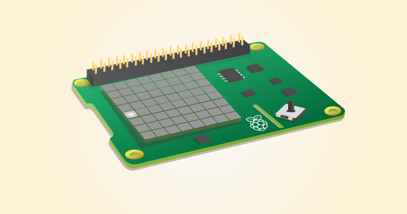

# Make a Pong clone for your Sense HAT

In this activity you will build your own Pong clone using your Raspberry Pi, a Sense HAT, and some Python code.

Pong was one of the earliest graphical games ever created, and could even be played on an oscilloscope.

<iframe width="560" height="315" src="https://www.youtube.com/embed/bzEBOjvA11w" frameborder="0" allowfullscreen></iframe>

If you don't have a Sense HAT to use with this tutorial, you can use the Sense HAT emulator. To install this, open a terminal window by pressing `Ctrl + Alt + T`. Type the following command:

``` bash
sudo pip3 install sense-emu
```

To start the emulator, you can type `sense_emu_gui` in the terminal window.

## Graphics and coordinates

When we create graphical games, we often use the coordinates `x` and `y` to tell us where an object is on the display. `x` is used to set the horizontal position of an object, and `y` is used to set the vertical position of an object.

We can do the same with the LEDs on the Sense HAT.



At the **top-left** corner, both x and y would have values of `0`.

## Lighting up an LED

Let's start our Pong game by lighting up a single LED, and then a few more to create a bat.

1. Click on `Menu` > `Programming` > `Python 3 (IDLE)`. Then, in the window that opens up, click on `File` and `New File`. The second window that opens is where you will write your code.

1. First, you'll need to import the `sense_hat` and `time` modules. Type the following into your file:

	```python
	from sense_hat import SenseHat
    from time import sleep
    
	sense = SenseHat()
	```

1. If you are using the emulator as opposed to the physical Sense HAT, you need to change one line, so that the above code reads:

    ``` python
    from sense_emu import SenseHat
    from time import sleep

    sense = SenseHat()
    ```

1. The bat will always be on the far-left column of pixels, so its `x` value will always be `0`, but the `y` value will change as you move the bat up and down. Start by setting the `y` value to 4, by adding this line:

	```python
	y = 4
	```

1. You can now illuminate your first LED using the following line of Python:

	```python
	sense.set_pixel(0, y, 255, 255, 255)
	```

1. The values `(0, y, 255, 255, 255)` indicate the `x` and `y` position of the LED, and the colour of light it should emit. `255, 255, 255` is white.

1. Save your file by holding down the `Ctrl` key and then pressing the `S` key. Call it  `pong.py`, then run it by pressing `F5`.

	A single LED should now be illuminated. 



## Making a bat

1. Next, we want to draw the rest of the bat by illuminating the LEDs immediately above and below the one that's currently illuminated. To do this, we're going to make a function. Delete the `sense.set_pixel(0, y, 255, 255, 255)` line, and then type the following:

	```python
	def draw_bat():
	```

1. Now add three lines to your function to illuminate the LED at position `y`, `y + 1`, and `y - 1`:

	```python
	def draw_bat():
		sense.set_pixel(0, y, 255, 255, 255)
		sense.set_pixel(0, y + 1,255, 255, 255)
		sense.set_pixel(0, y - 1,255, 255, 255)
	```

1. You can test your function works by **calling** it in the shell, which is the other IDLE window that should be open. Enter the following command:

	```python
	draw_bat()
	```

	When you press `Enter`, the LEDs should be illuminated.

	

	Your entire file should so far look like this:

		```python
		from sense_hat import SenseHat
		sense = SenseHat()

		y = 4

		def draw_bat():
			sense.set_pixel(0,y,255,255,255)
			sense.set_pixel(0,y+1,255,255,255)
			sense.set_pixel(0,y-1,255,255,255)
		```

## Moving the bat

1. You can now tell the Raspberry Pi what you want to happen when the Sense HAT joystick is used. You can do this by using what are known as **callbacks**. When the stick is pushed up, a `move_up` function will be called. When the stick is pushed down, a `move_down` function will be called. You haven't written those functions yet, but you will do that next. Start with the `move_up` callback:

    ``` python
    sense.stick.direction_up = move_up
    ```

1. Now above that line of code, you can write your function:

    ``` python
    def move_up(event)
        if event.action == 'pressed':
            y -= 1
    ```
    
    Did you notice the `event` parameter? When the stick is pressed, your function will be passed some information about the joystick `event`. This will include the time that the stick was used, the direction it was pushed, and whether it was pressed, released, or held.

1. To test out the code, you can draw the bat and clear the screen in a infinite loop. Add this to the bottom of your code:

    ``` python
    while True:
        sense.clear(0, 0, 0)
        draw_bat()
        sleep(0.25)
    ```

1. Does anything happen when you run the file and use the joystick? Probably not. This is because the variable `y` is a **global variable**. Variables outside of a function can't be changed by that function, unless you tell Python it's a global variable. Change your `move_up` function so it reads like this:

    ``` python
    def move_up(event)
        global y
        if event.action == 'pressed':
            y -= 1
    ```
    
    Now save and run your code, and you should be able to move the bat. There should be a bug in your code, though: can you spot it? 
    
1. If you move the bat too far up, your program tries to draw the bat off the LED grid. You need to check that the `y` variable never goes lower than `1`, with the following code:

    ``` python
    def move_up(event)
        global y
        if event.action == 'pressed' and y > 1:
            y -= 1
    ```
    
	Running this code and moving the joystick up should move the bat.

1. Next, you need to be able to move your bat down. Start by using a callback, just like you did before. Add this next line: 

    ``` python
    sense.stick.direction_down = move_down
    ```
    
1. Now you need a `move_down` function. Make sure this goes above your callback lines:

    ``` python
    def move_down():
    ```

1. Can you figure out the rest of the code for this function yourself? 
    - You'll need a declaration that `y` is a `global` variable.
    - You'll need the `y` variable to change by `+1`, but only if the action is `pressed` and `y < 7`.

	Your complete code should now look something like this:

    	``` python
    	from time import sleep
    	#from sense_hat import SenseHat
    	from sense_emu import SenseHat
	sense = SenseHat()

    	y = 4

    	def draw_bat():
        	sense.set_pixel(0, y, 255, 255, 255)
        	sense.set_pixel(0, y+1, 255, 255, 255)
        	sense.set_pixel(0, y-1, 255, 255, 255)

    	def move_up(event):
        	global y
        	if y > 1 and event.action=='pressed':
            		y -= 1
        	print(event)

    	def move_down(event):
        	global y
        	if y < 6 and event.action=='pressed':
            		y += 1
        	print(event)


    	sense.stick.direction_up = move_up
    	sense.stick.direction_down = move_down
    
    	while True:
        	sense.clear(0, 0, 0)
        	draw_bat()
        	sleep(0.25)
    	```

## Creating a ball

The next step is to create the ball. But first, a little maths!

If you think about a moving ball, it has two essential properties. It has a position and a velocity (speed in a straight line). As you're only working in two dimensions, both of these properties can be described by two numbers each:

- The ball's position, like the bat, has a vertical and horizontal position.
- The ball's velocity can also be described by two numbers: how fast it's moving in the `x` dimension and how fast it's moving in the `y` dimension.

1. Where you set the `y` variable near the top of your program, you can now add the ball's properties. The easiest way to store these properties is to use lists. One list can store the position and the other can store the velocity:

    ``` python
    ball_position = [3, 3]
    ball_velocity = [1, 1]
    ```

1. Now you can create a function to draw the ball:

    ``` python
    def draw_ball():
    ```

1. To begin with, you can add a line of code to the function to illuminate an LED. The position on the `x` axis will be the 0th item in the `ball_position` list. The `y` position will be the 1st item in the `ball_position` list. You can choose any colour you like for the ball, but in this example it's blue (`0, 0, 255`):

    ``` python
    def draw_ball():
        sense.set_pixel(ball_position[0], ball_position[1], 0, 0, 255)
    ```

1. In your `while True` loop, you can now call the function:

    ``` python
    while True:
        sense.clear(0, 0, 0)
        draw_bat()
        draw_ball()
        sleep(0.25)
    ```
    
1. Save your code by pressing `Ctrl + S` and then press `F5` to run it, and the ball should be drawn on the LED matrix.

## Moving the ball

To move the ball, you just need to change its `x` position by its `x` velocity, and its `y` position by its `y` velocity.

1. Add these two lines to your `draw_ball` function:

    ``` python
    ball_position[0] += ball_velocity[0]
    ball_position[1] += ball_velocity[1]
    ```

	Now, when you run your code, the ball should move across the LED matrix, and then your program will crash with the error `ValueError: X position must be between 0 and 7`. What happened? The ball gained an `x` position that was higher than 7, and this is obviously impossible.

1. You can handle this in your code by adding a conditional, stating that if the `ball_position[0]` reaches `7`, its velocity gets reversed so it goes in the other direction:

	``` python
	if ball_position[0] == 7:
    	ball_velocity[0] = -ball_velocity[0]
	```

1. If you can identify the bug that still remains, try and fix it before you run your code. Otherwise, just run your program and look at the error, then try to fix it before moving on.

1. The error you get should say `ValueError: Y position must be between 0 and 7`. This means the `y` position of the ball went outside the bounds of the LED matrix. It needs to stay between `0` and `7`. Another conditional can fix this:

    ``` python
    if ball_position[1] == 0 or ball_position[1] == 7:
        ball_velocity[1] = -ball_velocity[1]
    ```

1. Now the ball bounces until it reaches the far-left of the LED matrix. If this happens, the game should end, as the player hasn't managed to get the bat into place. Display a message to the player with the following code:

    ``` python
    if ball_position[0] == 0:
        sense.show_message("You Lose", text_colour=(255, 0, 0))
        quit()
    ```

1. Run your code to watch the ball bounce and the game end.

## Collision with the bat

Your game is only two more lines away from being finished, but the next part takes some explaining.

1. You can start by making the ball bounce when it gets close to the horizontal position of the bat, no matter where the bat is vertically. Add this to your `draw_ball` function:

    ``` python
    if ball_position[0] == 1:
        ball_velocity[0] = -ball_velocity[0]
    ```

1. Run this code and the ball will bounce forever.

1. Now the conditional needs to check the position of the bat. Switch over to the shell window to test this out:

	``` python
	>>> y = 3
	>>> 2 <= y <= 4
	```

	The interpreter is telling you that the statement you've just written is `True`. Look closely at the line. In English it would read as `Two is less than or equal to y, which is less than or equal to four.` This is a very handy way of determining if one number is between another two numbers or not.
    
1. So to see if the ball is going to hit the bat, you can test whether the top of the bat (`y - 1`) is less than or equal to the ball's position (`ball_position[1]`), and the ball's position is less than the bottom edge of the bat (`y + 1`):

    ``` python
    if ball_position[0] == 1 and y - 1 <= ball_position[1] <= y + 1:
        ball_velocity[0] = -ball_velocity[0]
    ```

1. Run your code and have a go at playing your own version of Pong.

1. If you get an error, then check your code against this full listing:

    ``` python
    from time import sleep
    #from sense_hat import SenseHat
    from sense_emu import SenseHat
    sense = SenseHat()

    y = 4
    ball_position = [3, 3]
    ball_velocity = [1, 1]

    def draw_bat():
        sense.set_pixel(0, y, 255, 255, 255)
        sense.set_pixel(0, y+1, 255, 255, 255)
        sense.set_pixel(0, y-1, 255, 255, 255)

    def move_up(event):
        global y
        if y > 1 and event.action=='pressed':
            y -= 1
        print(event)

    def move_down(event):
        global y
        if y < 6 and event.action=='pressed':
            y += 1
        print(event)

    def draw_ball():
        sense.set_pixel(ball_position[0], ball_position[1], 0, 0, 255)
        ball_position[0] += ball_velocity[0]
        ball_position[1] += ball_velocity[1]
        if ball_position[0] == 7:
            ball_velocity[0] = -ball_velocity[0]
        if ball_position[1] == 0 or ball_position[1] == 7:
            ball_velocity[1] = -ball_velocity[1]
        if ball_position[0] == 0:
            sense.show_message("You Lose", text_colour=(255, 0, 0))
            quit()
        if ball_position[0] == 1 and y - 1 <= ball_position[1] <= y+1:
            ball_velocity[0] = -ball_velocity[0]

    sense.stick.direction_up = move_up
    sense.stick.direction_down = move_down

    while True:
        sense.clear(0, 0, 0)
        draw_bat()
        draw_ball()
        sleep(0.25)
    ```

## What next?

- Can you change variable values to make the game easier or harder, by changing the `sleep` period?
- Can you add a score, which increases each time the ball bounces off the bat?
- How about giving the player three lives, and making them lose one each time they miss the ball?
