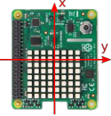
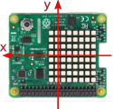
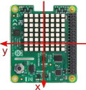
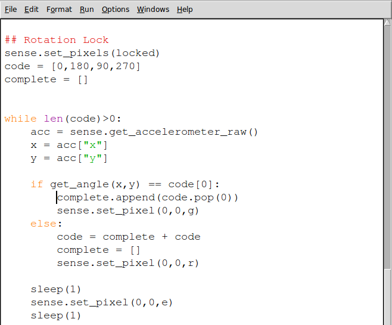

# Puzzle Box - Combination Lock

In this activity you will learn how to create an orientation-sensitive combination lock for your Sense HAT puzzle box. Before working through this activity, you should have completed the initial [worksheet](worksheet.md) and have the code shown below.


## The lock mechanism

Before you begin writing the code to make your combination lock mechanism, it's important to understand how it will behave and how you will create that behaviour with code.

There are many ways you could use the Sense HAT orientation sensors in a lock mechanism, but in this activity you'll make a program that does the following:

  - Sets up a sequence of angles that will be the combination.
  - Repeatedly checks the orientation of the Sense HAT and converts it to an angle.
  - Compares this angle with each item in the combination in order.
  - If correct, it continues to the next item; if not, it goes back to the beginning of the sequence.
  - Once all items in the combination are complete, it unlocks.

The list above roughly describes the program you're going to write and is called an **algorithm** or a set of instructions. We can make this algorithm more precise by breaking the steps up into smaller tasks. In computer science, we call this **decomposition**.

Here's the same algorithm written in a slightly more detailed way:

> ##### Combination setup
> > Display an image to show the user that the puzzle box is locked.

> > Create a list of angles (0, 90, 180, 270) which forms the combination.  

> > Create an empty list to store the correctly completed combination steps. Each time the user gets a step right, the step is moved from the combination to another list; when the combination list is empty then the combination is complete.  

> ##### Combination Lock loop  
> > Start a loop that continues until the combination has been completely entered.  

> > > Check the orientation of the Sense HAT and convert it to an angle (0,90,180,270)  

> > > If the angle matches the next item in the combination then  

> > > > Show a green light  

> > > > Move the item from the combination list to the completed list  

> > > Otherwise  

> > > > Show a red light  

> > > > Move all the items from the completed list back to the combination list  


## Converting orientation to angles

The Sense HAT measures orientation in three axes (x, y, z), but we want to turn that data into a simple rotation angle using the `x` and `y` data. The table below shows how x and y relate to these rotation angles. When stationary, the Sense HAT will record a measurement of 1**g** (**g** = acceleration due to gravity) straight down, and this can be used to calculate which way up it is.

|  0 degrees | 90 degrees  | 180 degrees | 270 degrees |
| - | - | - | - |
|  |  |  |  |
| **x = 0** | **x = -1** | **x = 0** | **x = 1** |
| **y = 1** | **y = 0** | **y = -1** | **y = 0** |

As your lock program is going to need to regularly calculate its orientation angle, you should create a function to perform this calculation. This function will need values of `x` and `y` as inputs, and will return the orientation angle as an output. In your `Functions` section, add the following code:

```python
##### Functions #####
def get_angle(x,y):
  x = round(x, 0)       # Rounds x and y to a whole number
  y = round(y, 0)

  if x == -1:           # Checks the x and y values and decides on a corresponding angle
      angle= 180
  elif x == 1:           
      angle= 0
  elif y == -1:
      angle =  90
  else:
      angle = 270  

  return angle          # Returns the appropriate angle to the main program
```

This takes the raw values of x and y and rounds them to the nearest whole number, before using an `if` statement to decide which angle the Sense HAT is at. Finally, it returns the value of the angle as its output.

## Setting up your combination lock

Below your `Locks` section, you need to add the following code:

```python
##### Locks #####

## Rotation Lock
sense.set_pixels(locked)
code = [0,180,90,0,270]
complete = []
```

The first line of code tells the Sense HAT to display the "locked" image and the next two lines create two lists:

- The `code` list contains the elements in the combination lock. In the example five numbers have been used, but more could be added for a more complex code.
- The second list, `complete`, will be used to store the completed steps of the combination: each time the user gets a step correct, that number gets moved to the complete list.


When the code list is empty then the combination has been completed and the lock is unlocked.

## Creating an unlocking loop

Next, you need to create a loop which will continue until the `code` list has been emptied. For this you'll need a `while` loop.

1. Start your loop with the following code:

  ```python3
  while len(code)>0:
      acc = sense.get_accelerometer_raw()
      x = acc["x"]
      y = acc["y"]
  ```

  The condition `len(code)>0` checks whether the length of the combination code is greater than 0. If it is, then the loop continues; if not, it exits.
  The following three lines get the acceleration data from the sensor and store x and y data in two variables.

1. Next, you'll need to convert `x` and `y` to an angle using your `get_angle` function and compare that with the first item in the `code` list.

  ```python3
  if get_angle(x,y) == code[0]:
       complete.append(code.pop(0))
       sense.set_pixel(0,0,g)
  ```

  - The condition `get_angle(x,y) == code[0]` uses the `get_angle` function to convert `x` and `y` to an angle. It then checks whether the angle matches the first item in `code`.
  - If the angle matches then the line `complete.append(code.pop(0))` removes (or "pops") the first item from `code` and adds it to the `complete` list.
  - The `sense.set_pixel(0,0,g)` line turns a single LED green to inform the user they got that step right.

1. If the user gets the angle wrong then the `complete` and `code` lists reset and a red LED is shown. Add the following `else` condition to your `if` block:

  ```python3
  if get_angle(x,y) == code[0]:
       complete.append(code.pop(0))
       sense.set_pixel(0,0,g)
   else:
       code = complete + code
       complete = []
       sense.set_pixel(0,0,r)
  ```

1. Finally, you'll need to add some `sleep` commands to give the user time to rotate their Sense HAT. Using two sleep commands and turning the LED off in between will create a flashing LED that informs the user whether they've got the steps correct.

```python
  sleep(1)
  sense.set_pixel(0,0,e)
  sleep(1)
```

Your complete lock [code](code/puzzle_box_combination.py) should look like this. Be sure to check the capital letters and indentations carefully.



## Testing your lock

Here's how your lock should behave:

<iframe width="560" height="315" src="https://www.youtube.com/embed/RnWAOWRMkIQ" frameborder="0" allowfullscreen></iframe>

## What's Next?

- You may want to add [other locks](worksheet.md) to your puzzle box.
- You could adapt this lock by adding more steps to the combination.
- How would you add more potential angles, e.g. every 45 degrees rather than every 90?
