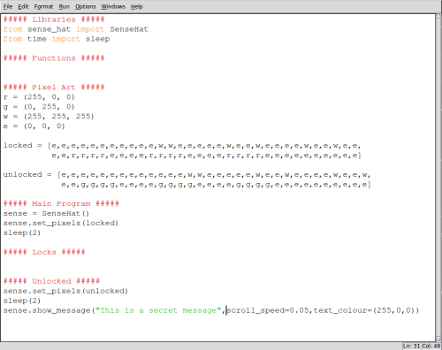
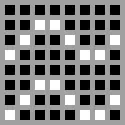
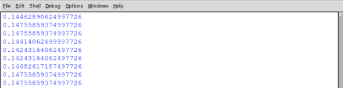
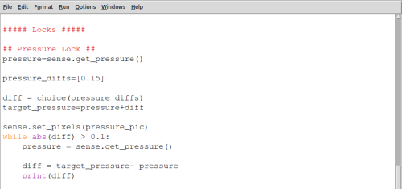

# Puzzle Box - Pressure Lock

In this activity you will learn how to create a pressure-sensitive lock for your **Sense HAT puzzle box**. Before working through this activity you should have completed the initial [worksheet](worksheet.md) and have the code shown below.



## The lock mechanism

Before you write the code to make your pressure lock mechanism, it's important to understand how it will behave and how you will create that behaviour with code. There are many ways you could use pressure in a lock mechanism, but in this activity you'll make a program that does the following:

- Finds out the current pressure
- Chooses a target pressure slightly higher than the current pressure
- Displays an image to indicate that the pressure lock is active
- Continually checks the current pressure until it's close enough to the target pressure
- Finally, the program will give an indication that the pressure lock is unlocked

The list above roughly describes the program you're going to write and is called an **algorithm** or a set of instructions. We can make this algorithm more precise by breaking the steps up into smaller tasks; in computer science we call this **decomposition**.

Here's the same algorithm written in a slightly more detailed way:

> ##### Finds out the current pressure.  
> > Measure the pressure using the Sense HAT and store the result as *current_pressure*  

> ##### Choose a target temperature close to the current temperature.  
> > Set up a list of numbers that can be added or subtracted from the *current_pressure* and call this list *pressure_diffs*  
> > Randomly pick a value from *pressure_diffs* and call this number *diff*  
> > Add the selected *diff* to the *current_pressure* to get the *target_pressure*  

> ##### Display an image to indicate the the pressure lock is active.  
> > In this example a set of wavy lines will be used.  
> > A cryptic clue or message could be displayed instead.  

> ##### Continually watches the current pressure until it's close enough to the target pressure  
> > While the *diff* is greater than 0.1  
> > Measure the current pressure using the Sense HAT  
> > Recalculate the *diff* by subtracting the *current_pressure* from the *target_pressure*  

> ##### Indicate that the temperature lock is unlocked    
> > Light all the LEDs green  
> > Wait for 2 seconds  
> > Switch all the LEDs off.  

## Adding a pressure lock image

You'll need some way of showing that the pressure lock is active. Add the following lines of Python to the Pixel Art section below your *locked* and *unlocked* images:

  ```python3
  pressure_pic = [
      e,e,e,e,e,e,e,e,
      e,e,w,w,e,e,e,e,
      e,w,e,e,w,e,e,w,
      w,e,e,e,e,w,w,e,
      e,e,e,e,e,e,e,e,
      e,e,w,w,e,e,e,e,
      e,w,e,e,w,e,e,w,
      w,e,e,e,e,w,w,e
  ]
  ```

This will create an image of 3 wavy lines to indicate airflow:



## Setting a target pressure

1. Before you write the code for this algorithm, you'll need to add an extra `import` line to allow your program to make a random choice. Add this to your `import` section:

`from random import choice`

1. The first thing you'll need to do is ask the Sense HAT to check and store the current pressure. Under the **Locks** section of your code, add a **Pressure Lock** heading and get the current pressure using this line:

  `pressure = sense.get_pressure()`

1. Next, create a list of numbers called `pressure_diffs`, containing a range of numbers that could be added to the current pressure. The wider this range of numbers, the harder the lock is going to be to break.

  ```python3
pressure_diffs = [0.12,0.13,0.14,0.15]
    ```

  There are other ways to generate a list of numbers rather than typing them in, but for now this way is sufficient.

1. Choose a pressure difference at random and add this to your current pressure to get a target pressure.

  ```Python3
  diff = choice(pressure_diffs)
  target_pressure = pressure + diff
  ```

## Waiting for the pressure to change

The next part of your lock program is to repeatedly check the pressure until it reaches, or is close to, the target pressure.

1. Begin a `while` loop which will only end when the current pressure is close enough to the target pressure. The `abs()` function is used to find the size of the pressure difference by, ignoring whether it is positive or negative.

  `while abs(diff) > 0.1:`

  This `while` loop will end when the current pressure is within 0.1 of the target pressure.

1. Add code within your loop to find the new current pressure and store it as *pressure*, before using it to recalculate the difference(*diff*) from the target pressure. Your should also print out the *diff* so that you can test your program.

  ```Python3
  while abs(diff) > 0.1:
      pressure = sense.pressure()

      diff = target_pressure - pressure
      print(diff)
  ```

  When you run your program by pressing F5, you should eventually see some numbers scroll past indicating the current pressure difference.



Your final lock code should look like the image below and can be downloaded [here](code/puzzle_box_pressure.py).



## Testing your lock

To test your lock with the diff values used here, you should be able to simply blow on the pressure sensor which will momentarily raise the pressure.

<iframe width="560" height="315" src="https://www.youtube.com/embed/CWOED2Yo0ck" frameborder="0" allowfullscreen></iframe>

## What's Next?

- You may want to add [other locks](worksheet.md) to your puzzle box.
- You could adapt this lock by changing the pressure range needed to unlock it, or by having several pressures you have to match in sequence.
