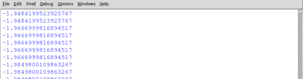
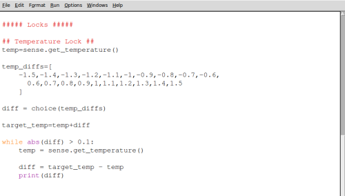

# Puzzle Box - Temperature Lock

In this activity you will learn how to create a temperature-sensitive lock for your **Sense HAT puzzle box**. Before working through this activity you should have completed the initial [worksheet](worksheet.md) and have the code shown below.


## The lock mechanism

Before you write the code to make your temperature lock mechanism, it's important to understand how it will behave and how you will create that behaviour with code. There are many ways you could use temperature in a lock mechanism, but in this activity you'll make a program that does the following:

- Finds out the current temperature
- Chooses a target temperature close to the current temperature
- Gives you a clue as to whether it's too cold or too hot compared to the target temperature
- Continually checks the current temperature until it's close enough to the target temperature
- Finally, the program will give an indication that the temperature lock is unlocked

The list above roughly describes the program you're going to write and is called an **algorithm** or a set of instructions. We can make this algorithm more precise by breaking the steps up into smaller tasks; in computer science we call this **decomposition**.

Here's the same algorithm written in a slightly more detailed way:

> ##### Finds out the current temperature.
> > Measure the temperature using the Sense HAT and store the result as *current_temp*

> ##### Choose a target temperature close to the current temperature.  
> > Set up a list of numbers that can be added or subtracted from the *current_temp* and call this list *temp_diffs*  

> > Randomly pick a value from *temp_diffs* and call this number *diff*  

> > Add the selected *diff* to the *current_temp* to get the *target_temp*  

> ##### Show whether it's too cold or too hot compared to the target temperature  
> > If the *diff* is positive then the LEDs should be all blue, showing the device is colder than *target_temp*  

> > Otherwise the LEDs should be all red, showing the device is hotter than *target_temp*

> ##### Continually watches the current temperature until it's close enough to the target temperature  
> > While the *diff* is greater than 0.1  

> > Measure the current temperature using the Sense HAT  

> > Recalculate the *diff* by subtracting the *current_temp* from the *target_temp*  

> ##### Indicate that the temperature lock is unlocked**  
> > Light all the LEDs green  

> > Wait for 2 seconds  

> > Switch all the LEDs off.  

## Setting a target temperature

1. Before you write the code for this algorithm, you'll need to add an extra `import` line to allow your program to make a random choice. Add this to your `import` section:

  `from random import choice`

1. The first thing you'll need to do is ask the Sense HAT to check and store the current ambient temperature. Under the *Locks* section of your code, add a *Temperature Lock* heading and get the current temperature using this line:

  `temp = sense.get_temperature()`

1. Next, create a list of numbers called `temp_diffs`, containing a range of numbers that could be added or subtracted from your current temperature. The wider this range of numbers, the harder the lock is going to be to break.

  ```python3
  temp_diffs=[
      -1.5,-1.4,-1.3,-1.2,-1.1,-1,-0.9,-0.8,-0.7,-0.6,
      0.6,0.7,0.8,0.9,1,1.1,1.2,1.3,1.4,1.5
    ]
  ```

  There are other ways to generate a list of numbers rather than typing them in, but for now this way is sufficient.

1. Choose a temperature difference at random and add this to your current temperature to get a target temperature.

  ```Python3
  diff = choice(temp_diffs)
  target_temp = temp + diff
  ```

## Waiting for the temperature to change

The next part of your lock program is to repeatedly check the temperature until it reaches, or is close to, the target temperature.

1. Begin a `while` loop which will only end when the current temperature is close enough to the target temperature. The `abs()` function is used to find the size of the temperature difference, by ignoring whether it's positive or negative.

  `while abs(diff) > 0.1:`

  This `while` loop will end when the current temperature is within 0.1 degrees of the target temperature.

1. Add code within your loop to find the new current temperature and store it as **temp**, before using it to recalculate the difference(**diff**) from the target temperature. Your should also print out the **diff** so that you can test your program.

  ```Python3
  while abs(diff) > 0.1:
      temp = sense.get_temperature()

      diff = target_temp - temp
      print(diff)
  ```

  When you run your program by pressing F5, you should eventually see some numbers scroll past indicating the current temperature difference. Over time, you should be able to increase or decrease the temperature until it gets close enough and unlocks.



## Adding a colour prompt

You may want to give your user a visual clue as to what they need to do. Include the following code in your lock, which will show red when the temperature is too high and blue when too cold.

  ```Python3
    if diff > 0:
      sense.clear(0,0,150)
    else:
      sense.clear(150,0,0)
  ```

Your final lock code should look like the image below and can be downloaded [here](code/puzzle_box_temp.py).



## Testing your lock

To test your lock, you could carefully hold your Raspberry Pi above a hot or cold drink to affect the temperature.

<iframe width="560" height="315" src="https://www.youtube.com/embed/zIgaA9zaaA4" frameborder="0" allowfullscreen></iframe>

## What's next?

- You may want to add [other locks](worksheet.md) to your puzzle box.
- You could adapt this lock by changing the temperature range needed to unlock it, or by having several temperatures you have to match in sequence.
