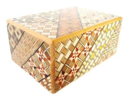
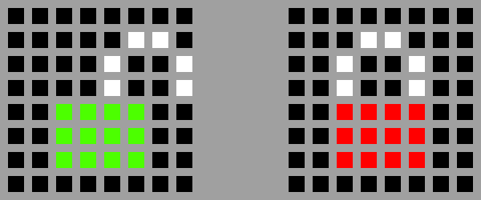

# Sense HAT Puzzle Box

In this activity you're going to be creating an electronic puzzle box that could be used to keep some information safe, or simply used for its entertainment value. However, before you start here's a quick bit of history.

## Early cryptography

You may think that keeping our information secret and secure is a modern obsession. We have passwords for all our different online accounts and are increasingly concerned with other people having access to our information. However, security of information has been a concern for thousands of years and people have been trying to protect information long before the invention of computers. There are many ways to hide information or keep it secret, all of which can be described as some sort of **[Cryptography](https://simple.wikipedia.org/wiki/Cryptography)**. Two common approaches to using cryptography for securing information are *encryption* and *steganography*; these different approaches can be used separately or together.

- **[Encryption](https://simple.wikipedia.org/wiki/Encryption)** allows information to be hidden so that it cannot be read without special knowledge such as a password. This is done with a secret code or cypher. The hidden information is said to be **encrypted**.

  > One of the simplest and earliest methods of encryption is known as the Caesar cipher, named after the Roman emperor Julius Caesar, and involves "shifting" each letter a certain amount through the alphabet. So if the shift was 5, then *a* would become *f*, *b* becomes *g* and *c* turns into *h*. To have a go encrypting and decrypting with the Caesar cipher, try this [activity](http://www.geogebra.org/m/1342697).

- **[Steganography](https://en.wikipedia.org/wiki/Steganography)** involves trying to hide the existence of some secret information; this information could itself be in plain text or encrypted. There are many ways that people have hidden information throughout history. Some early examples:

  > Ancient Greek messengers would have a message tattooed on their shaved head and then travel to their destination once the hair had regrown.  
  
  > Messages have been written under postage stamps to hide their existence.  
  
  > Text or objects were hidden inside ornate boxes with secret compartments, or requiring a complex technique to open them. These boxes were popular in Japan where they are known as *Yosegi*; the boxes usually require many steps to open them.  

  |  | <iframe width="256" height="192" src="https://www.youtube.com/embed/2A-I5J19GKI" frameborder="0" allowfullscreen></iframe> |
  |------------------------------|-------------|

Now it's your turn to make a digital puzzle box like the ones shown above. Using a Raspberry Pi and a Sense HAT add on board, you will "hide" a message behind a series of locks or puzzles that the user will have to solve. You'll be making use of the sensors built into the [Sense HAT](https://www.raspberrypi.org/learning/astro-pi-guide/) for your puzzles.

## Getting started

1. Before you can make your puzzle box program, you'll need to assemble your Sense HAT and install the appropriate software for it. To do this, follow these instructions:

  - [Assemble your Sense HAT & Raspberry Pi](https://www.raspberrypi.org/learning/astro-pi-guide/assemble.md)
  - [Check you've installed the required software](software.md)

1. Once assembled, you should power up your Raspberry Pi and launch **Python 3 (IDLE)** from the **Programming** section of the menu.

  

1. Once Python 3 has loaded, you should create a new program by clicking **File** then **New**.

  

  The window on the right is where you will write your code and the left-hand window is where it will run. In the right-hand window you should enter the following code:

    ```python3
    ##### Libraries #####
    from sense_hat import SenseHat
    from time import sleep
  
    ##### Functions #####
  
    ##### Pixel Art #####
  
    ##### Main Program #####
    sense = SenseHat()
  
  
    ##### Locks #####
  
    ##### Unlocked #####
    sense.show_message("This is a secret message",scroll_speed=0.05,text_colour=(255,0,0))
    ```
    
  This short piece of starter code carries out a few simple tasks:
  
    - `from sense_hat import SenseHat` adds the ability to control the Sense Hat from your program.
    - `from time import sleep` imports the `time` library so that your program can pause for periods of time.
    - `sense = SenseHat()` creates an object that refers to *your* connected Sense Hat; you will use the word *sense* to tell you Sense Hat what to do.
    - `sense.show_message...` shows the text on the Sense Hat display at a speed of 0.05 and in red (255,0,0). To choose a different colour you can use a number of [websites](http://www.rapidtables.com/web/color/RGB_Color.htm) that will give the **RGB** values for any colour you like.
    - The lines starting with *#* symbols are *comments* and are only there as headings; they are ignored by Python.

  Below the **Locks** heading you'll be adding some code which will prevent the program getting to the last line, unless the user has performed a certain action. Before you get started on making these locks, you're going to create some pixel art to show the state of the puzzle box.

## Adding some pixel art

It would be helpful to show the user some feedback as to whether the box is locked or not. For this example you're going to use a pair of padlock images: one red padlock (locked) and one green (unlocked).



In order to create these images, you're first going to choose some colours to use; the Sense HAT uses **R**ed, **G**reen and **B**lue values to describe colour. The amount of red, green and blue is described by 3 numbers between 0 and 255. In the example image there are 3 colours used:

  - **Red** = (255,0,0) # Maximum amount of red, with no green or blue
  - **Green** = (0,255,0 # No red, full green, no blue
  - **White** = (255,255,255) # Maximum of all three colours
  - **Empty / Black** = (0,0,0) # All colours off

1. In your code you should add these lines in the **Pixel Art** section, which will store your colour choices in some variables and then create two lists to represent the two images. If you look carefully you can make out the shape of the padlocks.

  ```python3
  ##### Pixel Art #####
  r = (255, 0, 0)
  g = (0, 255, 0)
  w = (255, 255, 255)
  e = (0, 0, 0)

  locked = [
    e,e,e,e,e,e,e,e,
    e,e,e,w,w,e,e,e,
    e,e,w,e,e,w,e,e,
    e,e,w,e,e,w,e,e,
    e,e,r,r,r,r,e,e,
    e,e,r,r,r,r,e,e,
    e,e,r,r,r,r,e,e,
    e,e,e,e,e,e,e,e
    ]

  unlocked = [
    e,e,e,e,e,e,e,e,
    e,e,e,e,e,w,w,e,
    e,e,e,e,w,e,e,w,
    e,e,e,e,w,e,e,w,
    e,e,g,g,g,g,e,e,
    e,e,g,g,g,g,e,e,
    e,e,g,g,g,g,e,e,
    e,e,e,e,e,e,e,e
    ]
  ```

1. Next, in your **Main Program** section you should add these lines which will show the locked image for 2 seconds:
  
  ```python3
  sense.set_pixels(locked)
  sleep(2)
  ```

1. After your **Unlocked** section you should do the same thing, but this time with your unlocked image:

  ```python3
  sense.set_pixels(unlocked)
  sleep(2)
  ```

1. Your program should now look like this:

  

## Adding locks

Now your basic code is ready, it's time to add some locks to protect your secret message. These locks can be added in any order and it's up to you to choose which you will add.

Here are some ideas:

### [Temperature Lock](temp_lock.md)

Using the Sense HAT's temperature sensors, this lock will require the user to raise or lower the temperature by a number of degrees in order to unlock.

### [Orientation Combination Lock](comb_lock.md)

It's possible for the Sense HAT to know which way up it is, and point up, down, left, and right. To break this lock, the user must rotate the device to match a sequence of orientations; for example, the combination might be up, left, up, down and the user would have to rotate the Sense HAT in those directions.

### [Pressure Lock](pressure_lock.md)

The Sense HAT can detect the air pressure around it. This could be changed in a number of ways:

 - Placing the Raspberry Pi in a sealed container and squashing it.
 - Cooling or heating the air in the container before sealing it. The air will expand or contract over time, which will change the pressure.
 - Fast-moving air affects the pressure, and you can detect air being blown onto the Sense HAT.

### [Location Lock](gps_lock.md)

Using some additional hardware, your puzzle box is able to calculate where in the world it is. A really challenging lock would be one that requires the user to go to a specific place.

## What next?

- Beyond the locks demonstrated in this activity, there are many more you could create using the other sensors on the Sense HAT, perhaps using the joystick, humidity or magnetic sensors.
- Why not build an actual physical box for your Raspberry Pi and Sense Hat?
