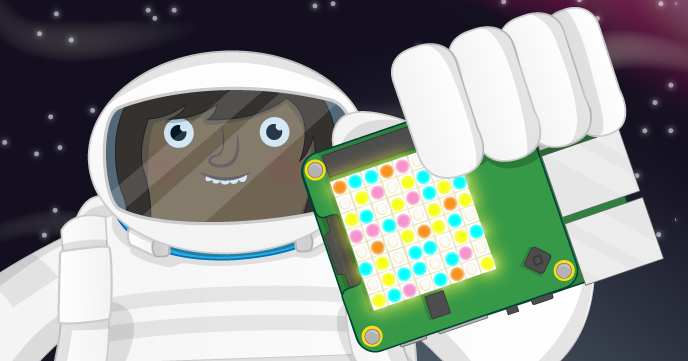

# Sense HAT Random Sparkles

Let your Sense HAT shine with pride!

## Requirements

As well as a Raspberry Pi with an SD card loaded with Raspbian, you'll also need:

### Hardware

- 1 x [Sense HAT](https://www.raspberrypi.org/products/sense-hat/)
- If you do not have a Sense HAT, you could create the project in a web browser using the [Sense HAT emulator](https://trinket.io/sense-hat)

### Software

- Sense HAT for Python 3

See more information on checking you have these packages installed, and how to install them, on the [software installation](software.md) page.

## Licence

Unless otherwise specified, everything in this repository is covered by the following licence:

***Sense HAT Random Sparkles*** by the [Raspberry Pi Foundation](https://www.raspberrypi.org/) is licensed under a [Creative Commons Attribution 4.0 International Licence](http://creativecommons.org/licenses/by-sa/4.0/).

Based on a work at https://github.com/raspberrypilearning/sense-hat-random-sparkles
