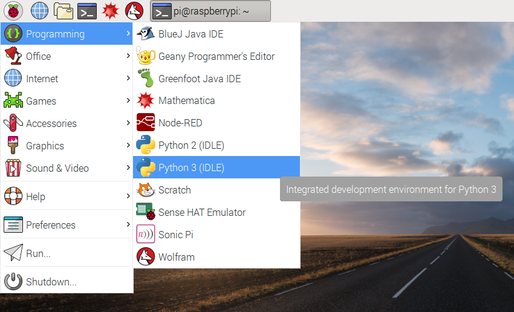

# Sense HAT Random Sparkles

Let your Sense HAT shine with pride!

Start by attaching the Sense HAT to your Raspberry Pi.

If you do not have a Sense HAT, you could create the project in a web browser using the [Sense HAT emulator](https://trinket.io/sense-hat).

## Using set_pixel

First, we'll think up some random numbers and use the `set_pixel` function to place a random colour on a random location on the Sense HAT display.

1. Start by opening Python 3 (IDLE) from the main menu:

    

1. Create a new file by clicking `File > New file`.

1. Save the new file as `sparkles.py`.

1. In the new file, start by importing the Sense HAT module:

    ```python
    from sense_hat import SenseHat
    ```

1. Next, create a connection to your Sense HAT by adding:

    ```python
    sense = SenseHat()
    ```

1. Now think of a random number between 0 and 7 and assign it to the variable `x`, for example:

    ```python
    x = 4
    ```

1. Think of another random number between 0 and 7, then assign it to `y`:

    ```python
    y = 5
    ```

1. Think of three random numbers between 0 and 255, then assign them to `r`, `g`, and `b`:

    ```python
    r = 19
    g = 180
    b = 230
    ```

1. Now use the `set_pixel` function to place your random colour at your random location on the display:

    ```python
    sense.set_pixel(x, y, r, g, b)
    ```

1. Check over your code. It should look like this, with your own random numbers assigned to the variables:

    ```python
    from sense_hat import SenseHat

    sense = SenseHat()

    x = 4
    y = 5
    r = 19
    g = 180
    b = 230
    sense.set_pixel(x, y, r, g, b)
    ```
    <iframe src="https://trinket.io/embed/python/17a33cb9e7" width="100%" height="600" frameborder="0" marginwidth="0" marginheight="0" allowfullscreen></iframe>

1. Now run your code by pressing `F5`. You should see a single pixel light up.

    *You might have guessed where the pixel would appear, and maybe you had an idea what colour it was going to be. The `x` and `y` are coordinates - the top-left corner pixel is `(0, 0)` and the bottom-right corner is `(7, 7)`. The `r`, `g` and `b` numbers are the red, green and blue parts of the colour. `(255, 0, 0)` would be pure red, `(0, 255, 0)` would be pure green, and `(255, 255, 0)` would be yellow.*

1. Now pick some new random numbers - change them all - and run the program again. A second pixel should appear on the display!

## Using the random module

So far you picked your own random numbers, but you can let the computer choose them instead.

1. Add another `import` line at the top of your program, below `from sense_hat import SenseHat`:

    ```python
    from random import randint
    ```

1. Now change your `x = ` and `y = ` lines to automatically select a random position:

    ```python
    x = randint(0, 7)
    y = randint(0, 7)
    ```

    *The `randint` function (random integer) chooses a random number between the two given numbers, in this case 0 and 7.*

1. Run your program again, and you should see another random pixel being placed on the display. It will be the same colour you chose previously.

1. Now change your colour value lines to:

    ```python
    r = randint(0, 255)
    g = randint(0, 255)
    b = randint(0, 255)
    ```

    Now your program will automatically select a random colour.

1. Run it again, and you should see another pixel appear in a random location with a random colour.

1. Run it a few more times, and you should see more of the grid fill up with random pixels.

<iframe src="https://trinket.io/embed/python/744a00dba6" width="100%" height="600" frameborder="0" marginwidth="0" marginheight="0" allowfullscreen></iframe>

## Add a loop

Rather than have to keep running your program, you can add a loop so that it will keep going.

1. First, add an `import` to the top of your file:

    ```python
    from time import sleep
    ```

    You'll use this to pause the program between pixels.

1. Add a `while True:` to your code so that the random lines, `set_pixel` and `sleep` are all within the loop:

    ```python
    while True:
        x = randint(0, 7)
        y = randint(0, 7)
        r = randint(0, 255)
        g = randint(0, 255)
        b = randint(0, 255)
        sense.set_pixel(x, y, r, g, b)
    ```

1. Add a `sleep` into your program, after `set_pixel` but still inside the loop:

    ```python
    sleep(0.1)
    ```

1. Run the code and you should see random sparkles in action!

    <iframe src="https://trinket.io/embed/python/5cab63c3da" width="100%" height="600" frameborder="0" marginwidth="0" marginheight="0" allowfullscreen></iframe>

## What next?

- Try reducing your `sleep` down to `0.01` so it runs faster
- Try removing the `sleep` line so there's no delay at all
- Try limiting the colour numbers to `randint(100, 255)` to reduce the intensity of the colours
- Try fixing one of the colour values to `0` to bias the colour mix - for example, `r, g, 0` will only make red/green/yellow colours
- What else can you draw on your Sense HAT display? Try making an [animated Pixel Pet](https://www.raspberrypi.org/learning/pixel-pet/)!
