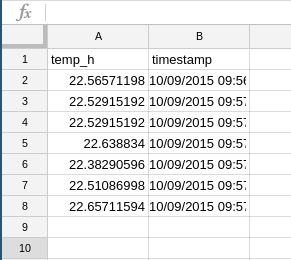
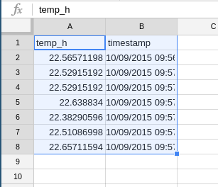
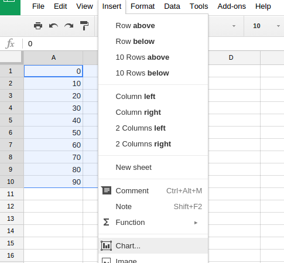
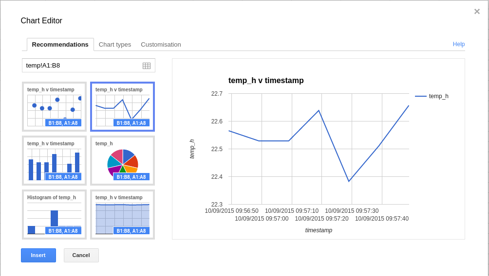
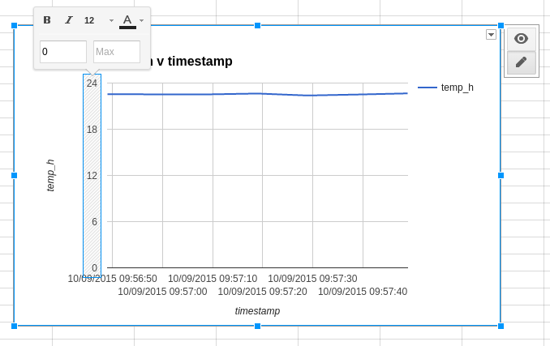

# Lesson 2 - Avoiding Sweaty Astronauts

In this lesson you're going to investigate ways to keep astronauts protected from extremely high and extremely low temperatures in space.

## Experiment 1

The Sense HAT has a temperature sensor built into it. Your teacher will demonstrate using the Sense HAT to record temperatures.

Follow your teacher's instructions to get access to the CSV file, once some data has been logged.

### Graphing the CSV

You can use online software to produce graphs of your data, or your teacher might prefer you to use a program like Excel. The example below is using Google Sheets, but the process is similar in any program.

1. Go to [Google Sheets](https://docs.google.com/spreadsheets)

2. Click on the folder icon in the top right-hand corner of the screen.

   

3. Click on the `Upload` option from the menu bar.

   

4. Choose to `Select a file` and choose the `temp.csv` file from the Raspberry Pi.

5. You should see something like this:

   

6. Select your two columns of values.

   

7. Click on `Insert` and then `Chart`

   

8. From the recommended charts choose the one similar to that shown below.

   

5. The graph probably looks pretty dramatic at the moment, with big rises or troughs. To give a more realistic chart, change the scale on the Y axis. To do this you need to click on the axis and change the `Min` and `Max` values.

   

6. Write a sentence describing how the temperature changed over the period that the experiment was run.

## Experiment 2

1. Now that you've seen how temperature can be captured by the Sense HAT, you can investigate what happens when all the LEDs on the Sense HAT are illuminated.

1. Write down your prediction for how the temperature will change when all the LEDs on.

1. Once your teacher has shared the CSV file, produce a graph as you did before and state what is happening to the temperature in the Cupola.

## Experiment 3

Now we will investigate how using different materials to cover the Cupola might change the rate of heat loss.
   
   - Which material was the best at keeping heat inside the Cupola?
   - Why do you think this material performed the best?

## Experiment 4 
As it can also get extremely hot on the sunny side of the ISS, it is important to protect the astronauts from high temperatures.

   - Which material was the best at keeping heat outside the Cupola?
   - Why do you think this material performed best?

