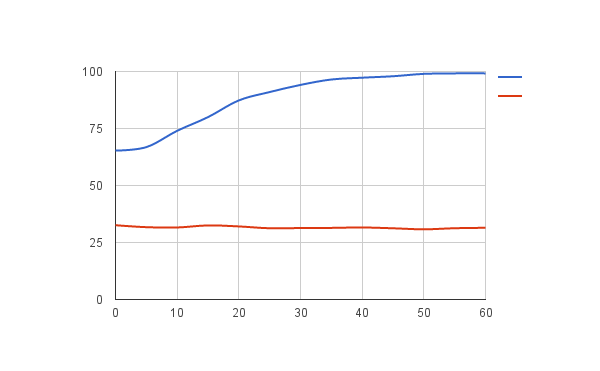

# Lesson 4 - Water, Water Everywhere.

In this lesson students will learn that water is one of the waste gasses produced by humans when they breathe and sweat, and will consider some of the methods that could be used to remove excess water vapour from the air.

## Learning objectives

- Understand that humans produce waste water vapour during respiration.
- Recognise that excess water vapour needs to be removed from the air.

## Learning outcomes

### All students are able to

- Plot simple humidity graphs using the Sense HAT.
- Explain the need to control humidity aboard the ISS.

### Most students are able to

- Explain chemical and physical processes that can remove water vapour from the air.
- Make predictions regarding the effect of human activity on humidity levels in a closed environment.

### Some students are able to

- Understand that hygroscopic substances can be used to extract water vapour from the air.

## Lesson Summary

- Students will observe and graph changes in humidity caused by a hygroscopic agent such as silica gel.
- Students can then observe and anlayse the effect of human activity on the humidity in an enclosed environment.

## Starter

1. Ask students about the waste human bodies produce. Hopefully they'll be familiar with the obvious contenders.
    - Urine
    - Faeces
    - Carbon dioxide.

1. Explain that water is also a waste product of respiration, the process by which we release energy from sugar in our cells.

    ```
    Sugar + Oxygen ---> Carbon dioxide + Water
    ```

1. Some of the water produced exits our bodies as water vapour when we breathe.

1. Have students come up with ideas for why it might be a problem aboard the ISS if the excess water vapour is not removed.

1. Explain that the concentration of water vapour in the air is called the humidity.

## Main development

### Simple Humidity Logging

1. To begin you're going to need to connect a pair of ziplock bags, as shown in the image below.

    

1. The first bag will be used to collect the breath of our 'astronaut' and the second bag will house the Raspberry Pi and Sense HAT.

1. You'll need to edit the Sense-Logger.py file to record humidity.

    ```python
    ## Logging Settings
    TEMPERATURE=False
    HUMIDITY=True
    PRESSURE=False
    ORIENTATION=False
    ACCELERATION=False
    MAG=False
    GYRO=False
    DELAY = 5
    BASENAME = "humidity"
    ```

1. Run the Sense-Logger.py file again and start logging.

1. Log the humidity readings received when the Raspberry Pi and Sense Hat are in the bag, with no interference.

### Humidity while breathing

1. Log the humidity readings again, while breathing gently into the first bag. Continue to breathe into the bag for about a minute and then quit the logging program.

1. Have students compare the graphs, to show the effect upon humidity of respiration.

    

### Reducing Humidity

1. The previous experiment can now be repeated, using various methods to dehumidify the air.

1. One method would be to place a freezer block beneath the first bag, or even place ice inside the bag.

1. Another method would be to use a hygroscopic substance such as silica gel, salt or rice.

1. Students can then compare the humidity when actively removing some water vapour from the air.

## Plenary

Ask the students about the pros and cons of using hygroscopic substances to remove water vapour compared to cooling the air and removing the condensation. Students might like to consider the energy needed to remove the water vapour by cooling, versus the energy required to transport hygroscopic substances to and from the station.


