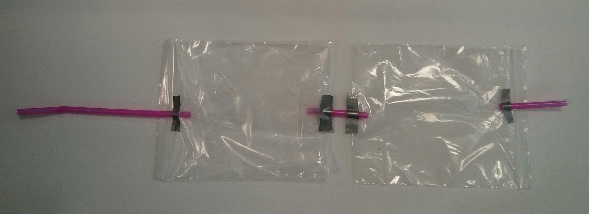

# Lesson 4 - Water, Water Everywhere.

Humans produce a lot of waste material. Can you think of four waste products humans produce, just by being alive? 

## Experiment 1

1. You're going to look at how waste water can be removed from the atmosphere on the ISS, but first we had better get an idea of how much water vapour humans can produce.

1. Your teacher will set up two bags connected with straws, as shown below.
  

1. Graph the CSV data taken when the Sense HAT is in the bag.

## Experiment 2

1. The first bag will be exhaled into, and the second bag will contain the Raspberry Pi and Sense HAT.

1. Once the humidity inside the second bag has been logged, you can download the CSV sheet, in the same way you have done previously, and graph the results.

1. What happens to the humidity level of the air in the second bag?

## Experiment 3

1. Now that you've seen the how much water vapour is in exhaled air, you should be able to understand that there is a need to remove water vapour from the air on the ISS. If it wasn't removed, in such an enclosed environment, the atmosphere would very rapidly become uncomfortably moist for the astronauts.

2. Can you think of a way of removing water vapour from the air? Your teacher should now demonstrate a couple of methods of removing water vapour. Create a graph that compares the different methods and then state which is the most effective.

3. Can you think of any barriers to using this method aboard the ISS?
