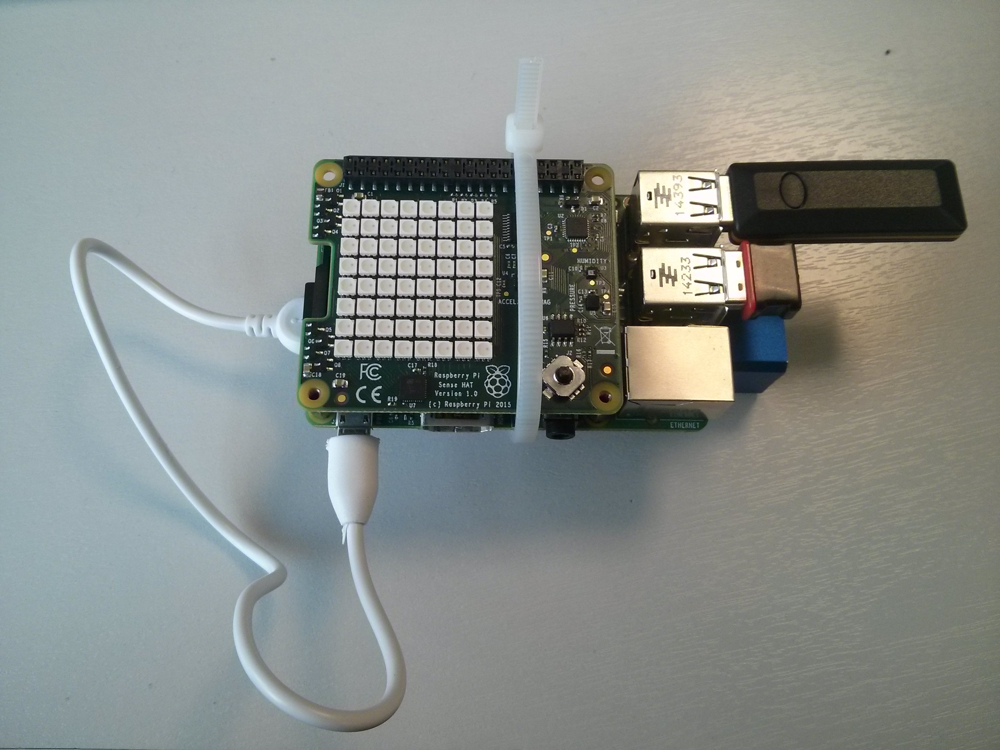
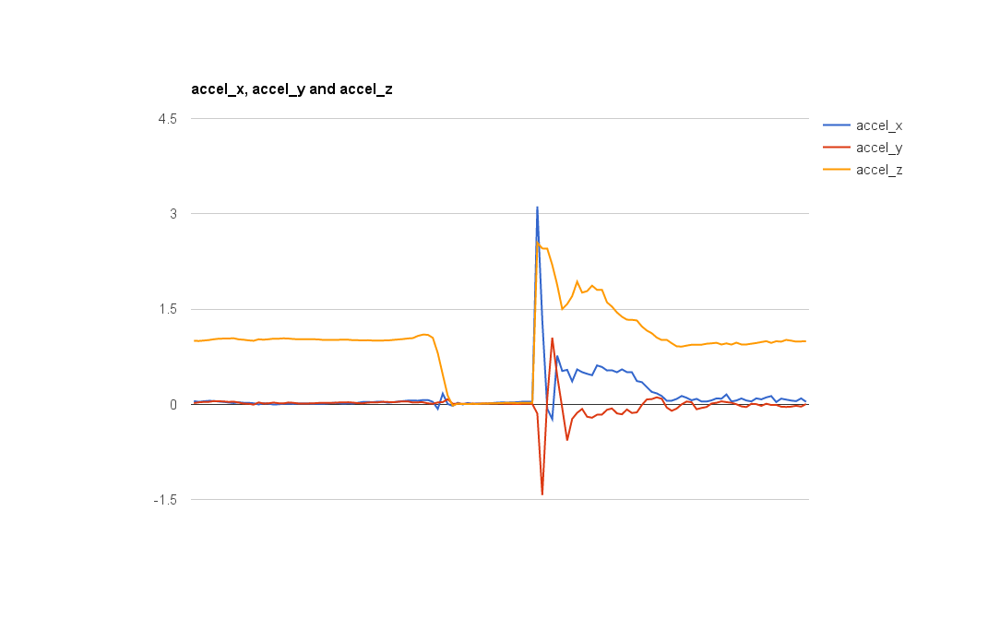
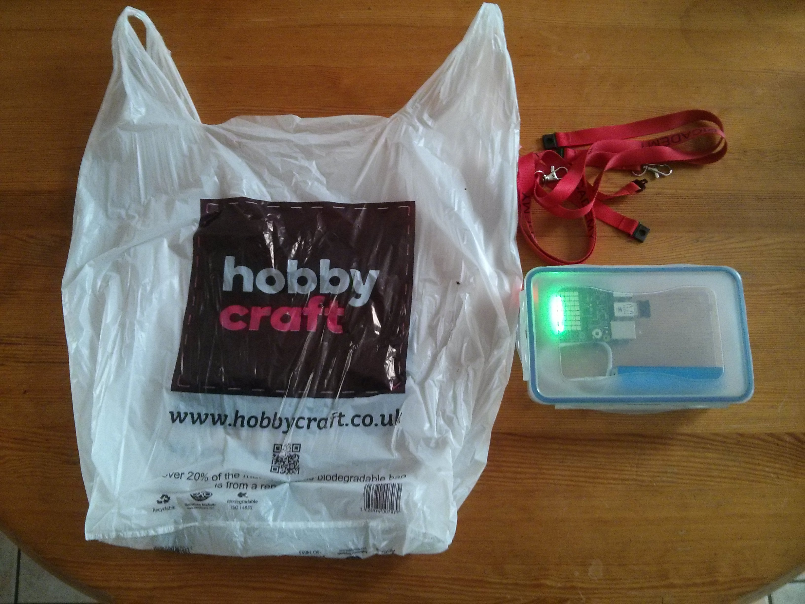
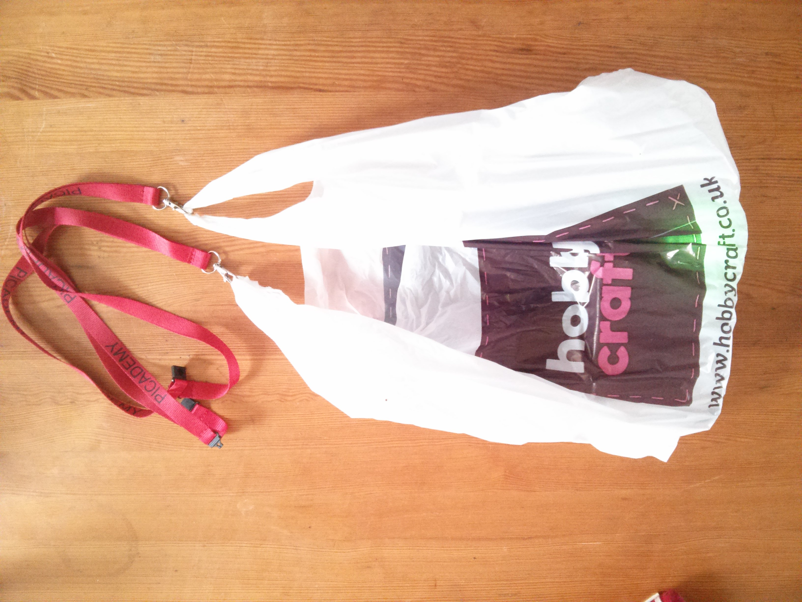
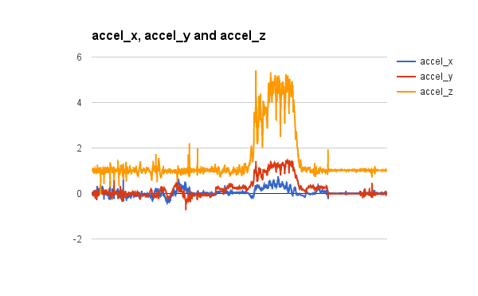

# Lesson 5 - Always Falling

## Learning objectives

- To understand that objects in orbit are always falling towards the Earth.
- To understand that gravity can be simulated by circular motion

## Learning outcomes

### All students are able to

- Plot graphs using more than two data sources.
- Use the terms X, Y and Z to describe motion in three dimensions

### Most students are able to

- Relate weightlessness to an object in free fall.

### Some students are able to

- Relate circular motion to force (centripetal), and understand how this could be used to provide artificial gravity.

## Lesson Summary

In this lesson, students will conduct some research on living with micro-gravity, and then look at ways that gravity could be simulated on future space stations. They'll look at how circular motion can produce a constant force.

## Starter

1. Show students a video of astronauts having fun in space, like [this one](https://www.youtube.com/watch?v=coX1u2_KBsQ).
2. Tell students that we experience a force of approximately ten Newtons per kilogram on Earth. Ask them to guess what the force experienced by astronauts on the ISS is.
3. Reveal to students that although the force of gravity decreases with distance from the Earth, at between 200 and 250 miles (the altitude of the ISS) the force of gravity is actually still 90% of what we experience on Earth: roughly 9 Newtons per kilogram.
4. Why, then, do astronauts appear to be weightless?

## Main development

### Free fall

1. Explain that the Sense HAT contains an accelerometer which can measure forces acting on the Sense HAT.
2. Open Sense-Logger.py and edit the opening lines, so that only acceleration is being measured every 5 seconds.

  ```python
  ## Logging Settings
  TEMPERATURE=False
  HUMIDITY=False
  PRESSURE=False
  ORIENTATION=False
  ACCELERATION=True
  MAG=False
  GYRO=False
  DELAY = 5
  BASENAME = ""
  ```
3. Start the logging process, let it run for a few seconds and then stop logging.

4. Share the produced CSV file and let students reason as to what the data means. They may need guidance to realise that the measurement of approximately `1` in the `accel_z` column is a measurement of the force on the Sense HAT caused by the gravitational pull of the Earth.

5. Open up Sense-Logger.py again and change the `DELAY` variable, so that the Sense Hat will log data as quickly as it can.
  ```python
  ## Logging Settings
  TEMPERATURE=False
  HUMIDITY=False
  PRESSURE=False
  ORIENTATION=False
  ACCELERATION=True
  MAG=False
  GYRO=False
  DELAY = 0
  BASENAME = ""
  ```
6. You may want to secure your battery to the Raspberry Pi for the next part, or even place them in a protective container of some description.



7. Lift the Raspberry Pi high into the air, start the logging process and then drop it. You'll either need to quickly catch it yourself or have someone else catch it. If you've used a protective container, you might even like to throw the Raspberry Pi into the air.

8. Once you have caught the Raspberry Pi, stop the logging process and then get the students to predict what the graph of the CSV will look like.

9. Share the CSV and have your students produce a graph, then try and get them to explain what is happening.

10. They should see something like this:

  

showing a steady acceleration due to gravity of 1, that suddenly drops to 0 while the Raspberry Pi is falling.

11. Ask your students what it would feel like if they were in free fall. You can show them [this video](https://www.youtube.com/watch?v=4Y_L8pnDRvY) of the Vomit Comet.

12. Explain to students that the reason astronauts feel weightless when in orbit is because in reality, the ISS is falling towards Earth. Because the Earth is curved, the ISS never actually reaches the surface, so it is always in **free-fall**.

  

  

### Simulating Gravity

1. Have students read [this article about Gennady Padalka](http://www.telegraph.co.uk/news/science/space/11860476/Astronaut-takes-the-record-for-longest-time-ever-in-space.html), who has spent a record 879 days in space.

2. Having read the article, ask your students if there are any long term risks of living in micro-gravity. Ask them how these risks might be mitigated.

3. Discuss with your students how we could implement artificial gravity in yet-to-be-built space stations. They might come up with many ideas, such as magnetic boots or even using super-heavy elements at the centre of a space station.

4. You can show students [this video from Stanley Kubricks's 2001: A Space Odyssey](https://www.youtube.com/watch?v=52cu-8FX5OQ) showing an astronaut jogging in a space station, and ask how this might be possible.

5. Take the Raspberry Pi and Sense HAT and secure them in a container of some description, so that it is limited in it's movement.

6. You can use a plastic carrier bag to hold the container, with straps coming from the handle.

  
  

7. With logging started, spin in a horizontal plane.

  <iframe width="560" height="315" src="https://www.youtube.com/embed/TF_-EVjAWbk" frameborder="0" allowfullscreen></iframe>

8. Quit the logging program and give students access to the CSV file for graphing. They should see something like:

  

9. The graph clearly shows an increase in the force experienced by the Sense HAT while being spun. Try the experiment again using different lengths of strap to see how this changes the force experience.

## Plenary

- Have students discuss what they think would happen to the force of gravity on a spinning space station as you moved close to the axis of spin.


