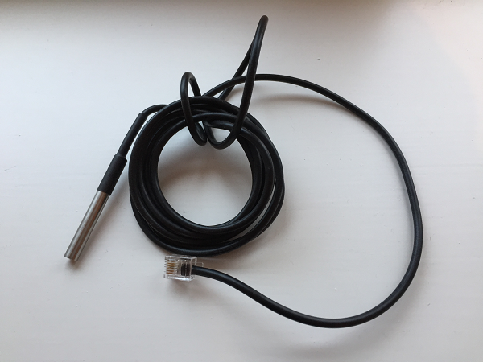

# About the soil temperature sensor

Here is the soil temperature sensor supplied with the Raspberry Pi Weather Station kit.



## How does it work?

Your soil temperature probe is a prewired and waterproof digital temperature sensor. If you were to take the sensor out of the protective wiring and waterproofing, it would look like this:


-- Image by oomlout [CC BY-SA 2.0](http://creativecommons.org/licenses/by-sa/2.0), via Wikimedia Commons --

The sensor has three pins: a ground pin, a data pin, and a 3.3V power pin. You may have noticed that the sensor was described as a *digital* temperature sensor; this is because the signals generated are converted into a digital format that the Raspberry Pi can understand.

To initiate a temperature measurement, the Raspberry Pi sends a command to the sensor. Then the resulting thermal data is stored in a temperature register in the sensor memory for the Raspberry Pi to read.

Here is the [data sheet](http://datasheets.maximintegrated.com/en/ds/DS18B20.pdf) for the soil temperature probe.

## How does the sensor connect?

1. To connect the soil temperature probe to the Weather Station, first assemble the main Weather Station.
1. Now attach the air quality sensor board to the main Weather Station box. The soil temperature probe is attached to this board.


## Sample code

The following program is a very basic program to take a reading from the soil temperature sensor. This program needs to be put inside the `weather_station` directory, as it uses the library `ds18b20_therm` which is included with the Weather Station software.

```python
import ds18b20_therm as soil_temp

temp_probe = soil_temp.DS18B20()
print( temp_probe.read_temp() )
```
