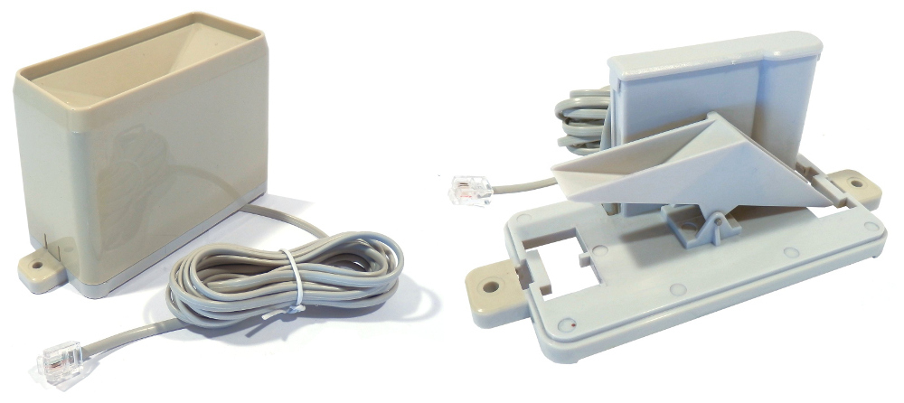
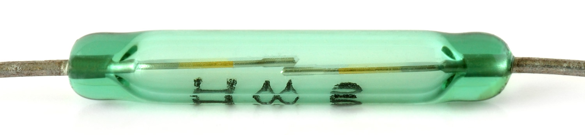

# Sensing the Weather - Rainfall Worksheet

In this lesson you will:

- Collect data using the Raspberry Pi Weather Station hardware
- Learn the difference between **continuous polling** and **interrupt handling**
- Convert the collected data into meaningful measurement information

## How does the rain gauge work?

Today you will be using the rain gauge sensor to collect data about rainfall. The gauge consists of a bucket to collect water, and a seesaw-like device to measure how much water passes through. Each time the bucket fills with a certain amount of water it tips, releasing the water and presenting the opposite bucket to be filled.

  

Each tip causes a magnet to pass in front a sensor called a reed switch, which closes the switch and triggers a `LOW` signal on GPIO pin 6. We can detect this `LOW` signal and use it to count how many times the bucket tips.

  

In order to calculate the amount of water that has passed through the gauge we need to know:

  - The amount of water needed to tip the bucket, in this case **0.2794** mm (this can be found on the [datasheet](https://www.argentdata.com/files/80422_datasheet.pdf)).
  - How many times the bucket has tipped, which can be counted as the number of input signals.

  **Rainfall = 0.2794 * number of tips**


## Counting bucket tips

Make sure your rain gauge is connected to your Weather Station, then turn it on.

1. Launch the terminal.

  


1. Move to the `weather station` directory by typing `cd weather_station` into the terminal and pressing `Enter`.

1. Start a new Python program by typing `sudo idle3 rain_polling.py`.

1. We're going to set up the rain sensor as a digital input device. It's digital because when the bucket tips this causes a single input at a specific point in time, rather than a gradual measurement of the bucket tipping.

We will also store the size of the bucket as a constant (hence the capitals), and a counter for how many times the bucket has tipped.

  ```python
  from gpiozero import DigitalInputDevice

  rain_sensor = DigitalInputDevice(6)
  BUCKET_SIZE = 0.2794
  count = 0
  ```

1. We want to count the number of times the bucket tips. Remember that when the bucket tips, this causes the reed switch to close and drops the voltage on GPIO pin 6 from `HIGH` to `LOW`. In order to do this, we need to keep track of the **current state** and the **previous state** of the pin. To do this, create two variables and set them each to `True`, which is the default `HIGH` voltage.

	```python
	current_state = True
	previous_state = True
	```

1. The current state of the rain gauge sensor can be found by asking for the value. The value will be `True` if the GPIO pin has a `HIGH` voltage, and `False` if it has a `LOW` voltage. 

  ```python
  current_state = rain_sensor.value
  ```


1. We will want a `while True:` loop to constantly check the pin status, but we want to do something extra with it. In pseudocode (planning) our loop might look like this:


	> LOOP  
	> SET **CURRENT STATE** TO THE READING OF THE **SENSOR VALUE**  
	> IF **PREVIOUS STATE** = True AND THE **CURRENT STATE** = False THEN  
	> --- ADD 1 ONTO **COUNT**  
	> --- DISPLAY **RAINFALL**  
	> MOVE THE **CURRENT STATE** TO **PREVIOUS STATE**  
	> END LOOP  


  In Python we would write:

	```python
	while True:
	       current_state = rain_sensor.value

	        if previous_state == True and current_state == False:
	            count = count + 1
	            print ( count * BUCKET_SIZE )

			previous_state = current_state
	```

You can see the complete code [here](code/rainfall_poll.py).

1. Once you have entered your code, run it by presing **F5**.
1. If you tilt the rain gauge a few times, your program should display something like:

    ```
    0.2794
    0.5588
    0.8382
    ```

1. You can quit at any time with the keystroke `CTRL + C`.

## Using interrupts in place of polling

### Question

Using an infinite loop to repeatedly check the status of the input pin is called **polling**. Why do you think this method is a very inefficient way of checking whether the sensor has been activated?

### Answer

The code constantly checks for rainfall every 0.01 seconds, which uses some processing power. Wouldn't it be better if the system only checked for rainfall when it was raining, and ignored the rain gauge the rest of the time?

To do that we need to use a technique called interrupt handling. Rather than constantly check the status of the pin, we use a mechanism called an **interrupt** to trigger a function.

1. From your `rainfall_poll.py` program in IDLE, click the **File** menu and select **Save As**, replacing the file name with `rainfall_interrupt.py`.

1. We need to make a few changes to the code. Firstly, you should remove the variables `current_state` and `previous_state` as we won't need them.

1. Let's make a function (a reusable section of code with a name) to tell the program what to do when the bucket is tipped. For each time the bucket gets tipped, we will add 1 to the variable `count` and then print out the total rainfall so far (number of tips * size of bucket).

    ```python
    from gpiozero import DigitalInputDevice

    rain_sensor = DigitalInputDevice(6)
    BUCKET_SIZE = 0.2794
    count = 0

    def bucket_tipped():
        global count
        count = count + 1
        print(count * BUCKET_SIZE)

       
    ```

1. You'll need to tell the sensor to call the `bucket_tipped()` function when the sensor is activated; that is, when the voltage on GPIO pin 6 drops to `LOW`. Make sure this line of code is not indented.

    ```python
    rain_sensor.when_activated = bucket_tipped
	```

1. Run your code by pressing **F5**; this will ask you to save your code.
1. Tip the rain gauge from side to side and you should see the following:

	```
	0.2794
	0.5588
	0.8382
	1.1176
	```

The complete code can be found [here](code/rainfall_interrupt.py).

## Summary

You should now have a working rain gauge using two different approaches. Consider the following questions:

- What is the difference between polling and interrupt handling?
- Is one of these techniques better? If so, why?
- Why is the unit of measurement for the gauge **mm** rather than **ml**?

## What next

Now that you have built your rain gauge code you should test its accuracy. You could try tipping a known amount of water in ml into the top of the rain gauge. How much water in ml would you have to pour in per 1mm of measured rainfall?
