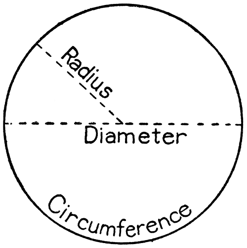

# Sensing the Weather - Wind Speed Worksheet

In this lesson you will:

- Collect data from an anemometer using the Raspberry Pi GPIO pins
- Use interrupt handling to detect inputs from the sensor
- Use simple circle theory to convert the collected data into meaningful wind speed measurements

## How does the anemometer work?

Today you will be using the anemometer sensor to collect data about wind speed. The sensor has three arms with buckets on the end which "catch" the wind, causing the arms to spin. If you were to dismantle the sensor, you would find a small magnet attached to the underside.


At **two** points within the magnet's rotation, it triggers a reed switch which produces a `LOW` signal we can detect via GPIO pin 5. So for each full rotation of the arms, the sensor will produce two detectable signals.


So let's start collecting data from the sensor!


## Detecting anemometer interrupts

First, we need to be able to count the signals coming from the anemometer. To do this, we can reuse some of the code we wrote to read data from the rainfall sensor.

1. Set up your Raspberry Pi and ensure you are in desktop mode.

1. Launch the terminal.

    

1. Move to the `weather station` directory by typing `cd weather_station` and pressing `Enter`.

1. Make a copy of your `rainfall_interrupt` program to a new file called `wind_interrupt.py` by typing this command into the terminal and pressing `Enter`:

	```bash
	cp rainfall_interrupt.py wind_interrupt.py
	```

1. Open your program by typing `sudo idle3 wind_interrupt.py`. The code will currently look like this:

    ```python
    from gpiozero import DigitalInputDevice

    rain_sensor = DigitalInputDevice(6)
    BUCKET_SIZE = 0.2794
    count = 0

    def bucket_tipped():
        global count
        count = count + 1
        print(count * BUCKET_SIZE)

    rain_sensor.when_activated = bucket_tipped
	   
    ```

1. Think about what parts of this code you will need to change to gather data from the anemometer instead of the rain gauge. Update and test your code! Press **F5** and save when prompted, then spin the anemometer by hand.

Your code should display the number of half-rotations counted. Press `Ctrl + C` to stop the program. If it doesn't work as expected, check your code against this [solution](code/wind_interrupt.py).

We can now count the signals from the anemometer; now let's use this information to calculate the wind speed.

## Calculating wind speed

We know that the anemometer registers two signals per spin, so we can count the number of full rotations of the sensor by halving the number of detected inputs. But how do we change that into a speed?

1. Let's start by considering the formula for calculating [speed](http://www.bbc.co.uk/education/guides/zwwmxnb/revision):

    **speed = distance / time**

  To calculate **speed** we need to know the **distance** travelled in a certain amount of **time**. Measuring time is fairly straightforward as we can count the number of signals over the course of a fixed time period, for example 5 seconds. We now have the time but we also need the distance travelled.

1. The distance travelled by one of the cups will be equal to the number of rotations * the distance around the edge of the circle (circumference). So we could write:

    **speed = (rotations * circumference) / time**

1. The circumference can be calculated if we know either the **radius** or **diameter** of the circle.

    

    We can measure the radius of the circle made by the anemometer by measuring the distance from the centre to the edge of one of the cups. Knowing the radius, we can find the circumference with the formula `2 * pi * radius`. We also know that a whole rotation generates two signals, so if we halve the number of signals detected our formula becomes:

    **speed = ( (signals/2) * (2 * pi * radius) ) / time**

    This formula should enable us to calculate the speed of the wind in cm/s.

## Updating the code

Now that we are able to calculate the wind speed from the sensor signals, we need to add the code to make this work.

1. Measure the radius (in cm) of the anemometer for use in your program. The radius of the anemometer in the Raspberry Pi Weather Station kit is 9.0cm.

1. Decide on your time interval for calculating average windspeed, and make sure it's at least 5 seconds.

1. Save another copy of your existing wind speed code by clicking **File** --> **Save As** and naming the file `wind_calc.py`.

1. Adapt your code to calculate the wind speed using the following solution as a guide:

    > import gpiozero, time, math  
    > count = 0  
    >
    > FUNCTION spin (channel)  
    > --- increment global count variable  
    > --- display count  
    >
    > FUNCTION calculate_speed  
    > --- You will need the radius, your chosen time interval, the count of signals, and math.pi  
    > --- calculate windspeed  
    > --- return windspeed  
    >
    > Set up the sensor as a DigitalInputDevice on pin 5
    > When the sensor is activated, call the function spin
    >
    > INFINITE LOOP  
    > --- reset global count to 0  
    > --- wait **delay** sec  
    > --- call calcspeed to get value  
    > --- display windspeed value  

- The first two lines set up the different variables and required libraries.
- The **spin** function is called every time an interrupt is detected, adds 1 to the count variable, and prints it.
- The **calcspeed** function uses the given information to calculate the wind speed and returns it.
- The sensor is set up on pin 5 and set to call the spin function when activated.
- The final loop resets the counter then waits for a time period before calculating the speed, printing it, and then starting again.

Can you convert this program plan to a working Python program? (A solution can be found [here](code/wind_calc.py).)

## Measurement units

Currently, the program we have created will measure the wind speed in **cm** per **second**; however, this is not particularly useful. A more practical unit would be **km** per **hour**. 

It's a good idea to set up constants to store the values of the number of seconds in an hour, and the number of centimetres in a kilometre. This will make our calculations less confusing for other people to understand:

```python
CM_IN_A_KM = 100000.0
SECS_IN_AN_HOUR = 3600
```

In order to convert our units we'll need to:

- Convert cm -> km by **dividing** the distance by the number of cm in 1km
- Convert seconds -> hours by **multiplying** the speed by the number of seconds in 1 hour


Adapt your code so that it displays the windspeed in km/h.

## Calibration

### Question

Is the wind speed shown by your program accurate? Given the information on the [datasheet](https://www.argentdata.com/files/80422_datasheet.pdf), how could you test its accuracy?

### Answer

The [datasheet](https://www.argentdata.com/files/80422_datasheet.pdf) says that if the anemometer rotates once a second that should equate to 2.4 km/h. So in the example interval of 5 seconds, 5 spins (10 signals) should equal the same 2.4 km/h.

1. Run your program and spin the anemometer 5 times within the first 5 seconds. What wind speed value is reported?

  ```bash
  1
  2
  3
  4
  5
  6
  7
  8
  9
  10
  2.03575203953 kph
  ```

  That's not quite right! This loss of accuracy is due to something called the *anemometer factor* and is a result of some of the wind energy being lost in turning the arms. To compensate for this, we're going to have to multiply the reading generated by our program by a factor of **1.18** which should correct this error. Update the final line in the `calculate_speed` function to multiply your speed in km/h by 1.18.

  Again, you might want to store the anemometer adjustment value as a constant with the value of 1.18, and then use the constant in your code to make sure it makes sense to other people.

  ```python
  ADJUSTMENT = 1.18
  ...

  return km_per_hour * ADJUSTMENT
  ```

  Your final code should now look something like [this](code/wind_final.py).

1. Re-run the code and this time you should get a value closer to 2.4:

    ```
    1
    2
    3
    4
    5
    6
    7
    8
    9
    10
    2.40218740664 kph
    ```

## Summary

- You have created a program which uses the anemometer to measure wind speed. What kind of location would be most suitable for this device? 
- What factors should be considered when choosing a place for your anemometer outside? 

## What next

Now that you have a working anemometer program, there are some other things you could do:

- Test your anemometer with a wind source such as a fan to ensure it works consistently.
- In this lesson we have used interrupts to manage the data coming from the sensor. Could you rewrite the program to use the continuous polling method we discussed in the rain gauge lesson?
