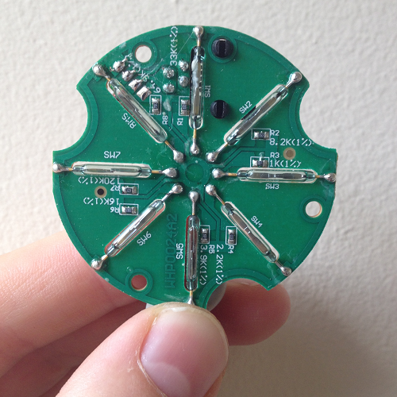
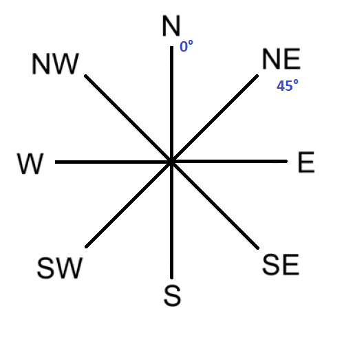
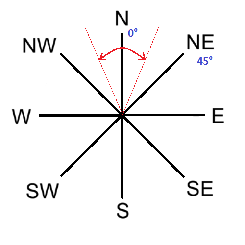
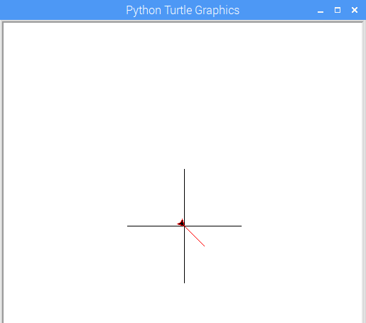

# Sensing the Weather - Wind Direction Worksheet

In this lesson you will:

- Understand how the wind vane uses reed switches to change its output voltage
- Understand the difference between an analogue and a digital signal
- Be able to write a program to output the wind direction based on input from the wind vane

## How does the wind vane work?

A wind vane shows the direction *from which* the wind is coming, not where it's going; this can be confusing because TV weather maps show the opposite. It works by the wind exerting force on a vertical blade which rotates to find the position of least resistance; this position is then aligned with the direction of the oncoming wind.

The wind vane is more complex than the [rain gauge](../guides/rain_gauge.md) or [anemometer](../guides/wind_speed.md). It does use reed switches and magnets, but it works in a completely different way. 

If you look inside the wind vane, you'll see there are eight reed switches arranged like the spokes of a wheel.



So what's going on here? Firstly, we need to understand what a [resistor](http://en.wikipedia.org/wiki/Resistor) is. These are small components that resist/reduce the flow of electrical current but don't stop it; at the same time they also reduce the voltage moving through the circuit. Resistors can have different values; a low resistance value would let almost all voltage/current through, but a high resistance value would let very little through. There are eight resistors in the wind vane, and as the magnet rotates, different reed switches will open and close and thus switch their corresponding resistor in and out of the circuit.

Each of the eight resistors have different values which you'll see printed in white text next to them (e.g. you can see 8.2K on the right). This allows the wind vane to have 16 possible combinations of resistance, since the magnet is able to close two reed switches when halfway between them. More info can be found in the [datasheet](https://www.argentdata.com/files/80422_datasheet.pdf).

## Analogue vs. digital

We record a voltage from the wind vane which varies according to which combination of resistors is currently being switched into the circuit. This is an *analogue* signal because it continuously reports a **range** of voltages. When we used the anemometer it simply reported a `HIGH` or `LOW` voltage, all or nothing, which is a *digital* signal. To be able to interpret an analogue signal, we need a special component called an Analogue to Digital Convertor (ADC) to allow us to observe this signal as a number; the signal is *analogue* and our Raspberry Pi is a *digital* machine. The board inside your Weather Station has an ADC built in.

## Using the wind_direction module

Reading information from the ADC is a little tricky, so we're going to use a **module** which contains code someone else has written to help us.

1. Set up your Raspberry Pi Weather Station.

1. Launch the terminal.

    

1. Move to the `weather station` directory by typing `cd weather_station` and pressing `Enter`.

1. Start a new Python program by typing `sudo idle3 find_wind_direction.py`. It's important that your program is in the `weather_station` directory, as this is where the module we need is stored.

1. First, let's import the module. Type this code into the start of your Python program:

	```python
	import wind_direction as wind_vane
	```

This code tells Python to get the contents of the `wind_direction` module, and that when you refer to this module you will refer to it by the name `wind_vane`.

1. Now we need to create an **object** which will allow us to gather readings from our wind vane:

	```python
	our_wind_vane = wind_vane.wind_direction(0, "wind_direction.json")
	```

The object we have created is given the name `our_wind_vane`, just as we would name a variable.

1. We would like to sample the wind direction at a 10-second interval. There's a function inside the module we are using called `get_value()`. The code below calls this method on the `our_wind_vane` object which returns a value in degrees for the direction of the wind vane:

	```python
	interval = 10
	print( our_wind_vane.get_value(interval) )
	```

1. By placing this code inside a `while True:` infinite loop, we can repeatedly sample the wind direction at 10-second intervals. The finished code so far should look like this; save it and run the code whilst pointing your weather vane in different directions to see if it works.

	```python
	import wind_direction as wind_vane

	while True:

	    our_wind_vane = wind_vane.wind_direction(0, "wind_direction.json")

	    interval = 10
	    print(our_wind_vane.get_value(interval))

	```


## Which direction is the wind coming from?

### Question

Earlier, we talked about how the 8 reed switches can provide 16 possible values depending on the position of the vane. So how is it possible for the `get_value()` function to give us a reading in degrees, when there are 360 degrees in a circle and only 16 possible combinations of resistance?

### Answer

During the sampling interval, multiple readings are taken and we are given an *average* of those readings, converted into degrees.


### Question

How can we use the data from the wind vane (given in degrees) to show which compass direction the wind is coming from?

### Answer

The Met Office weather reports use a number of [wind symbols](http://www.metoffice.gov.uk/guide/weather/symbols#windsymbols) to show information about the wind, as well as giving a compass direction that the wind is blowing *from*.

Looking at this diagram with compass points, if we consider North to be 0 degrees then any of the compass points can be worked out as a bearing from North. The first has been shown for you as an example:



Your task is to write some code to take the value we received from the sensor, and instead of presenting the data as degrees, to work out the corresponding compass direction.

Clearly a reading of 0 degrees should report back **North**. But what about 1 degrees, 2 degrees, and so on? You need to define a range within which each direction is reported by your program. In the diagram below, the range of degrees for North would be between the red lines.



The code for the shaded area is done here for you:

```python
if degrees >= 338 or degrees < 23:
	print("N")
```

Now add more `elif` statements to define the other directions. Test your code and put the wind vane in different positions to check whether it works. North on the wind vane can be found by positioning the pointed end of the vane level with the black anemometer port underneath the vane.

The [final code](code/find_wind_direction.py) is here if you want to check your answer.

## Summary

- You have gathered data converted from an analogue voltage to a digital number representation using an ADC, and then converted again to a measurement in degrees.

- Will it matter which way around our weather vane is situated when we put it up outside?

## What next

It would be good if we could represent the wind's direction graphically. Can you use `turtle` graphics to draw a graphic representation of the direction of the wind? The example below uses the turtle to draw compass points before drawing a red line pointing in the direction the wind is blowing from.



If you use the Python `turtle` module in Logo mode (so that North is 0 degrees), you can set the `heading` of the turtle which sets the angle the turtle points. Full documentation for the `turtle` module is available [here](https://docs.python.org/2/library/turtle.html).

Can you go one step further and draw a weather map-style arrow, pointing in the direction the wind is blowing TO? To do this, you will need to calculate the angle which is exactly 180 degrees further around the circle than the wind direction. However, simply adding 180 to the measurement won't work; what if the measurement was 350 degrees, for example, since adding 180 to that would result in 530 degrees? To do this correctly, you can use the `MOD` (`%`) operator, which gives the remainder of a division:

```
direction = 350
direction = (direction + 180) % 360
```

`%` performs [integer division](http://mathworld.wolfram.com/IntegerDivision.html) and reports the remainder. So in this case:

```
350 + 180 = 530
530 \ 360 = 1 		# How many times 360 fully goes into 530
530 % 360 = 170		# The remainder of the integer division
```
