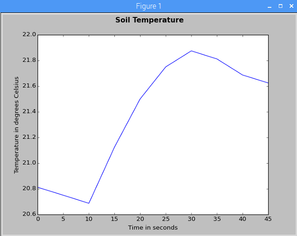
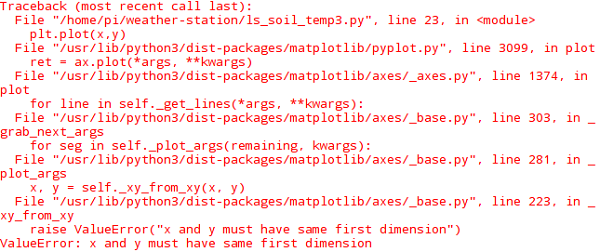

#  Sensing the Weather - Soil Temperature Lesson

In this lesson students will learn how to take multiple readings from a soil temperature sensor and turn them into a graph showing the temperature change over time.

## Sensor guide

Here is some background information about the [soil temperature sensor](../guides/soil_temperature.md).

## Learning objectives

- Reinforce how to store multiple sensor readings using a list
- Be able to plot a line graph showing soil temperature change over time

## Cross-curricular applications

- Computer Science - lists, loops, list comprehensions
- Mathematics - line graph

## Lesson summary

- How does the soil temperature sensor work?
- How can we take a reading from the sensor?
- Taking multiple readings across a time period
- Plotting the results as a graph

## Starter

In order to produce graphs using your Raspberry Pi Weather Station, you will need to install a new library called `matplotlib`.

1. Open the terminal.

	

1. Type in the following command to install the `matplotlib` library:

	```bash
	sudo apt-get install python3-matplotlib
	```

Introduce students to the soil temperature sensor and discuss what they might find if they were to open it up and have a look inside. For this sensor it's not possible to dismantle it without damaging the waterproof housing, but you may have access to a non-waterproofed version of the component to demonstrate. Alternatively, there is a photograph in the [information about the sensor](../guides/soil_temperature.md).

## Main development

1. Students boot their Raspberry Pi Weather Station and log in.

1. To access the sensor data we will use a module of code written by someone else to help us, in exactly the same way as we did when using the wind vane. Firstly, we instantiate an object which can talk to the sensor and then we call a method on that object to get the current data reading. Students create a simple program which takes one reading from the sensor. DS18B20 is the name of the temperature sensor component.

	```python
	import ds18b20_therm as soil_temp

	temp_probe = soil_temp.DS18B20()
	print( temp_probe.read_temp() )
	```

1. Introduce the concept of a list comprehension. We are going to use this to automatically generate the `x` axis of our graph so that instead of having to type out the intervals, Python will generate them for us. There are some list comprehension exercises in [this worksheet from a different topic](https://www.raspberrypi.org/learning/visualising-sorting-with-python/lesson-1/worksheet/) which you could ask students to experiment with to begin with. Then students will follow the [worksheet](worksheet.md). Some of the more complex parts are clarified below.

1. We want to be able to specify the `interval` we will sample at (how many seconds between samples), just as we have done for most of the other sensor programs so far. To produce a list which looks like this:

	```python
	[0, 5, 10, 15, 20, 25, 30, 35, 40, 45]
	```

	...we would use this code:

	```python
	interval = 5
	x = [i for i in range(0, 10*interval, interval)]
	```

Breaking this down, we are assigning the variable `x` to a list generated "on the fly" which consists of numbers in the range beginning at `0`, ending at `10*interval` (or `50`), and going up by `interval` (or `5`) each time.

1. This lesson reinforces the concept of storing multiple sensor readings in a list, a concept first encountered in the wind gust speed lesson. Students need to work out how to generate and store 10 readings from the temperature probe, which is easily done with a `for` loop. They will also need the `time` library so that they can pause the program for an appropriate interval between the readings. It's nice to print out when a reading has occurred, otherwise the program has a long pause where it appears as if nothing is happening, even though readings are being taken behind the scenes.

	```python
	for i in range(10):
	    y.append(temp_probe.read_temp())
	    print("Reading " + str(i) )
	    sleep(interval)
	```

1. Here is the [finished code](code/soil_temp.py) for the program which generates a very basic graph.

1. Students could investigate the [matplotlib documentation](http://matplotlib.org/users/beginner.html) to find out how to improve their graph, for example adding axis labels, a title, changing the colour of the line plot, or one of the many other options.

Here is an example of a graph which could be produced. Students can vary the temperature whilst testing by simply holding the sensor in their hand and releasing it during the sampling, or they might be able to think of other possible tests!

	

## Plenary

Ask the class the following questions:

1. Why did we use the list comprehension to generate the numbers for the `x` axis on our graph rather than writing them out by hand?
1. Why did we use a `for` loop to generate the readings instead of a `while` loop?

**Answers:**

1. This makes our code reusable. If we hard-code the numbers in, and then later decide we want to change the number of readings, we will have to go back, find the place in the code where we wrote the numbers, and alter it manually.
1. A `for` loop is a count-controlled loop, which will run a specified number of times. We could also have used a `while` loop with a counter variable and a condition. We need a specific number of readings because the `matplotlib` library will give an error if the `x` and `y` lists have different numbers of elements in them; the lists must be exactly the same length to successfully generate a graph.

	


## Extension

- Can you alter the program to make it possible to customise the number of readings taken by the sensor? At the moment the sensor will always take 10 readings, but could the user type in how many readings they want?
- Could the user specify the interval they would like to sample at?
- Can you work out how to save your graph as a PDF using functions from the `matplotlib` documentation?
