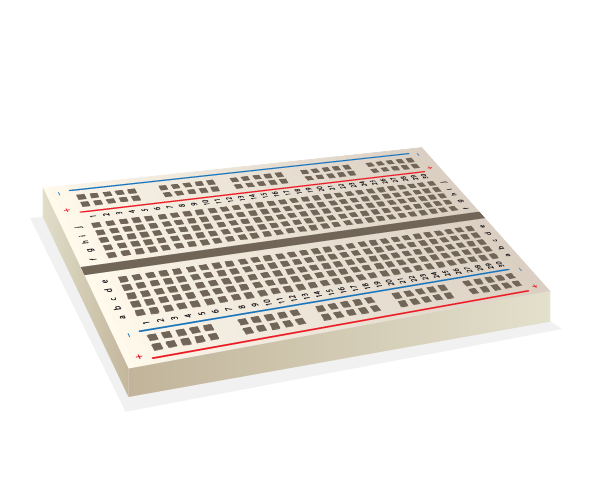

# Breadboard

You can think of a breadboard as being something like an artist's canvas, but without any of what we create on the canvas being permanent. Whilst it is possible to make a circuit without a breadboard, it keeps components organised rather than being a mess of wires without clear indication of how every wire connects to each other. Secondly, if you were to take a circuit and design it to fit on a PCB, a breadboard allows you to organise components logically before making the design permanent.

From an electronics perspective, horizontal lines of holes are connected together inside the breadboard by metal connections, with the components inside the holes clipping onto each connection. 

Along the sides of the breadboard are power and ground rails - these connect vertically instead of horizontally, and are used to tidy up the circuits by being a union point for any power connections. It's also safer this way, as all power can be disconnected from components by pulling the power source's connection to these rails, rather than pulling the connection to each individual component requiring power.
