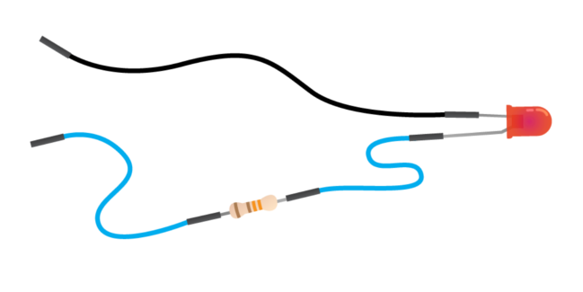
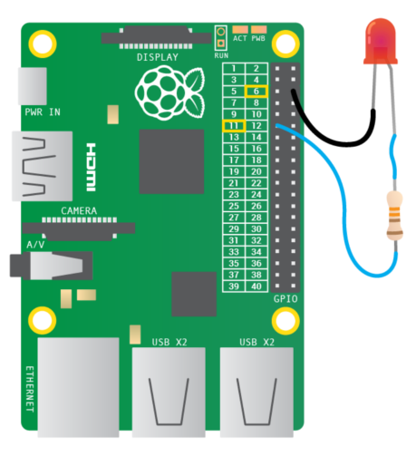

# Connecting an LED without a Breadboard

1.  The LED has a short leg and a long leg. Slot a jumper wire onto the long leg.

2.  Slot the resistor into the other end of the same jumper wire.

3.  Add another jumper wire the other end of the resistor.

4.  Make another jumper wire and slot one end onto the short leg of the LED. You should end up with something that looks like this:

    

5.  Find pin 1 and pin 6 on your Raspberry Pi using the diagram below:

    

    The general purpose input ouput (GPIO) pins on the Raspberry Pi speak and listen to the outside world and can be          controlled or programmed.  Each pin has a specific role. To make life easier the pins are numbered for reference.         Pin 1 is for power. Pin 6 is for grounding.

6.  Plug the resistor jumper wire into pin 1 on your Raspberry Pi and the other jumper wire into pin 6.

7.  Plug in the micro USB power supply and you should see some text appear on your screen.

Now you have a circuit and the LED should be on. If it is not, make sure that you have plugged the jumper wires into the correct pins by checking the diagram above. 

*Why does the LED shine? When the circuit is plugged into the Raspberry Pi GPIO pins, electricity flows through the circuit. The flow is called the current. The LED lights up only when electric current flows from the long leg through the bulb to the short leg. The resistor reduces the amount of electric current passing through the circuit. This protects the LED from breaking, as a high current will make the light shine more brightly and then stop working.*
