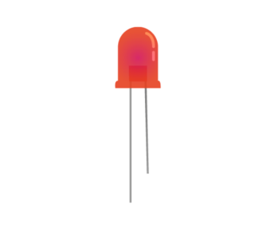

# What is an LED?

LED stands for Light Emitting Diode, and glows when electricity is passed through it. When you pick up the LED, you will notice that one leg is longer than the other.The longer leg (known as the `anode`), is always connected to the positive supply of the circuit. The shorter leg (known as the `cathode`) is connected to the negative side of the power supply, known as `ground`.LEDs will only work if power is supplied the correct way round (i.e. if the `polarity` is correct).  You will not break the LEDs if you connect them the wrong way round, they simply will not glow.If you find that they do not light in your circuit, it may be because they have been connected the wrong way round.

## Why does the LED shine? 

When a circuit is plugged into the Raspberry Pi GPIO pins, electricity flows through the circuit. The flow is called the current. The LED lights up only when electric current flows from the long leg through the bulb to the short leg. The resistor reduces the amount of electric current passing through the circuit. This protects the LED from breaking, as a high current will make the light shine more brightly and then stop working.
