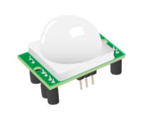

## What is a PIR Motion Sesnor?

PIR stands for Passive Infra Red. You might have seen these before as they are very common these days. You would most often find them in the corners of rooms for burglar alarm systems. All objects whose temperatures are above absolute zero emit infra red radiation. Infra red wavelengths are not visible to the human eye, but they can be detected by the electronics inside one of these modules.

The sensor is regarded as passive because it doesn't send out any signal in order to detect movement. It adjusts itself to the infra red signature of the room it's in and then watches for any changes. Any object moving through the room will disturb the infra red signature, and will cause a change to be noticed by the PIR module.

We don't need to worry about its inner workings. What we're interested in are the three pins on it; we can connect those to the Raspberry Pi GPIO pins. One pin is for +5 volts, one pin is for ground and the other is the sensor pin (the middle pin on our Pi). This sensor pin will receive power whenever motion is detected by the PIR module. We can then see that happening on the Raspberry Pi and take action accordingly.
