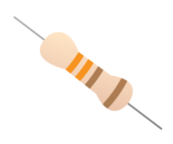

# What is a resistor?

Resistors are a way of limiting the amount of electricity going through a circuit; specifically, they limit the amount of **current** that is allowed to flow. The measure of resistance is called **Ohm (Ω)**, and the larger the resistance, the more it limits the current. 

The value of a resistor is marked with coloured bands along the length of the resistor body. A commonly used resistor in LED projects has the resistance value of a 330Ω. You can identify the 330Ω resistors by the colour bands along the body. The colour coding will depend on how many bands are on the resistors supplied: If there are four colour bands, they will be Orange, Orange, Brown, and then Gold. If there are five bands, then the colours will be Orange, Orange, Black, Black, Brown. 

You have to use resistors to connect LEDs up to the GPIO pins of the Raspberry Pi. The Raspberry Pi can only supply a small current (about 60mA). The LEDs will want to draw more, and if allowed to they will burn out the Raspberry Pi. Therefore putting the resistors in the circuit will ensure that only this small current will flow and the Pi will not be damaged. It does not matter which way round you connect the resistors. Current flows in both ways through them.
