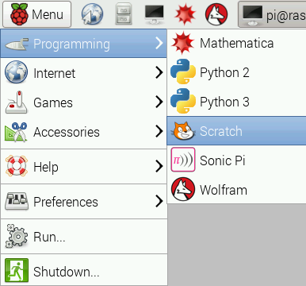
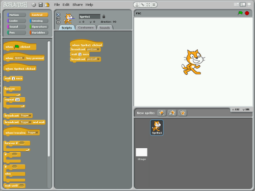
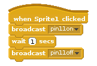

# Test a connected LED with Scratch

1.  Locate the program **Scratch** by clicking on **Menu** followed by **Programming** and selecting **Scratch**. 

 

  *Our version of Scratch on Raspbian is extra special. It allows you to access and control the GPIO pins.* 

1.  If prompted click **OK** when the remote sensor connections are enabled.

    

1.  Click on **control** in the top left display. Drag the **when Sprite1 clicked** block onto the scripts area. 

1. Click on the **control** in the blocks palette and drag a **broadcast** block to your scripts area and attach it to the play sound block. Click on the drop down menu on the broadcast block and select **new**.

    In the message name box type **pin11on** This instruction will tell the Raspberry Pi to light the LED.

    

1. Drag a **wait 1 second** block onto the scripts area and connect it to the broadcast block.

1. Drag another **broadcast** block onto your scripts area and connect it to the wait 1 second block. Click on the drop down menu on the broadcast block and select **new**.

    In the message name box type **pin11off** This will switch off the light on the cardboard robot's antenna.

1. Now add another **wait 1 second** block to the script.

1. Save your work so far by clicking on **File** and **Save As**. Name your file **Test LED** and click **OK**.

1. Test your program again by clicking on the sprite. You should see the LED come on for 1 second and turn off for one second.

    
